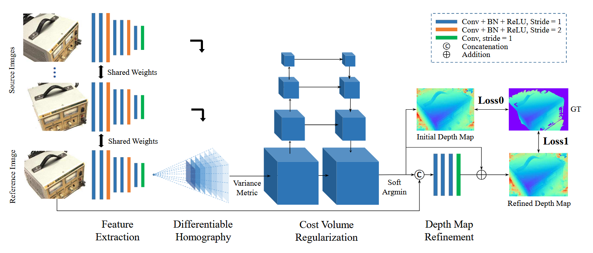
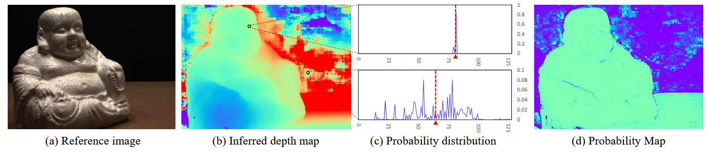
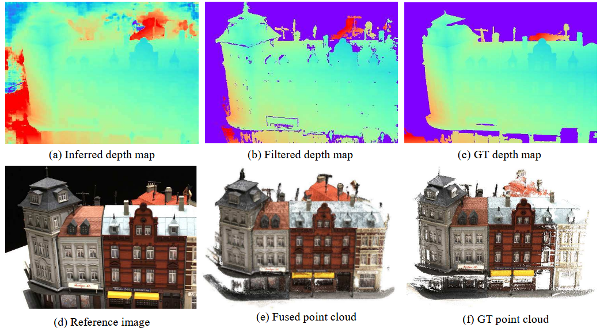
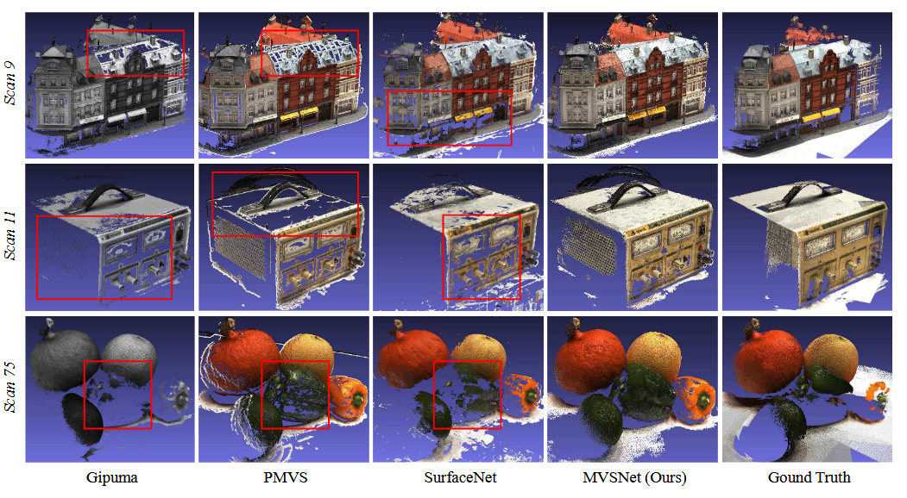
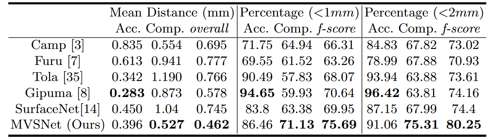
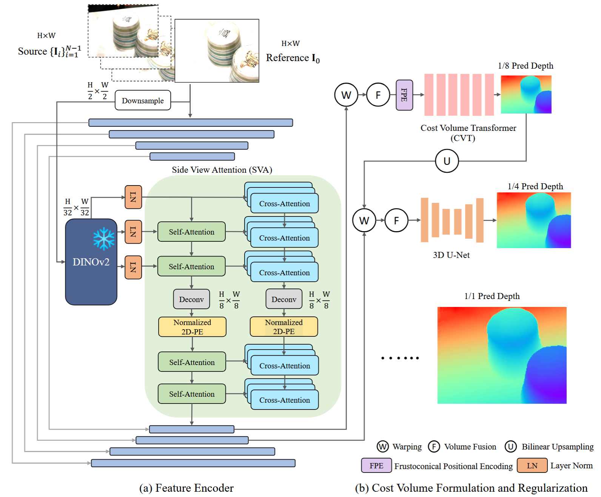

# MVSNet学习笔记

基本信息：

MVSNet: Depth Inference for Unstructured Multi-view Stereo

作者：Yao Yao, Zixin Luo, Shiwei Li, Tian Fang, and Long Quan

The Hong Kong University of Science and Technology, Shenzhen Zhuke Innovation Technology

原文：[MVSNet: Depth Inference for Unstructured Multi-view Stereo](https://arxiv.org/abs/1804.02505)

---

## 总述

### 摘要

- **论文提出一种端到端的深度学习架构，用于从多视角的照片中推断深度图**
- 网络中：
- - 提取视觉图像特征
  - 在视锥体上构建3D cost volume（方法：可微单应性变换）
  - 用3D卷积正则化和回归初始深度图，用参考图像进行细化并生成最终输出
- 灵活处理N视图的输入
- 多个特征映射为一个cost feature（用方差矩阵）
- 大规模室内DTU数据集，方法显著更优，运行速度更快
- 室外Tanks and Temples数据集，排名第一

### 结论

**核心贡献**：encode the camera parameters as the differentiable homography to build the cost volume upon the camera frustum, which bridges the 2D feature extraction and 3D cost regularization networks（相机参数encode可微单应性变换，2D特征到3D代价正则化）

### 总结

- 输入N视图的图像，通过可微单应性变换构建cost volume，然后过3D卷积，输出深度图。

## 背景

### 问题

MVS的目的是从重叠图像中估计稠密表示，也就是从不同角度拍摄同一角度的不同照片，企图通过视差来重建深度图。此时2D图像就能演变成3D场景。传统的方法主要依赖人工设计的数学公式和启发式规则，遵循一个流程：**匹配代价计算->代价聚合->视差/深度计算->优化**。可是这个过程中通常会有一些问题，例如：

- 归一化互相关：计算两个图像块(patch)之间的相关性；但无纹理（白墙）区域容易失效，因为任何位置相关度都很高，难以区分。
- 半全局匹配法SGM：互信息（解决曝光问题）、多路径聚合（平滑、效率，2D全局近似）；只能看局部小面积，大面积白墙弱纹理无法判断深度

**总结**：主要问题是场景中弱纹理、高光、反射区域会导致重建不完整。

可以发现，上述出现问题的原因是“局部”带来的信息缺失，使模型在面对“一大片墙”和“一大面镜子”时，无法准确识别。因此我们需要加强的是：整体内容的识别，并且提取特征（例如白墙边缘可以指示“这是白墙”等）

### 解决方法（前人）

**卷积神经网络CNN**可以引入全局语义信息，因此可以引入更鲁棒的匹配。立体匹配任务很适合应用基于CNN的方法，因为图像已经预先校正过（对应点都在同一水平线上），无需再考虑相机参数的水平像素级视差估计。不过这里提到的是双目深度估计、立体匹配，也不能直接用于多视图场景。双目到多目依旧有**几何**和**内存**障碍。

- 几何上，双目相机平行放置，只需要在图上横向搜索匹配；而多视图的相机位姿是任意的，难以对齐信息。同时两两拼凑也会丢失多视角的联合信息。
- 而SurfaceNet和LSM很暴力。
- - SurfaceNet将重建的3D空间切成无数个体素(Voxel)，每一个体素都通过相机内外参投影到所有的照片，得到这个体素在每个照片中的颜色；然后将颜色和相机视线角度打包到Colored Voxel Cubes中，再进行3D CNN。在面对大场景或高精度重建时尤其缓慢且极其占据内存。
  - LSM则是将2D图片提取的深度特征反投影到3D空间，这个过程可微，因此可以让网络自我修正。在这个过程中，其内存消耗比SurfaceNet更大，因为它要在3D空间里存状态，还要在3D空间里做3D卷积。

### 本文方法

多输入，单深度图输出。每次计算一张深度图。

- 核心是**可微单应性变换(differentiable homography warping)**——隐式编码相机几何信息，利用2D图像特征构建3D代价体；**基于方差的度量标准**——多个特征映射为代价体中的单一代价特征
- 3D代价体建立在相机视锥之上
- MVS重建任务解耦为单视图深度图估计问题，大规模重建成为可能

## 相关工作

### MVS重建

- 直接点云重建：提取特征点，极线几何约束，计算出小部分高置信度的初始3D点，再进行空间传播（向周围的区域进行搜索和推导）。问题在于难以完全并行化，必须先算出A的几何信息才能推导相邻的B
- 体素重建：将3D空间分成体素(Voxel)，每个Voxel存储一个数值表示是否包含真实物体。遍历每个Voxel，反算其在每个2D图像上的投影坐标，然后过3D CNN判断。问题是内存消耗巨大，同时离散切割Voxel会导致误差。由于这些原因，Voxel方法只适合小规模重建或是仅适合于低分辨率输入的合成数据。
- 深度图重建(MVSNet)：以某一个相机的2D图像平面建立二维矩阵，每一个坐标(u,v)存储一个深度值Z，该图作为参考图。取相邻的几张图作为源图，针对参考图计算每个像素的深度值。最后拼接成3D的全局点云。其优势在于，每张图像的深度图计算是完全独立的，同一张图的每个像素计算也可以高度并行化；同时无论真实空间多大，网络始终在2D范围内，省内存。

## MVSNet架构

### 特征提取

- 传统SGM是用原始像素，MVSNet则抛弃原始像素，先用CNN将图像转换为高维特征图

#### 孪生网络特征提取器

- 输入：N张不同视角的RGB图像，[H,W,3]，喂给N个结构和权重完全相同的特征提取塔
- Feature Tower：八层2D CNN；这八层分成3种不同的分辨率尺度
- 尺度一（原分辨率）：1、2层，步长为1，提取边缘、角点等基础文理特征
- 尺度二（降采样至1/2）：3、4层，第3层的步长设为2（Stride=2），这在数学和几何上等同于将图像的宽和高各缩小一半（分辨率变为原来的1/4）
- 尺度三（降采样至 1/4）： 剩余的层，第6层的步长再次设为2，使得图像的宽和高再次缩小一半（分辨率变为原图的 1/16）。
- 每一层卷积后跟一个batchnorm层和一个ReLU激活函数
- 输出：每一张图像输出一张特征图，[H/4,W/4,32channel]
- 原因： 下一步要做cost volume，全空间匹配占据太多内存；同时图像缩小也意味着可以有更大的感受野（上下文信息）
- 共享参数：希望提取出的32维特征在同一个数学空间里
- 注：这8层卷积的权重是可训练的

### cost volume

以参考相机的视锥体为坐标基准，这意味着所有的3D计算都是从参考相机的视角出发的，极大减少了不必要的计算空间。(每一层是[W,H,D]，不再是全部切成Voxel)

#### 可微单应性变换

##### 建立深度假设平面

- 站在参考相机 1 的光心，面对前方的视锥体。由于我们不知道真实的场景深度，我们就在空间中垂直于相机 1 的主光轴（Principle axis, n_1），平行地切出 D 个离散的虚拟平面（Fronto-parallel planes）。
- 假设其中一个平面的深度值为d。

##### 计算单应性矩阵 $H_i(d)$

- 问题：假设参考图像上的某一个像素 x，它对应的真实的 3D 点刚好落在这个深度为 d 的虚拟平面上。那么，这个 3D 点在源图像 i 上应该投影在哪个像素位置 $\tilde{x}$

$$
H = K_i R_i (I - \frac{(R_i^{-1} \mathbf{t}_i - R_1^{-1} \mathbf{t}_1) \mathbf{n}_1^T R_1}{d}) R_1^{-1} K_1^{-1}.
$$

- 这里的$\tilde{x}$~$Hx$，我们其实想求逆向，也就是源相机到参考相机的映射。此处采用反向映射
- 具体推导过程如下。论文本身公式有误。

[单](https://zhuanlan.zhihu.com/p/138266214)[应矩阵的推导与理解](https://zhuanlan.zhihu.com/p/138266214)[-](https://zhuanlan.zhihu.com/p/138266214)[知](https://zhuanlan.zhihu.com/p/138266214)[乎](https://zhuanlan.zhihu.com/p/138266214)

[Multi-View](https://zhuanlan.zhihu.com/p/363830541)[Stereo](https://zhuanlan.zhihu.com/p/363830541)[中的平面扫描](https://zhuanlan.zhihu.com/p/363830541)[(plane sweep) -](https://zhuanlan.zhihu.com/p/363830541)[知乎](https://zhuanlan.zhihu.com/p/363830541)

##### 特征采样

- 计算逻辑： 现在我们知道了，参考图像上的像素 x，在深度 d 的假设下，对应着源图像 i 上的位置 $\tilde{x}$。
- 我们直接去源相机 i 提取好的 32 通道特征图（F_i）上，把 $\tilde{x}$这个位置的 32 维特征向量**抓取（Sample）**过来，塞给参考图像。这相当于把源视角的特征“扭曲（Warp）”到了参考视角下。
- 双线性插值（Bilinear Interpolation）：经过矩阵计算出来的坐标 $\tilde{x}$通常带有小数（比如落在第 3.5 行，第 4.2 列），而特征图上的像素是离散的整数网格。双线性插值通过加权计算周围 4 个整数像素的值，来平滑地得出一个精确的特征向量。

##### 可微(differentiable)

- 在传统的平面扫描算法中，采样就只是强行取整拿数据，是无法进行反向传播求导的。
- 而 MVSNet 引入的双线性插值是一个连续且完全可导的数学函数。这意味着，如果最终网络发现构建出来的 3D 形状有误差，计算出的梯度（Gradient）可以顺着这个插值公式，穿过单应性矩阵，一路反向传播回第一步的 2D CNN 特征提取层。
- 这就是论文最后一句所说的：“使得深度图推断的端到端训练（End-to-end training）成为可能。”

#### 代价度量 cost metric

- 视锥体中我们得到了N个特征体积(feature volume)，每个特征体积维度是[W/4,H/4,D,F]，F：32channels，D：深度层数

- 由于3D CNN的输入通道数必须固定，因此必须找到一种数学运算将N个体积压缩为一个Cost Volume，使之能适应任意大小的N

$$
C = \frac{\sum_{i=1}^N (V_i - \bar{V})^2}{N}
$$

- 在32channels中，每一个channel进行N张图片的上述操作，得到这个“点”的方差

- 如果方差小，意味着特征高度一致。如果方差大，意味着可能有遮挡等，特征差别大

- 传统方法中，常常以参考图像作为中心。如计算公式可能是 (图1-图2) + (图1-图3) + (图1-图4)，这导致若参考图像有问题，最终结果可能大相径庭。而MVSNet的方差中，每张图的权重相同。只要图特征一致，依然可以反映出真实的集合信息。这极大地提高了算法的鲁棒性。

- 均值和方差：均值意味着网络不能识别是否有特征不一致的问题，导致后续必须使用加上CNN等手段弥补信息的丢失。而方差直接测量了特征差异，为后续3D CNN提供信息。

- 注：此处的Cost Volume可能包含很多的噪点和破洞，还需要过一次3D CNN，利用相邻信息(Context)、大尺度上下文进行互相印证

#### 代价体正则化

Cost Volume本身是“脏”的，因为有非朗伯体表面（反光表面）和物体遮挡。也就是说仅靠单个像素点的特征比对是不靠谱的，必须引入**平滑约束**（和周围的像素进行交叉验证）
**方法：类3D U-Net**：多尺度的3D CNN进行代价体正则化，类似于3D U-Net

- Encoder-Decoder：Encoder不断降采样，获得大感受野，看到全局上下文；Decoder再通过上采样把正确的规律铺回到每一个具体的微观像素上，抹平噪声和遮挡造成的局部噪声
- 为了继续降低算力需求，第一层3D卷积后，32通道缩减到了8个通道，并且每一层的卷积层数从3层减到2层。最后只输出1个通道
- 经过3D U-Net后，网络再沿深度方向做一个Softmax进行归一化，并生成了深度概率值。同时也可以借此评估置信度。在最后生成点云时，也可以设定阈值，删除离群点
- 输出维度：[W/4,H/4,D,1]
- 注：此处可训练

### 深度图

#### 初始估计

此时网络已经获得了一个概率体积，包含每个深度的概率。

- 我们的目的是获得一个2D深度图，让每个像素只保留一个单一的、精确的深度值。
- argmax：赢者通吃。会导致3D重建的结果像锯齿的阶梯而不是平滑的表面。同时由于其不可导，不能端到端地训练神经网络，网络不能调整权重
- **方法**：软argmin，计算期望值。

$$
D = \sum_{d=d_{min}}^{d_{max}} d \times P(d)
$$

- **$D$**：我们最终赋给该像素的、连续的深度值。

- **$\sum$**：我们将沿着整条射线，从最近的深度平面 ($d_{min}$) 到最远的平面 ($d_{max}$) 的值全部加起来。

- **$d$**：当前正在计算的特定深度平面的物理距离（比如 2.5 米）。

- **$P(d)$**：神经网络分配给该特定距离的概率（注意：沿着这条射线的概率总和必须为 1.0）。

- 注：由于前面的网络输出为[W/4,H/4]，这里的深度图将保持此大小

#### 概率图

虽然用期望值算出了每个像素的深度D，但如果神经网络对某一个像素完全无法判断，soft argmin依旧会给出一个可能错误的加权平均值，如下图所示。

- **对于匹配良好的像素：** 神经网络非常确信目标在某个特定深度。概率分布 $P(d)$ 在深度方向上会呈现出一个**单峰分布 (single modal distribution)**。
- **对于匹配错误的像素：** 概率分布会变得**分散 (scattered)**，可能是一条平缓的曲线，也可能是好几个低矮的山头（多峰分布），无法集中在一个峰值上。

假设我们刚刚通过 Soft Argmin 估算出的深度是 $\hat{d}$。作者提出，我们去寻找离这个 $\hat{d}$ **最近的 4 个离散深度假设平面**，然后把这 4 个平面上的概率 $P(d)$ **加起来**。

- 如果分布是一个极度尖锐的单峰，那么这 4 个最靠近峰值的平面的概率总和可能高达 0.8 甚至 0.9。这就说明网络极度自信，质量很高。
- **反之：** 如果分布很分散（比如均匀分布在 100 个平面上），那么随便挑 4 个平面的概率加起来可能只有 0.04。说明网络在瞎猜，质量极差。

#### 深度图细化

前面（概率体）得到的深度图基本是合格的，但因为处理过程中感受野较大，导致生成的深度图中物体的边缘不够锐利。

- 解决方法：因为原始图像有非常清晰的物理边界，所以想利用原始图像改善
- **深度残差学习**：在MVSNet网络最后加一个小型的残差学习网络
- - **输入融合：** 把 1 个通道的“初始深度图”和 3 个通道的“原图（缩放后）”叠在一起，变成一个 4 通道的输入。
  - **卷积提取：** 让这个 4 通道的数据穿过几个卷积层（三个 32 通道，外加最后的一个 1 通道卷积层）。
  - **学习“误差”：** 这个网络不是直接输出一张新的深度图，而是去计算**“残差”（Residual）**——也就是初始深度图距离完美深度图还差多少补足量。
  - **最终输出：** 把算出来的“残差”加回到“初始深度图”上，就得到了一张边缘清晰的完美深度图。

- “为了能够学习负残差，最后一层不包含批归一化（BN）层和 ReLU 激活单元。此外，为了防止模型偏向特定的深度尺度，我们在细化前将初始深度的幅值预缩放至 [0, 1] 范围，并在细化完成后将其还原。”

- [H/4,W/4,1channels]/[H/4,W/4,3channels] (RGB)

### Loss

- 网络在训练时会被检测两次：一次是在生成初始深度图后，另一次是在经过深度残差网络优化之后。这有助于网络在早期的阶段就能学到比较好的基础特征，防止误差越积越大。

$$
Loss = \sum_{p \in p_{valid}} \left( \|d(p) - \hat{d}_i(p)\|_1 + \lambda \cdot \|d(p) - \hat{d}_r(p)\|_1 \right)
$$

- **$p_{valid}$**：所有有真实深度值的有效像素点的集合。

- **$d(p)$**：第 $p$ 个像素的真实深度值（Ground Truth）。

- **$\hat{d}_i(p)$**：网络生成的**初始深度图**的预测值。

- **$\hat{d}_r(p)$**：网络生成的**优化后深度图**的预测值。

- **$\lambda$**：这是一个权重参数，用来平衡这两种损失的影响。因为作者在实验中设置 $\lambda = 1.0$，这意味着在训练中，“初始深度预测错误”和“优化后深度预测错误”的重要程度是 1:1 的，两者同等重要。

## 实现

### 训练

#### 数据准备

MVSNet 需要“深度图”形式的真实值（Ground Truth）进行监督学习，但大多数 3D 数据集仅提供原始点云或网格模型。因此，作者必须利用大型数据集生成所需的深度图。

- **所用数据集**：使用了 **DTU 数据集**，因为它包含 100 多个扫描场景，且在不同光照条件下均提供了完整的法线信息。
- 转换流程：
  - 使用 **筛选泊松表面重建（SPSR）** 算法将点云转换为实体网格表面。
  - 然后从每个相机视点渲染该网格，以生成用于训练的深度图。
- SPSR 参数：
  - **`depth-of-tree`**：设置为 **`11`**，以生成高质量的网格结果。
  - **`mesh trimming-factor`**（网格修剪因子）：设置为 **`9.5`**，以防止网格边界周围出现错误或锯齿状边缘。
- **数据规模**：最终的训练库包含 **27,097 个有效样本**，并划分为训练集、验证集和评估集。

#### 视图选择

- 图像分组：网络每次处理三张图像（N=3）——一张“参考图像”和两张“源图像”。他们基于基线角度的高斯分布评分函数来选择图像对。
  - 最佳目标角度（`θ0`）设置为 **`5`**。
  - 标准差（`σ1`, `σ2`）分别设置为 **`1`** 和 **`10`**。
- 输入尺寸：由于网络架构（特别是多尺度编码器 - 解码器结构）的要求，图像的高度和宽度必须能被 32 整除。为了适应 GPU 显存的限制：
  - 他们将原始图像从 1600x1200 下采样至 **800x600**。
  - 然后从中心裁剪出大小为**宽 W = 640**、**高 H = 512**的图像块作为训练输入。
- **深度采样**：网络通过将空间划分为 256 个切片（`D = 256`）来估计深度。这些深度切片在 **425mm 到 935mm** 之间均匀分布，意味着每个深度层代表 **2mm** 的分辨率步长。
- **训练实现**：该系统使用 TensorFlow 框架构建，并在 Tesla P100 显卡上训练了约 **100,000 次迭代**。

##### 基线角度的高斯分布评分函数

分段高斯函数：

$G(\theta) =  \begin{cases}  \exp\left(-\frac{(\theta-\theta_0)^2}{2\sigma_1^2}\right), & \theta \le \theta_0 \\ \exp\left(-\frac{(\theta-\theta_0)^2}{2\sigma_2^2}\right), & \theta > \theta_0  \end{cases}$

这里面的参数在论文中的设定是：

- **$\theta_0 = 5$**：代表理想的基线角度是 $5^\circ$。在这个角度下，评分最高（得分为 1）。
- **$\sigma_1 = 1$**：控制角度**小于** $5^\circ$ 时分数下降的速度。
- **$\sigma_2 = 10$**：控制角度**大于** $5^\circ$ 时分数下降的速度。

### 后处理

#### 深度图滤波

- **光度一致性 (Photometric Consistency)**

实验设定，如果某个像素深度估计的**概率低于 0.8**，说明网络自己都觉得很不靠谱，直接把这个点当成错误点（Outlier）扔掉。

- **几何一致性 (Geometric Consistency)**

把参考图像（Reference Image）里的某个像素点 $p_1$ ，根据它刚算出来的深度 $d_1$，投射到另一张图（另一视角）上，找到对应的像素点 $p_i$。

再去查另一张图上 $p_i$ 这个点算出来的深度 $d_i$。

利用 $d_i$ 把 $p_i$ **反向投射（Reproject）**回参考图像上，得到一个新坐标 $p_{reproj}$ 和一个新深度 $d_{reproj}$。

- **位置误差：** 反投影回来的位置 $p_{reproj}$ 距离起点 $p_1$ 不能超过 **1 个像素** ($|p_{reproj} - p_1| < 1$)。
- **深度误差：** 相对深度差异不能超过 **1%** ($|d_{reproj} - d_1| / d_1 < 0.01$)。

如果满足条件，这就叫“两视图一致（two-view consistent）”。在实际实验中，作者要求所有深度点**至少要满足“三视图一致”**（即在三个不同角度看都算得准）才能被保留。

分别是(a)MVSNet推断出的深度图，(b)过光度一致性过滤和几何一致性过滤后的滤波深度图，(c) 从真实值（Ground Truth）网格渲染得到的深度图，(d)参考图像，(e)最终融合生成的点云，(f)真实值（Ground Truth）点云

#### 深度图融合

把不同视角下幸存下来的有效深度点，拼合成一个统一、密集的 3D 点云世界。

- **可见性融合算法：** 采用经典的基于可见性的融合算法，目的是尽量消除不同相机视角之间的相互遮挡或深度冲突。
- **进一步降噪：** 对于某个被保留的有效像素，作者把它在所有可见视角中对应的反投影深度（$d_{reproj}$）做个**平均**，用这个平均值作为该像素的最终深度。
- **生成点云：** 融合并平均化后的深度图，就可以直接被重投影到 3D 空间中，变成最终干净的三维点云（3D Point Cloud）模型了。

## 实验

### DTU数据集测试

模型每次观察 **5个视角（$N$）** 的图像，图像大小为 **$1600 \times 1184$**。**$D=256$**，代表深度采样的层数。

- 距离度量：点到点的平均毫米误差

- 百分比测量：误差在阈值范围内的点占总数的比例，f-score作为综合得分

  $$
  f\text{-score} = 2 \times \frac{\text{Accuracy} \times \text{Completeness}}{\text{Accuracy} + \text{Completeness}}
  $$

- 结果：MVSNet可以给出最完整的点云，尤其是在被认为最难的有反射的区域

Gipuma在准确度上更高，但MVSNet在完整度上要高得多

- 因为传统方法是“宁缺毋滥”，MVSNet更能让整体更完整

### 泛化能力测试

进行了**跨数据集零微调测试**

- 由于室外数据集位姿不确定，必须先过SfM提取特征点并解算每一张照片的相机位置并生成稀疏点云（框定深度范围），再进行重建

## 消融实验

- 视图数量：在N=3设置下训练的模型在N=5效果甚至更好，说明MVSNet足够灵活
- 图像特征：单层32通道卷积不如原来完整的2D特征提取网络（深层CNN可以有更大感受野，其作用是显著的
- 代价度量：方差与均值相比，收敛速度更快，验证集损失更低，证明使用显式差异更为合理
- 深度优化：优化网络对验证集损失的影响不大（不过边缘占据的像素本来就不多，从评估结果上看没有提升，但图片上/3D点云上会不会有所区别？）

## 讨论

- 运行时间、GPU显存、训练数据
- Tanks and Temples没有提供法线信息或网格表面，因此无法在其上微调MVSNet
- 问题：没有法线就不能生成完整的3D体，没有标准答案就难以渲染出完整的深度图
- （主要问题是数据集的问题）

## 总结

| **处理阶段**         | **核心模块**             | **输入维度**                                  | **输出维度**             | **几何与物理意义**                                           |
| -------------------- | ------------------------ | --------------------------------------------- | ------------------------ | ------------------------------------------------------------ |
| **0. 数据预处理**    | 图像裁剪与降采样         | N 张 `[H_orig, W_orig, 3]`                    | N 张 `[H, W, 3]`         | 适应 GPU 显存限制，且保证宽高能被 32 整除（为了适配后续 U-Net 的多尺度下采样）。 |
| **1. 2D 特征提取**   | 共享权重的 2D CNN        | N 张 `[H, W, 3]`                              | N 张 `[H/4, W/4, 32]`    | 将原始 RGB 像素转化为 32 通道的高维语义特征。分辨率降为 1/4，目的是扩大感受野并大幅降低后续 3D 空间的内存消耗。 |
| **2. 3D 视锥体构建** | 可微单应性变换 (Warping) | N 张 `[H/4, W/4, 32]`                         | N 个 `[H/4, W/4, D, 32]` | **核心几何升维**：以参考相机视锥体为基准，切分出 D 个深度平面。利用单应性矩阵，将所有源图像的 2D 特征“拉伸并投影”到这个 3D 视锥体空间中。 |
| **3. 代价度量计算**  | 基于方差的特征压缩       | N 个 `[H/4, W/4, D, 32]`                      | 1 个 `[H/4, W/4, D, 32]` | **多视角融合**：通过计算 N 张图在同一点的特征方差，将 N 个维度压缩为 1 个统一的代价体 (Cost Volume)。方差小代表各视角特征一致（物理空间匹配成功）。 |
| **4. 代价体正则化**  | 3D U-Net 与 Softmax      | 1 个 `[H/4, W/4, D, 32]`                      | 1 个 `[H/4, W/4, D, 1]`  | 经过 3D 卷积平滑噪声和遮挡造成的局部误差后，通过 Softmax 将 32 个特征通道转化为 1 个**概率分布值**。这代表某个像素落在某个具体深度平面上的置信度。 |
| **5. 初始深度估计**  | Soft Argmin (期望值计算) | 1 个 `[H/4, W/4, D, 1]`                       | 1 张 `[H/4, W/4, 1]`     | **核心几何降维**：沿着 D 这个深度维度求期望值（概率加权求和），将 3D 的概率体坍缩成了一张 2D 的初始深度图。 |
| **6. 深度图细化**    | 深度残差网络 (ResNet)    | `[H/4, W/4, 1]`(深度) + `[H/4, W/4, 3]`(原图) | 1 张 `[H/4, W/4, 1]`     | 将 1 通道的深度图和缩放后的 3 通道参考原图拼接成 4 通道输入。网络学习“残差”并加回初始深度图，利用原图的物理边界让深度图边缘变得锐利。 |
| **7. 后处理成云**    | 滤波与几何融合           | 多张不同视角的 `[H/4, W/4, 1]`                | 无序的 3D 点云集合       | 根据光度一致性（概率 > 0.8）和几何一致性（反投影误差 < 1像素等）剔除离群点，最后将多个视角的干净深度图重投影到统一的三维世界坐标系中，形成密集的点云。 |

# Cascade Cost Volume学习笔记

基本信息：

Cascade Cost Volume for High-Resolution Multi-View Stereo  and Stereo Matching

作者：Xiaodong Gu, Zhiwen Fan, Zuozhuo Dai, Siyu Zhu,  Feitong Tan, Ping Tan

Alibaba A.I. Labs, Simon Fraser University

原文：[Cascade Cost Volume for High-Resolution Multi-View Stereo and Stereo Matching](https://arxiv.org/abs/1912.06378)

---

## 总述

### 摘要

* 在MVSNet中，算法需要构建3D代价体，（相机的视锥体上的很多平面作为长宽之后的第三个维度）
* 因此cost volume在生成高分辨率时会收到限制，因为开销会呈立方级增长
* 主要贡献是提出一种**兼具内存和时间效率的代价体积构建方法**，作为现有的基于3D代价体积的多视图立体视觉和立体匹配方法的补充
* **方法**：coarse and fine：由粗到细搜索

### 结论

**主要贡献**：将原本单一的代价体分解为包含多个阶段的级联形式；然后通过利用前一阶段生成的深度图，缩小当前阶段的深度搜索范围，减少需要计算的深度假设平面的总数。接着使用更高空间分辨率的代价体生成包含更多精细细节的输出。

- 是对现有所有基于3D代价体的MVS和立体匹配算法的补充

### 总结

- **分解 (Decompose)：** 打破单次构建庞大 3D 体积的传统，将其拆解为多个级联阶段。
- **缩减 (Narrow & Reduce)：** 利用上一阶段的粗略深度图，大幅缩小当前阶段的深度搜索区间（Z轴），从而成倍减少需要计算的“假设平面”数量。
- **提质 (Finer Details)：** 把从深度搜索域省下来的显存，全部投资到 2D 空间分辨率（X和Y轴）上，从而生成边缘极其锐利的精细 3D 模型。

## 总结

| **处理阶段**              | **核心模块**                                                 | **输入维度**                                                 | **输出维度**                                                 | **几何与物理意义**                                           |
| ------------------------- | ------------------------------------------------------------ | ------------------------------------------------------------ | ------------------------------------------------------------ | ------------------------------------------------------------ |
| **0. 数据预处理**         | 图像裁剪与降采样                                             | N张 [H_orig, W_orig, 3]                                      | N张 [H, W, 3]                                                | 统一步伐。与 MVSNet 类似，调整输入图像以适配 GPU 和后续网络的多尺度下采样操作。 |
| **1. 2D 特征金字塔提取**  | FPN (特征金字塔网络)                                         | N张 [H, W, 3]                                                | **N张 [H/4, W/4, 32]** **N张 [H/2, W/2, 32]** **N张 [H, W, 32]** | **核心创新1：提供多尺度弹药。** 抛弃 MVSNet 单一的低分辨率特征，一次性提取三种不同空间分辨率的高维语义特征 。就像为后续匹配准备了低倍、中倍、高倍三个显微镜镜头。 |
| 2. Stage 1 (粗略深度估计) | 全局单应性变换 方差代价度量 轻量级 3D U-Net Soft Argmin      | **特征:** N张 [H/4, W/4, 32] **深度:** 全局范围，**$D_1=48$** 层 | **1张 [H/4, W/4, 1]** (粗糙深度图 $D_{stage1}$)              | **广而稀的低倍镜搜索：** 在最低分辨率 (1/4) 下，跨越整个场景的深度范围进行大步长 (Interval=4) 扫描 。生成一张粗糙的深度图，为下一阶段圈定大体范围 。 |
| 3. Stage 2 (中等深度估计) | **自适应深度假设生成** 局部单应性变换 方差代价度量 轻量级 3D U-Net Soft Argmin | **特征:** N张 [H/2, W/2, 32] **向导:** $D_{stage1}$ (上采样) **深度:** 局部范围，**$D_2=32$** 层 | **1张 [H/2, W/2, 1]** (中等深度图 $D_{stage2}$)              | **核心创新2：缩小包围圈 (Narrow Band)。** 不再全局盲搜，而是以第一阶段的预测深度为中心，缩小深度搜索区间，缩小步长 (Interval=2) 。此时空间分辨率提升至 1/2，细节开始显现。 |
| 4. Stage 3 (精细深度估计) | **自适应深度假设生成** 局部单应性变换 方差代价度量 极小 3D U-Net Soft Argmin | **特征:** N张 [H, W, 32] **向导:** $D_{stage2}$ (上采样) **深度:** 极窄范围，**$D_3=8$** 层 | **1张 [H, W, 1]** (高精度深度图 $D_{stage3}$)                | **窄而密的高倍镜精准打击：** 在**原始分辨率 (1:1)** 下，仅在极小的误差范围内 (Interval=1) 切分 8 个深度平面进行最终确认 。彻底替代了 MVSNet 中脱离 3D 物理约束的 2D Refinement 。 |
| 5. 损失计算 (仅训练期)    | 多阶段联合 Loss                                              | 3张预测深度图 1张 GT 深度图                                  | Loss 值 (标量)                                               | $Loss = \sum_{k=1}^{N} \lambda^k \cdot L^k$ 。深度网络不仅看最终结果，也对 Stage 1 和 2 的粗略结果进行监督，保证“向导”不带错路 。 |
| **6. 后处理成云**         | 深度图滤波与几何融合 (Fusibile)                              | 多张不同视角的 [H, W, 1]                                     | 无序的 3D 点云集合                                           | 与 MVSNet 类似，利用光度一致性和几何一致性剔除离群点，生成最终的高密度、高分辨率点云 。 |

# 基础知识

## 普通注意力 (Vanilla Attention) vs. 线性注意力 (Linear Attention)

这两者的核心区别在于**计算复杂度**和**计算顺序**，这直接决定了它们能处理的图像尺寸大小。

- **普通注意力 (Vanilla Attention)**
  - **原理**：计算查询矩阵 $Q$ 和键矩阵 $K$ 的点积，得到一个 $N \times N$ 的注意力分数矩阵（$N$ 是序列长度，比如图像的图块数量），然后再乘以值矩阵 $V$。公式简写为 $\text{Softmax}(QK^T)V$。
  - **特点**：它能极其精准地捕捉每一个图块（像素）与其他所有图块之间的两两关系。
  - **痛点**：计算复杂度是 $O(N^2)$。如果图像分辨率翻倍，$N$ 会变成原来的 4 倍，计算量会暴增 16 倍，导致显存爆炸。这就是为什么 MVSFormer++ 的论文里说它在处理高分辨率图像时存在“长度外推限制”。
- **线性注意力 (Linear Attention)**
  - **原理**：通过数学近似（通常是去掉 Softmax 或使用替代核函数），改变矩阵乘法的顺序。先计算 $K^TV$（得到一个尺寸固定的小矩阵），然后再用 $Q$ 去乘。公式近似为 $Q(K^TV)$。
  - **特点**：计算复杂度降到了 $O(N)$。它极大地节省了显存，非常适合处理 MVS 中为了追求高精度而输入的高分辨率大图（长序列）。

**区别总结**：普通注意力精度高但算力吃紧（适合用在数据量较小、需要极高精度的“代价体降噪”阶段）；线性注意力算力消耗低、适合处理长序列（适合用在处理高分辨率大图的“特征提取”阶段）。

## Transformer 编码器的技术原理

在视觉任务中，输入图像通常会被切分成非重叠的网格（Patches），并通过线性投影转化为一系列特征向量（Tokens）。Transformer 编码器的任务是处理这个特征向量序列。

### 解决的核心问题：CNN 的感受野局限性

- **CNN 的机制：** 卷积神经网络依赖固定大小的卷积核（如 $3 \times 3$）在图像上滑动。这导致网络在浅层只能提取**局部梯度信息**（角点、边缘）。为了获得全局信息，CNN 必须不断加深网络并进行下采样（Pooling），但这会丢失大量高分辨率的空间细节。
- **面临的挑战：** 在缺乏显著纹理或存在大量重复纹理的区域，局部特征极其相似，CNN 提取的描述子会产生严重的歧义。
- **Transformer 的解决方案：** 放弃局部卷积操作，利用**自注意力机制（Self-Attention）**，在网络的第一层就直接计算图像中任意两个网格特征之间的交互，建立**全局感受野（Global Receptive Field）**。

### 核心组件与数学推导

Transformer 编码器主要由以下两个模块构成：

**A. 位置编码（Positional Encoding）**

- **存在的必要性：** 自注意力机制的核心操作是矩阵乘法，它本身具有**置换不变性（Permutation Invariance）**。这意味着如果不做干预，改变图像图块的输入顺序，网络的输出特征值不变（只是顺序跟着变）。为了让网络理解图像的 2D 几何结构，必须显式地注入空间坐标信息。
- **实现方式：** 将每个网格的绝对或相对图像坐标 $(x, y)$ 通过正弦/余弦函数映射为高维向量，或者作为可学习的参数，直接与图像的特征向量相加。

**B. 自注意力机制（Self-Attention）**

自注意力机制的目的是：通过计算特征空间中的向量相似度，更新每个位置的特征表示。

对于输入的特征序列，网络通过三个不同的线性变换矩阵（即乘以可学习的权重矩阵 $W_Q, W_K, W_V$），将其映射为三个矩阵：

- $Q$ **(Query)：** 当前正在处理的特征的数学表示。
- $K$ **(Key)：** 序列中其他候选特征的数学表示，用于与 $Q$ 进行匹配。
- $V$ **(Value)：** 序列中其他候选特征的实际数值内容。

**核心推导公式：**

$$\text{Attention}(Q, K, V) = \text{softmax}\left(\frac{QK^T}{\sqrt{d_k}}\right)V$$

**几何意义与步骤拆解：**

1. **$QK^T$ (特征空间投影)：** 矩阵 $Q$ 和 $K$ 的转置相乘，本质上是计算 $Q$ 中每个行向量与 $K$ 中每个列向量的**内积（Dot Product）**。在线性代数中，两个高维向量的内积衡量了它们在特征空间中的**余弦相似度和模长大小**。内积越大，表示两个图像图块的特征越相关。
2. **$\frac{1}{\sqrt{d_k}}$ (缩放因子)：** $d_k$ 是特征向量的维度。当维度很高时，内积的值可能非常大，导致后续的梯度消失。除以 $\sqrt{d_k}$ 是为了稳定方差，保持数值稳定性。
3. **$\text{softmax}$ (概率归一化)：** 对上述相似度矩阵的每一行进行指数归一化。这使得所有的相似度得分被映射到 $(0, 1)$ 区间，且每行之和为 $1$。这生成了一个**注意力权重矩阵**。
4. **乘以 $V$ (特征聚合)：** 将注意力权重矩阵与 $V$ 相乘。在线性代数中，这等价于根据前面计算出的权重，对所有的 $V$ 向量求**加权线性组合**。

**结论：** 经过编码器后，每一个输出的特征向量，都是全图所有特征向量的加权和。权重由它们在特征空间中的相似度决定。这就实现了**全局上下文信息（Global Context）**的融合。

------

## Transformer编码器在视觉 SLAM 中的应用

在视觉 SLAM（特别是前端的特征匹配和后端的回环检测）中，Transformer 编码器主要用于解决**极端条件下的数据关联（Data Association）**问题。

### 传统特征的局限

ORB 或 SIFT 等特征依赖于局部的像素灰度差异。当发生大视角变化（仿射形变）或光照突变时，局部图像块的像素分布会剧烈改变，导致描述子距离变大，匹配失败。

### Transformer 引入上下文感知特征

Transformer 将周围环境的几何结构和特征分布融入到了单个特征点的描述子中。即使局部外观发生改变，只要全局的结构上下文保持稳定，匹配就能成功。

**关键学术论文与作用：**

- **SuperGlue (CVPR 2020)**
  - **架构：** 在已提取的局部特征点（如 SuperPoint）基础上，构建图神经网络（GNN）。交替使用**自注意力**（在单张图像的特征点内部寻找结构关系）和**交叉注意力**（Cross-Attention，用图 A 的特征作为 $Q$，图 B 的特征作为 $K$ 和 $V$，在两图之间寻找匹配关系）。
  - **SLAM 中的角色：** 替代了传统的最近邻距离匹配（Nearest Neighbor）和 RANSAC 剔除算法。
  - **贡献：** 将特征匹配问题建模为最优传输（Optimal Transport）问题，显著提高了宽基线（Wide-baseline）图像对之间的匹配召回率和内点率。
- **LoFTR (CVPR 2021)**
  - **架构：** 无检测器（Detector-free）架构。直接从 CNN 提取的密集特征图（Feature Maps）上运行 Transformer 编码器，同样使用自注意力和交叉注意力。
  - **SLAM 中的角色：** 提供密集的特征匹配对，极大增强了系统在弱纹理环境（如纯色墙面、反光玻璃）下的鲁棒性。
  - **贡献：** 证明了无需显式提取角点，通过全局感受野直接在粗粒度和细粒度特征图上进行匹配，能绕过传统特征提取器在弱纹理区域的失效问题。

------

## Transformer 特征编码器

### 核心概念对比

| **特性**         | **传统 CNN 特征编码 (如 VGG/ResNet)** | **Transformer 特征编码 (如 ViT)**                       |
| ---------------- | ------------------------------------- | ------------------------------------------------------- |
| **感受野**       | 局部，随层数增加逐渐扩大              | 全局，第一层即可计算全图关联                            |
| **特征融合方式** | 卷积核在空间上滑动操作                | 向量内积相似度计算 + 加权线性组合                       |
| **几何位置信息** | 隐含在卷积的局部连接结构中            | 丢失，需通过**位置编码 (Positional Encoding)** 显式注入 |
| **SLAM 优势**    | 提取底层局部特征（如角点）速度快      | 提取全局上下文感知特征，应对大视角和弱纹理              |

### 数学核心：Self-Attention 机制

- **输入：** 图像块的特征向量序列。
- **映射：** 线性变换生成 $Q$ (Query), $K$ (Key), $V$ (Value) 矩阵。
- **公式：** $\text{Attention}(Q, K, V) = \text{softmax}\left(\frac{QK^T}{\sqrt{d_k}}\right)V$
  - $QK^T$ 计算特征空间中向量的**内积相似度**。
  - $\text{softmax}$ 生成**注意力权重矩阵**（加和为1）。
  - 乘以 $V$ 实现基于权重的全图特征**加权线性组合**。

### 视觉 SLAM 中的典型应用

- **痛点：** 传统特征（ORB/SIFT）在视角突变、光照变化、弱纹理环境下匹配失效。
- **SuperGlue：** 基于特征点（Sparse）。引入自注意力和交叉注意力，将局部特征升级为带有全局结构信息的特征，使用图匹配和最优传输解决数据关联，替代传统 RANSAC。
- **LoFTR：** 无检测器密集匹配（Dense）。直接在特征图上运行 Transformer，绕过特征提取步骤，在弱纹理区域（如白墙）通过全局上下文依然能找到可靠的像素对应关系。

## ViT (Vision Transformer) 架构与 SLAM 应用

### 核心动机：为什么要将 Transformer 引入视觉？

- **传统 CNN 的局限性：** 卷积核的感受野是局部的。在处理弱纹理（纯色墙面）或重复纹理（斑马线）时，局部梯度信息高度相似，容易导致特征提取出现严重的歧义。
- **ViT 的破局点：** 抛弃局部卷积操作，利用**自注意力机制（Self-Attention）**，在网络的最浅层就直接建立全图任意两个区域之间的特征关联，获取**全局感受野（Global Context）**。

### 核心架构解析（Step-by-Step）

ViT 的前向传播过程由以下四个严谨的数学步骤构成：

#### 图像分块与序列化 (Patching & Flattening)

- **目的：** 规避像素级注意力带来的 $O(N^2)$ 计算灾难。
- **操作：** 将尺寸为 $H \times W \times C$ 的图像，均匀切割成尺寸为 $P \times P$ 的非重叠图像块（Patches）。
- **数学结果：** 图像被转换为 $N$ 个图像块，其中序列长度 $N = \frac{H \times W}{P^2}$。

#### 线性投影 (Linear Embedding)

- **目的：** 将二维图像块映射到高维特征空间。
- **操作：** 将每个 $P \times P \times C$ 的图像块展平，并乘以一个可学习的权重矩阵。
- **数学结果：** 生成特征序列 $X \in \mathbb{R}^{N \times D}$，其中 $D$ 是特征向量的维度。此时，图像在数学上等价于一维的 Token 序列。

#### 位置编码 (Positional Encoding)

- **目的：** 补偿序列化过程中丢失的二维空间拓扑与几何结构。
- **操作：** 生成一个维度同样为 $N \times D$ 的可学习位置矩阵 $E_{pos}$，直接与特征序列 $X$ 逐元素相加。
- **几何意义：** 此时的每个特征向量，不仅包含局部的纹理特征，还被显式注入了其在原始图像中的绝对物理坐标信息。

#### Transformer 编码器

经过上述预处理后，序列输入多层 Transformer 编码器。其核心计算模块为**多头自注意力机制（Multi-Head Self-Attention, MSA）**：

- 通过线性变换生成查询矩阵 $Q$、键矩阵 $K$、值矩阵 $V$。

- **核心公式：**

  $$\text{Attention}(Q, K, V) = \text{softmax}\left(\frac{QK^T}{\sqrt{d_k}}\right)V$$

- **数学与几何拆解：**

  - $QK^T$：计算特征空间中各个 Token 之间的内积。内积值代表特征向量之间的余弦相似度。
  - $\text{softmax}$：将相似度归一化为概率权重（和为1）。
  - $\times V$：根据概率权重，对全图的所有特征向量进行**加权线性组合**。最终输出的 Token 融合了全图的上下文结构。

### ViT 在视觉 SLAM 中的几何价值

在多视图几何与 SLAM 系统中，ViT 的输出（去掉分类头后的 $N$ 个 Token）具有极高的实战价值：

| **SLAM 任务环节**   | **传统算法痛点 (如 ORB/SIFT)**                | **ViT 的几何优势**                                           |
| ------------------- | --------------------------------------------- | ------------------------------------------------------------ |
| **特征描述子提取**  | 依赖局部像素梯度，大视角/光照突变下描述子失效 | 输出密集特征 (Dense Features)，具备全局上下文，特征空间分布极稳定 |
| **数据关联 (匹配)** | 弱纹理区域无法提取角点，导致匹配数量归零      | 无需显式角点检测，直接在特征图级别建立基于相似度的密集匹配关系 |
| **宽基线位姿估计**  | 初始匹配内点率极低，RANSAC 迭代次数爆炸       | 匹配内点率高，为本质矩阵 $E$ 或基础矩阵 $F$ 的解算提供极高质量的初始值 |

## DINOv2

# MVSFormer++学习笔记

## 总述

### 摘要

**CNN 的局部盲区 vs. Transformer 的全局视野**

在传统的多视图立体视觉（如 MVSNet）中，核心工具是 CNN（卷积神经网络）。CNN 的致命弱点是**局部感受野**。当你让 CNN 去匹配一面白墙（弱纹理）或一排长得一样的窗户（重复纹理）时，它因为“视野太窄”找不到独特的特征，导致生成的 3D 模型千疮百孔。

Transformer 的核心是**注意力机制（Attention）**，它天生具备全局视野。它能通过“看”到白墙边缘的轮廓或地板的纹理（全局上下文），来反推这块无纹理区域的深度。

**MVSFormer++ 的三大几何级贡献**

- **贡献 A（SVA 跨视图信息）**：传统方法是两张图片各自独立提取特征（孪生网络）。MVSFormer++ 结合强大的 DINOv2 语义先验，让两张图在特征提取阶段就开始“互相看”。**几何意义**：提前利用极线几何约束，把不在同一个物理空间的噪声直接过滤掉。
- **贡献 B（针对性的 Attention）**：特征提取阶段重在让像素更具独特性；代价体（Cost Volume）处理阶段重在 3D 空间聚合。**几何意义**：用 Attention 替代笨重的 3D CNN，能在 3D 空间中寻找大面积的几何连续性（比如一整面平坦的墙）。
- **贡献 C（工程细节）**：**常见误区**是认为 Transformer 是万能的。其实它本质是个“词袋”，没有上下左右的概念。如果在 2D 图像中不加入专门的位置编码（Position Encoding），它根本不知道像素的几何排布。

------

### 结论：核心模块的几何意义拆解

**SVA (跨视图注意力机制) 与特征融合**

- **解决的问题**：打破早期特征提取缺乏几何约束的局面。
- **几何直觉**：就像我们在找两张照片里的同一个点，SVA 强制网络在早期就具备“几何感知”。它优先强化那些在多视图中具有共视关系（Co-visibility）的点，也就是物理世界里真实存在的、能对应上的点。

**CVT (代价体 Transformer)**

- **解决的问题**：3D CNN 只能在代价体（包含 X, Y, Depth 三个维度的概率空间）中做小范围的平滑，处理不了大面积的无纹理区域。
- **几何直觉**：CVT 允许在整个 3D 假设空间内进行长距离的信息传递。哪怕两个像素点隔得很远，只要 CVT 发现它们属于同一个物理平面，就能让它们共享深度的确定性，保证重建出的 3D 表面是全局平滑的。

**FPE & AAS (针对高分辨率的泛化)**

- **面临的共性问题**：给模型输入更高分辨率的图片，Transformer 的位置数学逻辑就会乱套，导致性能暴跌。
- **FPE (灵活位置编码)**：将位置编码与绝对像素网格解绑。**几何直觉**：不管你把照片放大多少倍，真实世界里两栋楼的物理相对位置是不变的，FPE 保留的就是这种相对物理空间先验。
- **AAS (自适应注意力缩放)**：在标准的 Attention 公式 $\text{Softmax}(\frac{QK^T}{\sqrt{d}})$ 中，分辨率变大会导致概率分布变平（失去焦点）。AAS 动态调整缩放比例，确保网络在极线上搜索匹配点时，注意力依然“尖锐”，能精准咬住几何上最对齐的那个像素。

------

## 背景：MVS 与 Transformer 的技术生态

为了让你知道这些创新点是如何站在巨人肩膀上的，我们需要了解行业的“前车之鉴”：

**代价体积（Cost Volume）的内存危机**

- **痛点**：在 3D 空间里密集猜测深度，显存瞬间就会被撑爆。
- **行业对策**：采用“级联（Cascade）”策略。就像找东西先锁定大概区域，再去仔细翻找一样。网络先在低分辨率下猜一个粗略深度，然后再在这个深度附近建立小型的代价体积进行精细搜索。

**Transformer 在底层视觉的计算瓶颈**

- **痛点**：标准注意力机制的计算复杂度是 $O(N^2)$，面对几十万像素的图像计算量极其恐怖。
- **行业对策**：引入 FlashAttention（优化底层读写）或采用滑动窗口（Swin），将庞大的全局计算限制在有几何意义的局部区域（如极线附近）。

**网络退化（Rank Collapse）与位置盲区**

- **痛点**：纯粹的 Attention 网络很难训练，且完全没有物理空间概念。
- **行业对策**：必须加入 Layer Norm（层归一化）来稳定训练，并强制加入显式的位置编码（PE），因为在 MVS 这种极度依赖空间坐标的底层任务中，知道“像素在哪”比知道“像素是什么”更重要。

## 模型架构

### 总体架构

#### 特征提取层：FPN 与 DINOv2

- **经典做法：** 传统 MVSNet 往往只用一个简单的 2D CNN（比如 8 层卷积）来提取特征。
- **MVSFormer++ 的升级：**
  - **FPN 分支：** 继续提取多尺度的局部特征，保留高频的边缘和角点信息。
  - **DINOv2 分支（核心亮点）：** 将图像输入冻结的 DINOv2。DINOv2 是预训练的视觉大模型，它提取的不是简单的像素纹理，而是**全局的高级语义特征**。
  - **解决的痛点：** 面对白墙，CNN 提取的特征全是相同的噪声，导致代价体积匹配完全失效。而 DINOv2 能“看”到整面墙的轮廓和上下文，赋予无纹理区域独特的语义描述，从根本上缓解了弱纹理匹配难题。

#### 跨视图交互：侧视图注意力 (SVA, Side View Attention)

- **经典做法：** 在 MVSNet 中，参考图像和源图像的特征是**独立提取**的，直到构建代价体积时，它们才通过计算方差（Variance）产生交集。
- **MVSFormer++ 的升级：** 引入 SVA 机制，让参考图像的特征在提取阶段，就提前去“关注（Attention）”源图像的特征。
- **几何意义与作用：** 这相当于在进行 3D 投影前，先在 2D 特征空间里做了一次预匹配。它让网络提前知道了“哪些特征在其他视角中也是显著的”，极大地增强了跨视角特征的一致性。

#### 核心正则化：代价体积 Transformer (CVT) 与截锥体位置编码 (FPE)

- **经典做法：** 使用 3D U-Net（三维卷积）对充满噪声的初始代价体积进行平滑和概率推断。但 3D CNN 的感受野有限，很难捕捉大范围的 3D 上下文。
- **MVSFormer++ 的升级：** 废弃了传统的 3D CNN，改用 **CVT (代价体积 Transformer)** 进行正则化。
- **FPE 的决定性作用（防坑预警）：**
  - **常见误区：** 如果直接把 Transformer 扔进 3D 代价体积，Transformer 会把体素（Voxel）当成一维序列，从而**彻底丢失三维空间结构**。
  - **FPE 的几何意义：** 由于相机的透视投影效应，代价体积在真实 3D 空间中并非一个完美的立方体，而是一个**越远越宽的截锥体（Frustum）**。FPE (Frustoconical Positional Encoding) 是一种特殊的三维位置编码，它用数学方式告诉 Transformer：“远处的体素代表了更大的物理空间，近处的体素代表了更小的物理空间”。这使得 Transformer 在进行全局信息聚合时，能够完美遵循多视图的极线几何法则。

### DINOv2改造至可理解多张图片并理解3D深度的MVS系统

