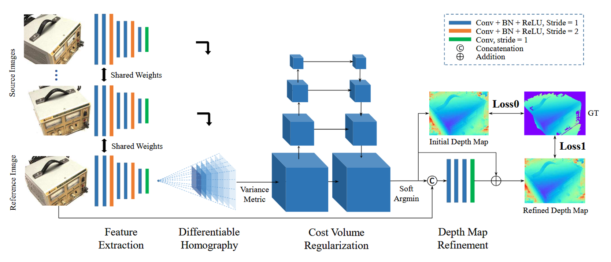
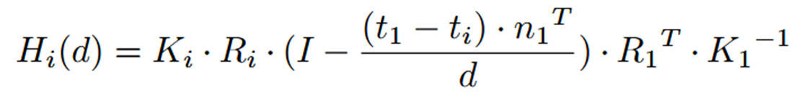
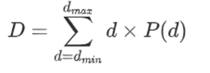
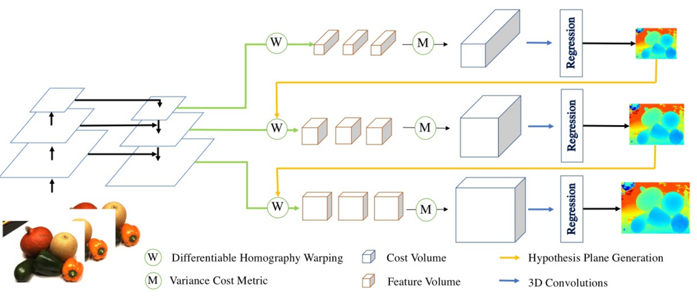
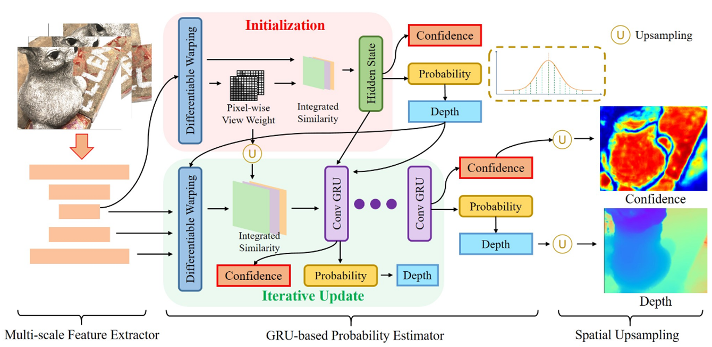
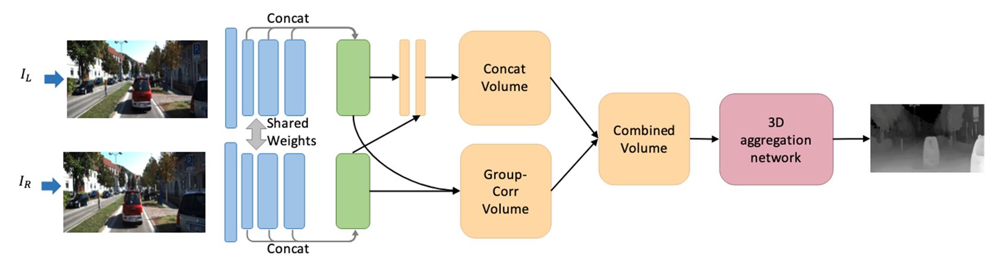
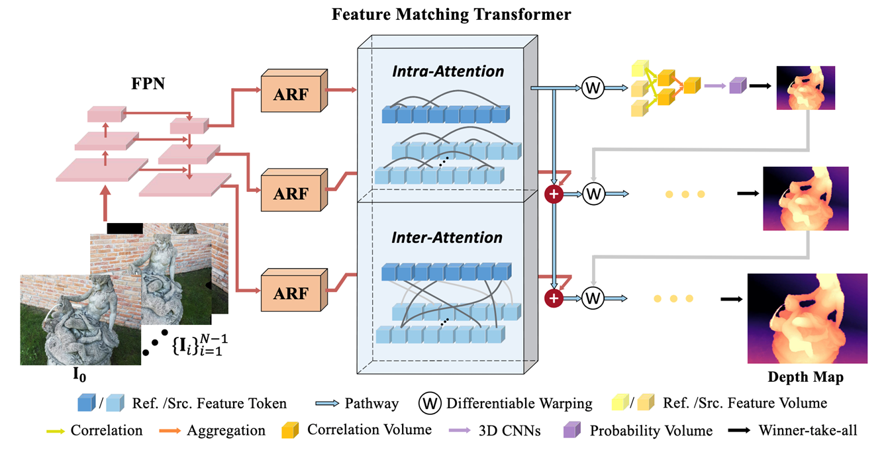
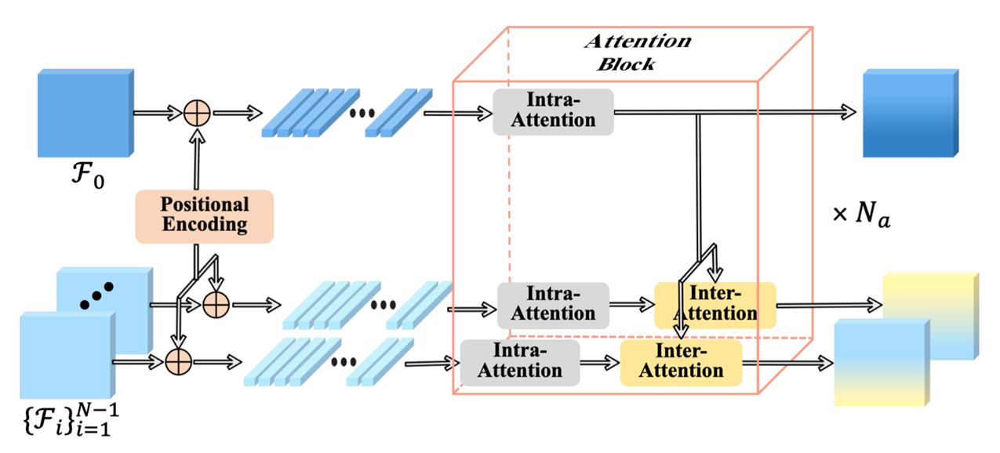
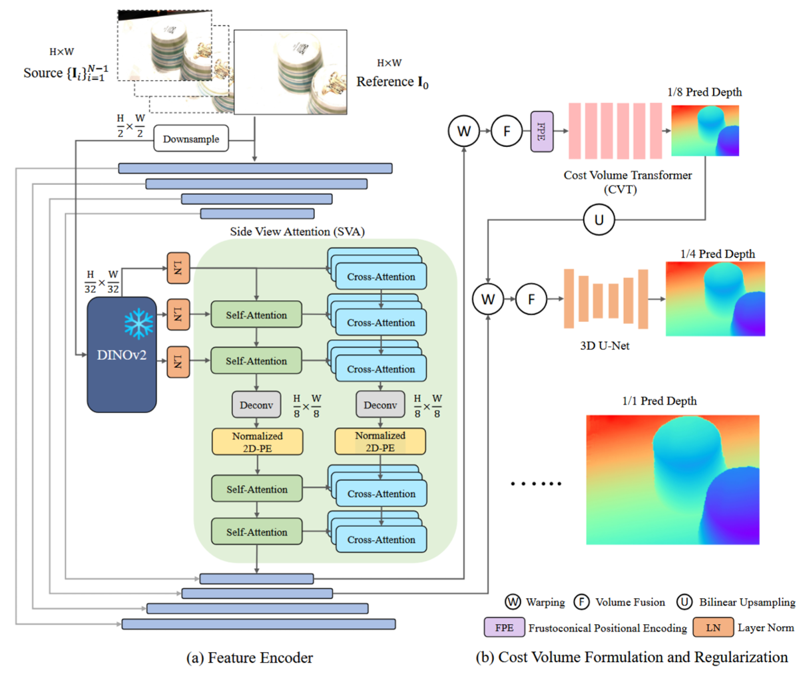
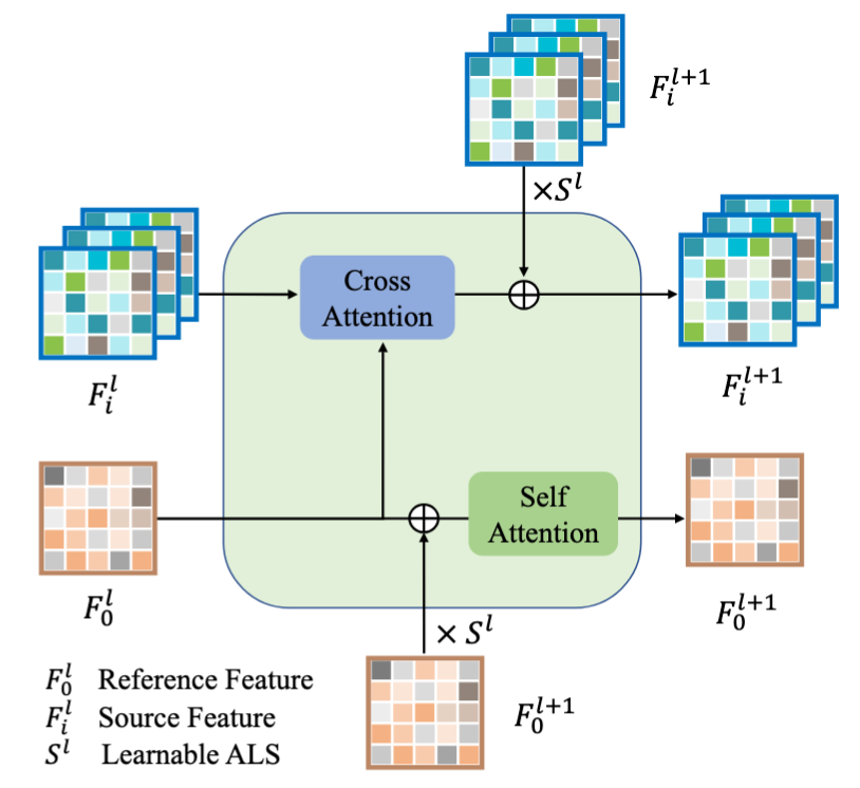

涉及到的文章：

* MVSNet: Depth Inference for Unstructured Multi-view Stereo
* Cascade Cost Volume for High-Resolution Multi-View Stereo and Stereo Matching
* IterMVS: Iterative Probability Estimation for Efficient Multi-View Stereo
* MVSFORMER++: REVEALING THE DEVIL IN TRANSFORMER’S DETAILS FOR MULTI-VIEW STEREO
* Group-wise Correlation Stereo Network
* TransMVSNet: Global Context-aware Multi-view Stereo Network with Transformers

主线是Muti-view Stereo

# Muti-view Stereo

Muti-view Stereo，即多视图几何，主要是解决在已知相机位姿的情况下，怎么从多视角的2D图像，恢复出3D结构的问题。3D结构，指的可以是2D的深度图，稠密的点云，或者三维模型。

在将要介绍的文章当中，MVSNet是MVS的“开山之作”。它提出了标准的MVS pipeline，后续的文章几乎都是在它的基础上进行修改或创新，或者借鉴了MVSNet的主要思想。Cascade Cost volume（CasMVSNet）引入了由粗到细（Coarse to fine）的机制，降低了MVSNet显存使用；IterMVS用基于GRU的循环神经网络，在架构上进行了修改，用时间换取空间，进一步压缩了显存。MVSFormer++则是结合了Transformer架构，解决了弱纹理/高反光的匹配难点，这极大提升了极端场景下的代价体质量。

而GwcNet和TransMVSNet用于辅助理解上述MVS论文中一些重点。其中GwcNet是立体匹配中承上启下的一篇文章，它重新定义了Cost Volume的构建方法（代价组相关）；TransMVSNet是业内首次尝试将Transformer引入到MVS中，推动了MVS领域从纯CNN架构向 Transformer 全局注意力机制的演进。

这里将详细介绍MVSNet，同时一并介绍其他文章解决的问题及创新点。个人理解恐有错误，望理解。

# MVSNet

## 背景

MVSNet其实是对传统立体匹配标准流程的“深度学习化”。在传统的立体匹配中，我们通常使用手工设计的度量标准（如NCC归一化互相关）来计算像素块之间的相似度。但这种手工特征在面对弱纹理、反光或光照剧烈变化的区域时，往往极其脆弱，容易产生错误的匹配代价。到初始代价后，传统方法会使用SGM（半全局匹配）等算法在多个一维方向上进行聚合，以过滤噪声并平滑视差。虽然经典，但 SGM 本质上还是基于人工设定的平滑惩罚项，难以适应复杂的真实 3D 表面。

随着深度学习的发展，SurfaceNet和LSM率先尝试用神经网络解决多视图立体匹配。它们将整个 3D 空间划分成一个个体素（Voxel），把多视角的图像特征投影到这个巨大的3D网格中，然后用3D卷积去分类每个体素是不是物体的表面。这导致显存消耗巨大。同时由于分辨率受限于Voxel的大小，这一组trade-off导致这两种方法不能扩展到大规模重建。

在这个背景下，MVSNet出现了：它结合了平面扫掠（传统几何）和特征提取（深度学习）的方法，放弃了全局体素网格，而以参考相机的视锥体为基础，以可微单应性变换构建出Cost Volume，完成了MVS端到端的实现。

## 模型架构

总体上，MVSNet分为特征提取、单应性变换、代价体正则化、深度图优化几部分。

### 特征提取

传统方法（例如SGM）使用的是原始像素，而MVSNet先用CNN将图像转换为高维特征图。这里用到的是共享权重的特征提取方法，将原图的长宽都缩小为原图的1/4。这一步降采样实际上是为了后续 降显存而做的。

### 可微单应性变换

这一步的目的是将每个source图像的特征通过单应矩阵变换到reference的坐标系，不过这里实际上是$x_i=H_i(d)x_1$，也就是先从reference图像映射到source坐标系下，然后通过逆向映射得到。

在这一步之后，我们可以得到N个[H/4,W/4,D,32]的代价体。其中D是指D个深度平面。这个代价体里面记载的是：这么多像素，在32个特征下，D个深度的每个像素的匹配相似度。

### 代价度量

这里选择使用方差作为代价度量。方差可以直接测量特征差异，比如某个地方被认为两个不同的深度都是正确的，此处方差就会增大，这可以为后续3D CNN提供信息。此处将N个代价体合为一个。

### 代价体正则化

代价体正则化用一个类3D U-Net，让代价体过这个网络，聚合32通道的特征，得到每个像素在不同深度D下的概率。

### Soft Argmin

沿着整条射线，从最近的深度平面到最远的平面的值求期望。

这里没有使用argmax找最大值，因为：这会导致3D重建的结果出现阶梯；同时由于其不可导，不能端到端训练神经网络。

这一步可以使最终的输出为[H/4,W/4,1]，也就是输出参考图的深度图。

不过虽然求期望能实现亚像素精度并且回传梯度，但是如果遇到遮挡或者反光，概率分布变成双峰，那么求期望可能会把深度算到双峰中间。这一步在后续会解决。

### 深度图细化

深度图细化时，用到了残差网络（ResNet）。前面算软期望得到的深度图基本是合格的，但是由于处理过程中感受野较大(H/4,W/4)，生成的深度图中物体的边缘不够锐利，因此想引入原始图改善。

这里用原始图三通道RGB图像进行改善，似乎是直接拼接？

### 后处理

后处理用于构建3D稠密点云，主要方法有深度图滤波和几何融合。

在滤波时，考虑光度一致性和几何一致性。刚刚计算软期望时，无法解决概率双峰的问题。这里使用光度一致性——计算得到的最终结果就近四个点的概率和。如果概率和小于0.8，说明可能是双峰等情况导致概率不在正确的位置，此时直接舍去这个点。几何一致性，即将图像根据计算出的深度进行正向投射和反向投射，像素重投影误差和深度相对误差不得超过阈值。

几何融合时，用到了可见性融合和降噪处理。

降噪处理时，网络会对多个视角算出的3D坐标求均值，使3D点云表面更平滑锐利。

在解决可见性冲突时，系统会沿着相机光心到3D点连成一条射线。如果某个3D点阻挡了大量其他高度确信的射线的视线，这个点会被视为违背了可见性物理规律的点而被强行剔除。

## 讨论

MVSNet在Tanks and Temples数据集上进行了跨数据集零微调实验。不过我个人认为，是因为Tanks and Temples没有提供法线信息或网格表面，因此无法在上面微调MVSNet。这也是这一部分作者主要想说的——数据集一定程度上限制了网络的性能。

## 总结

这篇文章首次提出将传统多视图几何中的“单应性变换（Homography Warping）”设计为完全可微的模块，从而构建出3D代价体积（Cost Volume），实现了传统几何规则与深度学习端到端训练的完美结合。

## 思考

注意到MVSNet在特征提取时进行了降采样，将图片大小降低为原来的1/16，这样一来深度图的分辨率降低。这种方法实际上是针对显存的trade-off，但是为了解决这个低分辨率的问题，后续加上了深度图优化。这个流程是否还可以简化？换言之，不用“降低分辨率”再“提高分辨率”的方法。

单应性变换时，切平面的方法是否可以简化？因为它也是全范围深度平面，且精度根据平面的个数变化。

另外，实际上最终的深度是256个平面取值求期望并优化后的结果。但是它依旧会受到双峰数学特性的影响（优化真的可以完全解决吗）。

# Cascade cost volume

## 背景

MVSNet在单应性变换那一步做的是全局搜索，其显存消耗依旧较大。

同时MVSNet其实拿到的图是降低分辨率之后的图，不够精细，边缘也容易模糊；在深度图细化之后才改善。

## 模型架构

Cascade cost volume用特征金字塔提取32通道特征。从低分辨率开始，依次按照MVSNet的方法进行可微单应性变换、基于方差的代价度量、3D卷积、优化，得到深度图。

得到深度图之后，每个像素相当于有一个基准深度。高一级分辨率就在此基准深度的基础上，远近取几个深度重复上述步骤。也就是说，每个像素都是在自己的深度基础上进行的细化，也就是这篇文章说的Coarse to fine过程。

不过这个方法导致一个问题：如果在低分辨率图处的深度估计有比较大的误差，后续无论如何精细可能都得不到比较准确的深度。

# IterMVS

## 背景

MVSNet的3D代价体积极其消耗显存，Cascade会造成误差累积。

## 模型架构

利用GRU的隐藏状态来压缩、编码全范围的像素深度概率分布（用时间换空间）。

### 隐状态初始化

初始化阶段，网络首先进行逆深度采样，以构建深度假设空间。接着会借鉴GwcNet的思想，利用组相关机制计算参考视图和N-1个源视图的匹配相似度。这些匹配相似度会融合成一个初始的代价体。为了评估每个深度的匹配概率和可靠程度，该代价体会被送入一个2D U-Net进行上下文信息的聚合、平滑和降噪。最后经过几层2D CNN、2倍双线性上采样、tanh激活，生成用于后续循环迭代的初始隐藏状态和初始深度图。

匹配相似度融合：动态评估可靠程度——利用参考视图和每个源视图之间的共视情况和几何一致性，每张源视图出一张权重图。加权求和——利用组相关求出相似度后，应用预测出的空间权重对N-1个源视图进行加权求和。自然地，这避免了遮挡或弱纹理带来的问题（这部分被赋予很低的权重，那么这两张图计算出的相似度就不算数）。

代价体维度变化：

单视图相似度维度：可微单应性变换和组相关计算后（特征分组为G）：N-1个[D,G,H/4,W/4]

融合后初始代价体维度：[D,G,H/4,W/4]

过2D U-Net后：[D,1,H/4,W/4]，即将G个通道特征转化为单一的匹配概率

进隐藏状态：[C,H/2,W/2]

### 迭代优化

FPN特征金字塔提取三个分辨率的特征，然后在1/4空间分辨率聚合（通道维度拼接）。拼接后，特征进入GRU。在GRU中，通道维度为(32+1+N1+N2+N3)，其中32是隐藏状态维度，1是当前迭代中的确切深度值（目标），N代表三个不同分辨率下提取的局部深度假设匹配信息。

在GRU迭代结束后，IterMVS会参考原始分辨率的图像，提取高分辨率的空间特征。对于最后要输出的高清深度图的每一个像素，网络会去低清深度图找邻居点，然后为邻居点赋予权重（可学习）。这可以让网络知道边缘发生了突变，就可以指导图像放大。

最终输出效果较好的深度图。

# Stereo Matching

输入：经过极线校正的左图和右图

输出：一张视差图，根据$Z = \frac{B \cdot f}{d}$可以求出深度图

# GwcNet

## 背景

以往立体匹配网络中全相关容易丢失信息、而纯拼接又导致参数量过大。

直接拼接：提取左图和右图的特征后，直接让特征图在通道维度上拼接在一起（通道数翻倍）。这保留了所有特征信息，但网络必须从零开始学习如何比较左右特征的相似度，参数量巨大。

全相关：提取特征后对特征向量进行内积，得到单通道的相似度分数。这虽然极大降低了参数量，但很多通道压缩成一个数字，网络失去了丰富的特征表达能力。

GwcNet结合两部分，提出分组相关的机制来构建代价空间。

## 模型架构

就是将通道分成G组，每组内部计算相关度，然后再拼接起来进行3D CNN的学习。

# TransMVSNet

## 背景

传统CNN缺乏全局感受野，导致在弱纹理或重复模式区域特征匹配困难。

这里引入特征匹配Transformer（FMT）聚合图像内和图像间的长距离全局上下文信息，并辅以自适应感受野模块（ARF）、跨尺度特征传递路径以及Focal Loss，实现了更鲁棒且高精度的三维重建。

## 模型架构

FPN特征金字塔做特征提取，ARF做连接，FMT做特征强化。所以实际上一直到FMT结束，都是在做特征提取。

### FMT

对于FMT模块，网络先给图片像素加上位置编码，然后参考图和源图都会通过自注意力机制提取各自视角的全局上下文特征；之后，源图通过单向的交叉注意力机制，将源图的信息向参考图进行特征对齐。这种自注意力+交叉注意力的过程会循环多次。

# MVSFormer++

## 背景

现有的机遇Transformer的MVS方法未能针对特征提取和代价体积模块定制注意力机制，以及在测试高分辨率图像时面临的序列“长度外推”与“注意力稀释”难题。

长度外推：早期mooing使用绝对位置编码，或者泛化能力差的相对位置偏置。面对高分辨率时，旧的位置编码机制直接失效，模型无法计算远距离图块之间的空间关系。

注意力稀释：Softmax——真正匹配的像素权重由于“权重总和为1”的要求而分配到非常低的权重，即特征会失去区分度。

MVSFormer++引入侧视图注意力SVA和跨视图几何信息注入预训练的DINOv2中，为代价体正则化设计带有3D截锥位置编码FPE和自适应注意力缩放AAS的代价体机Transformer（CVT）。

## 模型架构

依旧是特征金字塔提取特征，不过添加了SVA做特征强化。

DINOv2进行了降采样，然后特征进行正则化；正则化后的特征输入SVA。

### 侧视图注意力SVA

输入参考视图特征和源视图特征，进行特征强化后依旧输出参考视图特征和源视图特征，实际上只做特征强化的功能。

交叉注意力：参考视图为Query检索源视图，寻找匹配点。

自注意力：仅参考视图这么做，用于补充图像内部的局部上下文。

然后提取DINOv2中的下一层原始深层特征，引入自适应层缩放系数（ALS），将这部分l+1层的全局语义信息平滑地注入融合好的特征中，输出更新后的参考视图特征和源视图特征。

## 特征编码流程

SVA进行隐式的极线匹配，可以有效解决单目视角下的遮挡与无纹理问题。

第一阶段SVA之后，过一个Deconv上采样放大特征分辨率，然后立即用归一化2D-PE重新分配相对空间坐标。之后提高了分辨率的图像再过SVA。最后得到的特征才和FPN拼接。

输出是源视图和参考视图的多通道特征。

## 代价体构建及正则化

首先利用提取好的特征，进行单应性变换、方差计算，得到初始的3D代价体积，然后进行降采样（省显存）。

Transformer会展平张量为一维序列，这样一来会丢失物理空间结构。因此引入FPE（视锥体位置编码），根据真实空间（锥体）提取出代价体的真实3D坐标，投影后加到代价体特征上。

这些特征被送到CVT中，这里特征被展平并进行自注意力计算（正则化过程）；之后对特征进行逐层上采样，恢复到高分辨率。

注意到此处依旧使用了3D U-Net做优化。

# 总结

整个MVS在特征提取、代价体构建、正则化、细化部分值得注意。

特征提取：是一个逐渐”看全局“的过程。开始时没有特征提取，只是对原图进行操作，因此是逐像素比较；由于不参考其他像素很难得到正确的匹配，因此使用CNN进行特征提取，一方面了解其他像素的信息，另一方面从多个维度印证匹配是否正确。然而大面积的弱纹理、反光区域，局部CNN也容易失效，因此采用特征金字塔、Transformer等获得上下文的方法。

代价体构建：是一个逐渐降低显存占用的过程。MVSNet使用穷举法，得到多个D平面；然而这种方法显存占用较高，所以Cascade采用Coarse-to-fine的方法，由粗到细得到深度；更进一步地，IterMVS使用GRU，用时间换空间，进一步降低显存占用。

正则化、细化：多级网络去噪，或者用概率、期望的方法实现亚像素精度。
