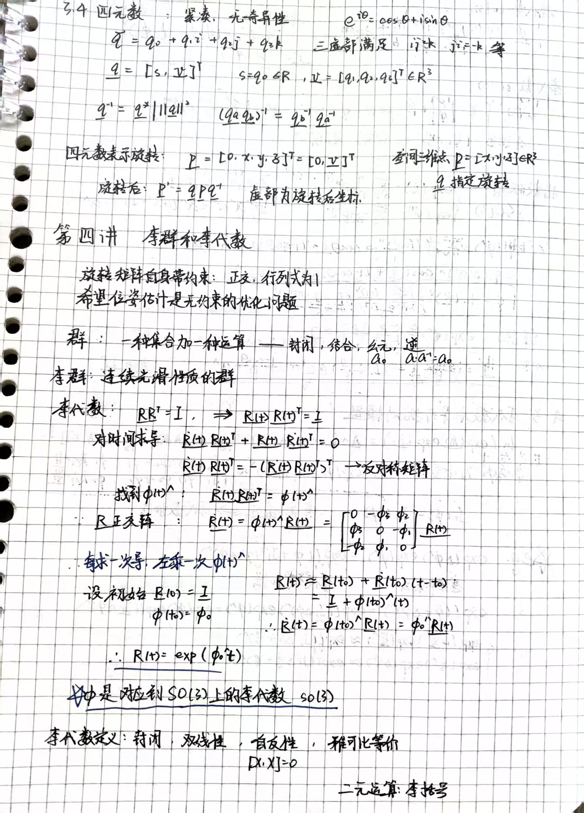
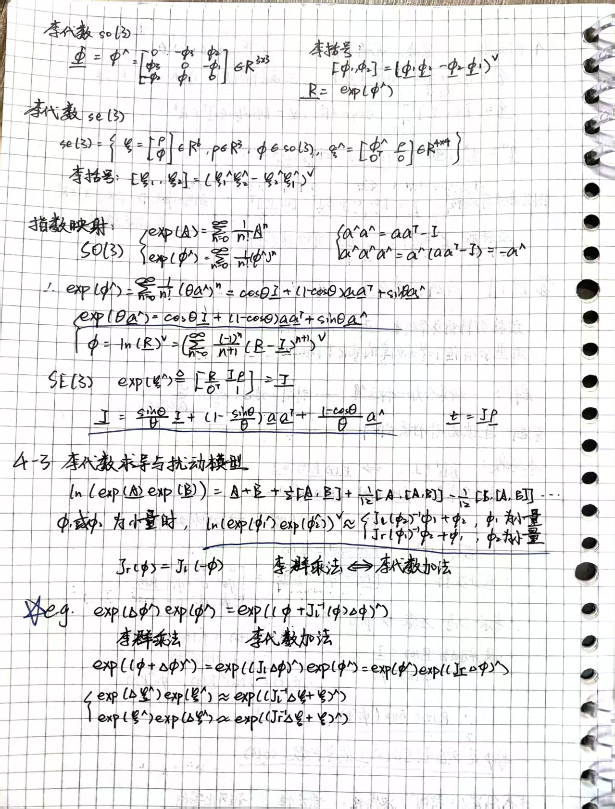
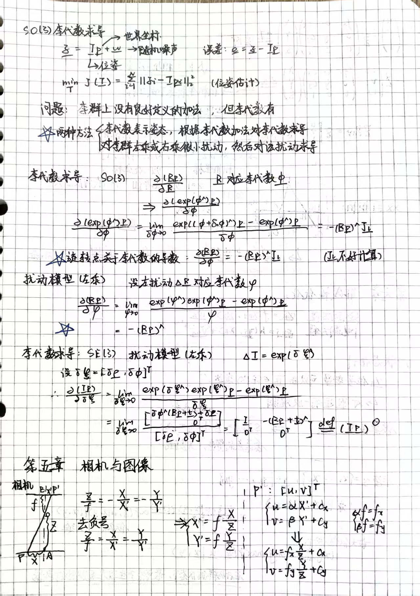
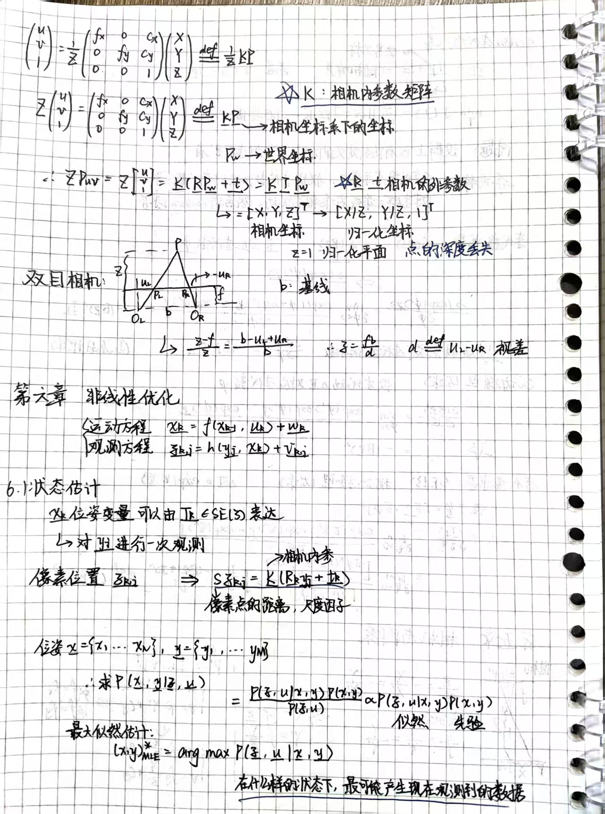
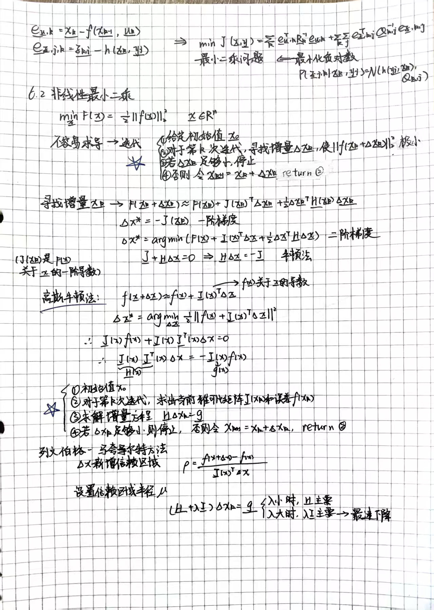

# 《视觉SLAM十四讲》笔记

## 第7讲 视觉里程计 1：特征点法 (Visual Odometry 1: Feature-based Methods)

### 1. 特征点法基础 (Feature Points)

视觉里程计旨在根据相邻图像的信息估计相机的运动。特征点法是主流方法，具有稳定、对光照和动态物体不敏感的优势。

#### 1.1 特征点 (Feature Point)

图像本身由像素组成，直接使用灰度值进行运动估计（直接法）比较困难。特征点是图像中具有代表性的点（如角点、边缘、区块）。

* **组成**：
  * **关键点 (Key-point)**：特征点在图像中的位置，有些还包含朝向、大小等信息。
    * **描述子 (Descriptor)**：描述关键点周围像素信息的向量。原则是“外观相似的特征应有相似的描述子”。
* **特性**：可重复性 (Repeatability)、可区别性 (Distinctiveness)、高效 (Efficiency)、本地性 (Locality)。
* **常见特征**：SIFT（经典但计算量大）、SURF、ORB（实时性好）。

#### 1.2 ORB 特征 (ORB Features)

ORB 是目前 SLAM 中非常流行的实时特征，由 **Oriented FAST** 关键点和 **BRIEF** 描述子组成。

1. **Oriented FAST 关键点**：
    * **FAST 原理**：检测局部像素灰度变化明显的地方。选取像素 $p$，对比周围半径为 3 的圆上 16 个像素。若有连续 $N$ 个点亮度显著不同（大于 $I_p + T$ 或小于 $I_p - T$），则为角点。
    * 改进 (Oriented)**：
        * **尺度不变性**：通过构建**图像金字塔 (Image Pyramid)**，在不同层级检测角点。
        * **旋转不变性**：使用**灰度质心法 (Intensity Centroid)**。计算图像块的质心 $C$ 与几何中心 $O$ 的连线方向，定义为特征点的主方向。

2. **BRIEF 描述子**：
    * 一种二进制描述子。在关键点周围选取 $N$ 对点（如128对），比较像素大小（$p>q$ 取1，反之取0），生成二进制串。
    * **Steered BRIEF**：为了具有旋转不变性，ORB 在计算 BRIEF 前，根据关键点的方向对采样点坐标进行旋转。

3. **特征匹配 (Feature Matching)**：
    * **距离度量**：浮点型描述子（SIFT）用欧氏距离；二进制描述子（ORB）用**汉明距离 (Hamming distance)**（两个二进制串不同位数的个数）。
    * **筛选**：暴力匹配 (Brute-Force) 后，通常会筛选掉距离过大的错误匹配（如距离大于最小距离的2倍）。

---

### 2. 2D-2D: 对极几何 (Epipolar Geometry)

当相机只有单目视角，只知道两组 2D 像素坐标时，如何估计运动？

#### 2.1 对极约束

* **几何关系**：点 $P$、两个相机中心 $O_1, O_2$ 构成**极平面**。极平面与像平面的交线称为**极线**。
* **代数推导**：
    设第一帧坐标为 $x_1$，第二帧为 $x_2$（归一化平面坐标），运动为 $R, t$。
    $x_2 \simeq R x_1 + t$
    两侧同时左乘 $t^{\wedge}$（外积）再左乘 $x_2^T$，得到**对极约束**：
    $x_2^T t^{\wedge} R x_1 = 0$

#### 2.2 本质矩阵 (Essential Matrix, E) 与 基础矩阵 (Fundamental Matrix, F)

* **本质矩阵**：$E = t^{\wedge} R$。包含运动信息。
* **基础矩阵**：$F = K^{-T} E K^{-1}$。包含内参信息。
* **求解 E (八点法)**：
  * $E$ 是 $3 \times 3$ 矩阵，有 9 个未知数，但尺度等价性使其只有 5 个自由度。
  * 利用 8 对匹配点，构建线性方程组 $Ae=0$，利用最小二乘或 SVD 分解求解 $E$。
* **从 E 恢复 R, t**：
  * 对 $E$ 进行 SVD 分解，可得到 4 组 $R, t$ 的解。
  * **验证**：将匹配点代入 4 组解中，只有 1 组解使得点在两个相机中深度都为正（在相机前方）。

#### 2.3 单应矩阵 (Homography, H)

* **适用场景**：特征点共面（如墙壁、地面）或相机发生纯旋转。
* **定义**：$p_2 \simeq H p_1$。
* **求解 (DLT)**：需要 4 对匹配点。
* **退化问题**：当特征点共面时，基础矩阵 $F$ 求解不稳定（退化），应使用 $H$。SLAM 中通常同时计算 $E$ 和 $H$，根据重投影误差选择更好的模型。

#### 2.4 尺度不确定性

单目 SLAM 无法获得绝对尺度（无法区分模型变大还是相机移动变远）。通常将 $t$ 归一化（长度设为1），导致整个轨迹和地图的尺度也是未知的。初始化的两帧需有一定平移。

---

### 3. 三角测量 (Triangulation)

在求出相机运动 $R, t$ 后，需要估计特征点的深度（3D坐标）。

* **原理**：利用两个视角的射线交汇点确定空间位置。
* **方法**：求解线性方程 $s_2 x_2 = s_1 R x_1 + t$。由于噪声，射线通常不相交，需用最小二乘法求解。
* **矛盾**：
  * **平移过小**：三角化角度极小，深度不确定性大（深度滤波器难以收敛）。
  * **平移过大**：图像外观变化大，导致特征匹配失败。

---

### 4. 3D-2D: PnP (Perspective-n-Point)

已知一组 3D 点（世界坐标或前一帧坐标）和它们在当前帧的 2D 投影，求解相机姿态 ($R, t$)。

* **适用**：双目/RGB-D SLAM，或单目 SLAM 初始化之后（已有地图点）。
* **优势**：无需对极约束，匹配点少（最少3对）。

#### 4.1 直接线性变换 (DLT)

* 将 $s u_i = K [R|t] P_i$ 展开，消去 $s$，构建线性方程组。
* 需要 6 对匹配点求解 12 个未知数（忽略了 $R$ 的约束），最后再投影回 $SE(3)$。

#### 4.2 P3P (3点法)

* 利用余弦定理，利用 3 对匹配点计算出 3D 点在当前相机坐标系下的坐标。
* 将 PnP 问题转化为 3D-3D 点对齐问题（ICP）。
* 仅利用了 3 个点的信息，受噪声影响大。

#### 4.3 最小化重投影误差 (Bundle Adjustment, BA)

这是目前最通用的非线性优化方法。

* **目标**：寻找 $R, t$，使得 3D 点投影位置与观测到的 2D 像素位置之差（重投影误差）的平方和最小。
    $\min_{T} \frac{1}{2} \sum_{i=1}^{n} \| u_i - \frac{1}{s_i} K T P_i \|_2^2$
* **求解**：使用高斯牛顿法或列文伯格-马夸特法。需要计算**误差关于位姿的雅可比矩阵**。
* **雅可比推导**：
  * 使用李代数扰动模型。
  * 最终得到 $2 \times 6$ 的矩阵，描述了像素坐标变化与相机位姿增量 $\delta \xi$ 的关系。
  * 该过程也可以同时优化 3D 点坐标（全 BA）。

---

### 5. 3D-3D: ICP (Iterative Closest Point)

已知两组 3D 点（例如 RGB-D 前后帧），估计运动。

#### 5.1 SVD 方法 (线性代数解法)

1. **去质心**：计算两组点的质心，将坐标平移到质心为原点。
2. **计算旋转 R**：构造矩阵 $W = \sum q_i q_i'^T$，对 $W$ 进行 SVD 分解 ($W=U\Sigma V^T$)，则 $R = UV^T$。
3. **计算平移 t**：$t = p - R p'$。

* 此方法有解析解，速度快。

#### 5.2 非线性优化方法

* 类似于 PnP 的 BA，但误差项是 **3D 点到 3D 点的欧氏距离**。
* 构建最小二乘问题，迭代求解。

---

### 6. 实践与编程 (Code Implementation Highlights)

本章提供了大量的 OpenCV 和 C++ 手写代码示例：

1. **特征提取与匹配**：使用 `cv::ORB` 或手写 `ComputeORB`（包含 SSE 加速）。
2. **位姿估计 (2D-2D)**：
    * `cv::findEssentialMat` + `cv::recoverPose`。
    * `cv::findHomography`。
3. **三角测量**：`cv::triangulatePoints`。
4. **PnP (3D-2D)**：
    * `cv::solvePnP` (支持 EPNP, DLS, ITERATIVE 等方法)。
    * **手写 BA**：使用 **g2o** 库进行图优化。定义顶点（相机位姿 VertexPose）和边（重投影误差 EdgeProjection），计算雅可比矩阵。
5. **ICP (3D-3D)**：
    * 手写 SVD 方法（使用 Eigen 库）。
    * 使用 g2o 进行非线性优化（定义 EdgeProjectXYZRGBDPoseOnly）。

### 7. 总结 (Summary)

* **2D-2D**：单目初始化，利用对极几何（本质矩阵 $E$ 或单应矩阵 $H$），恢复 $R, t$（尺度不确定）。
* **3D-2D**：已知地图点（PnP），利用 BA 优化位姿，精度高，是 SLAM 前端主要方法。
* **3D-3D**：RGB-D 或双目，利用 ICP（SVD 或优化），不需要解算深度，直接对齐点云。
* **三角化**：单目/双目中恢复深度。

这是一份关于《视觉SLAM十四讲》第8讲（视觉里程计2）的详细学习笔记。本章主要探讨了为了克服特征点法（Feature-based）的缺点（计算耗时、忽略图像大部分信息）而提出的替代方案：**光流法（Optical Flow）**和**直接法（Direct Method）**。

---

## 第8讲 视觉里程计2：光流与直接法

### 1. 为什么需要直接法？（引出）

传统的特征点法（如ORB-SLAM）虽然占据主流地位，但存在以下缺点：

1. **计算耗时：** 关键点的提取和描述子的计算非常耗时（例如ORB在CPU上需要约20ms）。
2. **信息丢弃：** 只保留了特征点，丢弃了图像中绝大部分可能有用的纹理和边缘信息。
3. **纹理依赖：** 在弱纹理场景（如白墙、空走廊）下无法提取足够的特征点，导致系统失效。

**解决思路：**

* **保留特征点，但这计算描述子：** 使用**光流法**跟踪特征点的运动。
* **完全不计算关键点和描述子：** 根据图像的像素灰度信息，直接计算相机运动，称为**直接法**。

---

### 2. 2D 光流（Optical Flow）

光流描述了像素在图像间随时间运动的过程。在SLAM中，最常用的是**稀疏光流**，以**Lucas-Kanade (LK) 光流**为代表。

#### 2.1 灰度不变假设

LK光流法的基础假设是：**同一个空间点的像素灰度值，在各个图像中是固定不变的。**
$I(x, y, t) = I(x+dx, y+dy, t+dt)$

#### 2.2 LK 光流推导

对上述假设进行泰勒展开并保留一阶项，得到**光流约束方程**：
$I_x u + I_y v + I_t = 0$
其中：

* $I_x, I_y$ 是图像在 $x, y$ 方向的梯度。
* $I_t$ 是灰度随时间的变化量。
* $u, v$ 是像素在 $x, y$ 轴上的运动速度（即我们需要求解的量）。

由于一个方程无法解两个未知数（$u, v$），LK光流引入了**局部窗口假设**：假设某一个窗口（如 $w \times w$）内的所有像素具有相同的运动。
这样就得到了一个超定线性方程组，可以通过**最小二乘法**求解：
$\begin{bmatrix} I_x & I_y \end{bmatrix}_k \begin{bmatrix} u \\ v \end{bmatrix} = -I_{tk}$
最终解为：
$\begin{bmatrix} u \\ v \end{bmatrix} = -(A^T A)^{-1} A^T b$

#### 2.3 多层光流（金字塔）

LK光流基于泰勒展开，只有在**运动较小**（满足线性假设）时才成立。当相机运动较快导致像素位移较大时，单层LK会失效。
**解决方案：图像金字塔（Coarse-to-fine）**

1. 对图像进行降采样，建立金字塔（顶层分辨率最低）。
2. 在顶层计算光流（此时大运动在低分辨率下变成了小运动）。
3. 将上一层的解作为下一层的初始值，逐层向下细化。

---

### 3. 直接法（Direct Method）

光流法只跟踪了像素位置，最后还需通过对极几何或PnP求解相机位姿。而直接法**直接根据像素亮度信息估计相机位姿**。

#### 3.1 核心思想

直接法最小化**光度误差（Photometric Error）**，而不是特征点法中的重投影误差。
$e = I_1(p_1) - I_2(p_2)$
目标是寻找相机位姿 $T$（李代数 $\xi$），使得两张图像中对应像素的灰度差的平方和最小：
$\min_{T} J(T) = \sum_{i=1}^{N} || I_1(p_{1,i}) - I_2(p_{2,i}) ||^2$

#### 3.2 导数推导

为了优化目标函数，需要推导误差 $e$ 相对于李代数 $\xi$ 的雅可比矩阵。利用链式法则：
$\frac{\partial e}{\partial \xi} = \frac{\partial I_2}{\partial u} \cdot \frac{\partial u}{\partial q} \cdot \frac{\partial q}{\partial \xi}$
雅可比矩阵由三部分组成：

1. **像素梯度：** $\frac{\partial I_2}{\partial u}$，即图像在 $u, v$ 处的梯度。
2. **投影导数：** $\frac{\partial u}{\partial q}$，像素坐标对空间点坐标的导数。
3. **变换导数：** $\frac{\partial q}{\partial \xi}$，变换后的空间点对李代数的导数。

最终得到的雅可比矩阵是一个 $2 \times 6$ 的矩阵，用于高斯牛顿法迭代。

#### 3.3 直接法的分类

根据使用像素的数量，直接法分为三类：

1. **稀疏直接法（Sparse）：** 仅使用数百个特征点（如FAST角点，但不需要描述子）。速度最快，但依赖角点。
2. **半稠密直接法（Semi-Dense）：** 使用图像中梯度明显的像素（如边缘）。可以重构出环境的轮廓。
3. **稠密直接法（Dense）：** 使用所有像素。计算量极大，通常需要GPU加速，但可以重建完整地图。

---

### 4. 直接法的优缺点讨论

#### 4.1 优点

1. **省时：** 省去了计算特征点和描述子的时间。
2. **适用性广：** 只要有像素梯度即可工作，不需要特征点（在只有边缘或渐变的场景下也能工作）。
3. **可稠密化：** 可以构建半稠密或稠密地图，这是特征点法做不到的。

#### 4.2 缺点

1. **非凸性（Non-convexity）：** 图像灰度是非凸函数，容易陷入局部极小值。因此直接法非常依赖**良好的初值**（通常假设相机运动平滑或使用金字塔）。
2. **单个像素区分度低：** 单个像素容易混淆，通常需要使用小的图像块（Patch）来计算光度误差。
3. **灰度不变假设脆弱：** 容易受**光照变化**（自动曝光、环境光变化）影响。如果光照变化剧烈，直接法会完全失效。

---

### 5. 实践总结

* **OpenCV LK光流：** 提供了 `cv::calcOpticalFlowPyrLK`，使用方便，能达到毫秒级跟踪速度。
* **实现细节：**
  * 在实现直接法时，通常使用**逆向光流（Inverse Compositional）**技巧来减少Hessian矩阵的重复计算。
  * **金字塔**对于处理大运动是必须的。
  * 在求解雅可比时，如果点投影到了图像边界外，需要丢弃该点。
* **对比结果：** 演示实验显示，直接法在不提取任何特征点的情况下，通过随机选取带有梯度的像素点，即可准确跟踪相机运动并恢复深度。

---
**核心公式记忆：**

* **光流约束：** $\nabla I \cdot \delta p + I_t = 0$
* **直接法目标：** $\min \sum || I_ref(p) - I_cur(T \cdot p) ||^2$

这是一份基于《视觉SLAM十四讲（第2版）》第9讲“后端 1”内容的详细总结笔记。这一章主要从理论到实践，讲解了SLAM后端的状态估计问题，从传统的滤波器方法过渡到现代主流的非线性优化（BA）方法。

---

## 第9讲 后端 1：从理论到实践

### 9.1 概述与状态估计的概率解释

后端（Back-end）的主要任务是处理前端产生的带有噪声的观测数据，通过优化算法估计机器人的轨迹（位姿）和地图（路标点）。

#### 1. 状态估计的两种思路

* **渐进式（Incremental）：** 也就是**滤波器**方法。根据当前时刻的观测，更新上一时刻的状态。仅保持当前状态的估计，适合实时性要求高但计算资源有限的场景。
* **批量式（Batch）：** 也就是**优化**方法。把一段时间内（甚至所有时间）的数据拿来进行整体优化。可以利用历史信息，通常精度更高。即所谓的**SfM（Structure from Motion）**或**BA（Bundle Adjustment）**。

#### 2. 概率解释

SLAM过程由运动方程和观测方程描述：

* **运动方程：** $x_k = f(x_{k-1}, u_k) + w_k$
* **观测方程：** $z_{k,j} = h(y_j, x_k) + v_{k,j}$

根据贝叶斯法则，后验概率（Posterior）成正比于似然（Likelihood）乘以先验（Prior）：
$P(x|z) \propto P(z|x) P(x)$
我们希望最大化后验概率（MAP），在假设噪声为高斯分布的情况下，MAP等价于**最小二乘问题**。

#### 3. 线性系统与KF（卡尔曼滤波）

如果是**线性高斯系统**，卡尔曼滤波（Kalman Filter, KF）构成了该系统的最优无偏估计。
KF分为两个步骤：

1. **预测（Prediction）：** 根据运动方程，从上一时刻状态推断当前时刻的先验分布（均值和协方差变大）。
2. **更新（Update）：** 根据观测方程，计算卡尔曼增益（$K$），结合观测数据修正先验，得到后验分布（不确定性减小）。

#### 4. 非线性系统与EKF（扩展卡尔曼滤波）

SLAM中的运动和观测通常是非线性的。EKF通过在工作点附近进行**一阶泰勒展开（线性化）**，将非线性系统近似为线性系统，然后应用KF公式。

* **线性化：** 需要计算雅可比矩阵（$F$ 为运动方程雅可比，$H$ 为观测方程雅可比）。
* **EKF的局限性：**
    1. **马尔可夫假设：** 假设状态只与前一时刻有关，无法利用很久之前的信息（如回环检测）。
    2. **线性化误差：** 一阶泰勒展开只在局部有效，非线性强时误差大，容易发散。
    3. **计算与存储：** 需要存储和维护状态量的均值和协方差矩阵。在路标点很多（Visual SLAM）的情况下，协方差矩阵（$P$）维度巨大且稠密，存储和求逆变得不可行。

---

### 9.2 BA与图优化

由于EKF在视觉SLAM中的局限性，现代SLAM更多采用基于非线性优化的**光束法平差（Bundle Adjustment, BA）**。

#### 1. 投影模型与BA代价函数

BA的本质是最小化重投影误差。

* **过程：** 世界坐标 $p$ $\rightarrow$ 相机坐标 $P'$ $\rightarrow$ 归一化平面 $P_c$ $\rightarrow$ 去畸变 $\rightarrow$ 像素坐标 $u,v$。
* **误差项：** 观测到的像素坐标 $z$ 与根据当前位姿和路标计算出的投影 $h(T, p)$ 之间的差。
* **目标函数：** 最小化所有时刻、所有路标点的误差平方和：
    $\min \frac{1}{2} \sum_{i} \sum_{j} || z_{ij} - h(T_i, p_j) ||^2$

#### 2. BA的求解与稀疏性

这是一个非线性最小二乘问题，通常使用高斯-牛顿法（G-N）或列文伯格-马夸尔特法（L-M）求解。核心在于求解增量方程：
$H \Delta x = g$
其中 $H \approx J^T J$。

* **H矩阵的稀疏结构：**
  * 雅可比矩阵 $J$ 是稀疏的，因为一个误差项 $e_{ij}$ 只与一个相机位姿 $T_i$ 和一个路标点 $p_j$ 有关。
  * $H$ 矩阵呈现**箭头形（Arrowhead）**或**块状结构**：
    * **左上角 $B$：** 相机位姿之间的关系（对角块矩阵，因为不同时刻相机在观测方程中无直接联系）。
    * **右下角 $C$：** 路标点之间的关系（对角块矩阵，因为路标点之间无直接联系）。
    * **右上/左下 $E$：** 相机与路标点的关联（非零块，表示该相机看到了该路标）。

#### 3. Schur消元（舒尔补）与边缘化（Marginalization）

直接对巨大的 $H$ 矩阵求逆（维度为 相机数+路标数）是不现实的，尤其是路标点数量成千上万时。
利用 $H$ 的特殊结构，可以使用 **Schur消元** 来加速求解：

1. **消元：** 先消去路标点变量 $\Delta x_p$。
2. **降维：** 得到一个只关于相机位姿增量 $\Delta x_c$ 的线性方程组：
    $(B - E C^{-1} E^T) \Delta x_c = v - E C^{-1} w$
    * 由于 $C$ 是对角块矩阵，$C^{-1}$ 非常容易计算。
    * 方程组维度大大降低（仅与相机数量相关）。
3. **求解：** 解出 $\Delta x_c$ 后，再代回原方程求解 $\Delta x_p$。

**物理意义：** Schur消元在SLAM中被称为**边缘化（Marginalization）**。$S = B - E C^{-1} E^T$ 矩阵虽然比原 $H$ 小，但其稀疏性通常会被破坏（变得稠密），这对应着因为共视了相同的路标点，不同相机位姿之间产生了约束。

#### 4. 鲁棒核函数（Robust Kernel）

* **问题：** 最小二乘法对**外点（Outliers）**非常敏感。错误的匹配会导致巨大的误差平方，从而拉偏整个优化结果。
* **解决：** 使用鲁棒核函数（如 **Huber Kernel**）代替平方误差。
  * 当误差小的时候，保持平方增长（二范数）。
  * 当误差大的时候，变为线性增长（一范数），降低外点对梯度的影响，防止系统发散。

---

### 9.3 & 9.4 实践：使用Ceres和g2o求解BA

本节通过使用 BAL（Bundle Adjustment in the Large）数据集，演示了如何使用两个主流优化库来求解BA问题。

#### 1. Ceres Solver

* **特点：** Google开发的C++库，广泛用于优化问题，支持自动求导（Auto Diff）。
* **实现步骤：**
    1. 定义**代价函数结构体（Functor）**：实现投影模型，计算残差。利用模板类支持自动求导。
    2. 构建 `ceres::Problem`。
    3. 添加残差块 `AddResidualBlock`：传入代价函数、核函数（如HuberLoss）、待优化变量（相机参数、路标点）。
    4. 配置 `ceres::Solver::Options`：关键是设置线性求解器类型为 `SPARSE_SCHUR`，以利用H矩阵的稀疏性加速。
    5. 调用 `ceres::Solve`。

#### 2. g2o (General Graph Optimization)

* **特点：** 基于图优化的库，直观地用“顶点（Vertex）”表示变量，“边（Edge）”表示约束。
* **实现步骤：**
    1. **定义顶点：**
        * 相机顶点（如 `VertexPoseAndIntrinsics`）：存储9维数据（旋转、平移、焦距、畸变）。
        * 路标顶点（如 `VertexPoint`）：存储3维坐标。
    2. **定义边：**
        * 投影边（如 `EdgeProjection`）：连接相机和路标，计算重投影误差，提供解析雅可比（也可以用数值导数，但解析导数更快）。
    3. **构建图：**
        * 设置求解器（BlockSolver），并选择线性求解器（LinearSolverCSparse/Cholmod）。
        * 添加顶点和边。
    4. **关键设置：** 必须手动对路标点顶点调用 `v->setMarginalized(true)`。这告诉g2o在求解时先边缘化掉这些点（使用Schur消元），否则计算极其缓慢。
    5. 调用 `optimizer.optimize`。

---

### 9.5 总结与重点回顾

1. **从EKF到BA：** 视觉SLAM由于路标点众多且非线性强，不再适合用EKF存储稠密协方差矩阵。BA（图优化）利用了问题的**稀疏性**，成为了主流。
2. **稀疏性是核心：** BA之所以能实时或近实时运行，完全依赖于 $H$ 矩阵的稀疏结构（箭头形）。
3. **Schur消元（边缘化）：** 这是解BA的数学技巧，通过先消去路标点，将大规模方程组转化为小规模的相机位姿方程组求解。
4. **鲁棒性：** 在优化中必须引入鲁棒核函数（如Huber）来对抗误匹配带来的外点干扰。
5. **库的选择：**
    * **Ceres：** 接口友好，自动求导极其方便，适合快速验证和建模。
    * **g2o：** 需要手动定义顶点和边（通常需要推导雅可比），但在SLAM领域应用极广，图的结构更符合SLAM的直观理解。

## 第10讲 后端 2：大规模SLAM的优化策略与位姿图

### 10.1 滑动窗口滤波和优化 (Sliding Window Filter & Optimization)

#### 1.1 为什么要控制规模？

在长期的SLAM过程中，关键帧和路标点的数量会不断增加。如果一直进行全量的BA（Bundle Adjustment），计算量会随时间增长，导致无法满足实时性要求。因此，必须限制后端的计算规模。

#### 1.2 滑动窗口法 (Sliding Window)

* **基本思路**：仅保留离当前时刻最近的 $N$ 个关键帧，去掉时间上更早的关键帧。优化被固定在一个“窗口”内。
* **共视结构**：也可以根据共视关系（Covisibility Graph）选择与当前帧有共视关系的关键帧进行优化，而非仅仅按时间截取。

#### 1.3 边缘化 (Marginalization) 与 稀疏性 (Sparsity)

* **边缘化的概念**：当我们删除一个旧的关键帧（或路标）时，不能直接丢弃它，因为它携带了关于剩余状态的先验信息。我们需要将其“边缘化”，将其信息转化为剩余变量的**先验分布**。
* **Fill-in（填入）问题**：
  * 在图优化（BA）中，Hessian矩阵（$H$）通常是稀疏的（只有相关联的变量间才有非零块）。
  * 边缘化操作（Schur消元）会将原本不相连的变量关联起来（因为它们都曾与被删除的变量有关联）。
  * 这导致 $H$ 矩阵的对应部分变稠密（Dense），破坏了稀疏性结构，称为 **Fill-in**。
* **后果**：随着边缘化的进行，线性方程组求解变慢。
* **策略**：为了保持稀疏性，实际工程（如OKVIS）中通常会选择丢弃某些导致严重Fill-in的观测信息（即不边缘化那些连接了太多路标点的帧，或者直接丢弃观测），这是一种在精度和计算效率之间的权衡。
* **SWF vs. 优化**：滑动窗口滤波（SWF）通常指保留边缘化后的先验信息（固定了线性化点），类似EKF；而现代的滑动窗口优化通常会在新窗口内重新线性化以提高精度。

---

### 10.2 位姿图 (Pose Graph)

#### 2.1 位姿图的意义

* 在BA中，特征点的数量远大于位姿节点。经过若干次优化后，特征点位置往往已经收敛。
* **思路**：为了进一步提升效率，可以**不再优化特征点位置**，将其视为固定约束。我们只关心相机位姿（Pose）之间的关系。
* **定义**：
  * **节点 (Nodes)**：相机位姿 $T_1, \dots, T_n$。
  * **边 (Edges)**：两个位姿之间的相对运动估计 $T_{ij}$（来源于特征匹配、IMU积分或回环检测）。
* 这种仅包含位姿节点和二元边的图优化称为**位姿图优化**。

#### 2.2 位姿图优化的数学推导

我们需要构建最小二乘问题来优化位姿。

1. **误差定义**：
    设节点 $i, j$ 之间的测量值为 $T_{ij}$，估计值为 $T_i, T_j$。
    理想情况下满足：$T_{ij} = T_i^{-1} T_j$。
    李代数形式的误差项 $e_{ij}$ 定义为：
    $e_{ij} = \ln(T_{ij}^{-1} T_i^{-1} T_j)^\vee$
    这表示测量值与估计值之间在李代数上的差异。

2. **目标函数**：
    $\min \frac{1}{2} \sum_{i,j \in \mathcal{E}} e_{ij}^T \Sigma_{ij}^{-1} e_{ij}$
    其中 $\Sigma_{ij}$ 是测量噪声的协方差矩阵。

3. **雅可比矩阵 (Jacobian) 推导**：
    为了使用高斯-牛顿法或列文伯格-马夸特法，需要求误差对状态变量（李代数 $\delta \xi_i$ 和 $\delta \xi_j$）的导数。
    * 利用 **BCH近似** 和伴随性质（Adjoint property）。
    * 书中详细推导了左扰动模型或右扰动模型下的近似形式。
    * 关于 $T_i$ 的雅可比（近似）：
        $\frac{\partial e_{ij}}{\partial \delta \xi_i} \approx - \mathcal{J}_r^{-1}(e_{ij}) \text{Ad}(T_j^{-1})$
    * 关于 $T_j$ 的雅可比（近似）：
        $\frac{\partial e_{ij}}{\partial \delta \xi_j} \approx \mathcal{J}_r^{-1}(e_{ij}) \text{Ad}(T_j^{-1})$
    * **注意**：$\mathcal{J}_r^{-1}$ 在误差接近0时可近似为 $I$（单位阵），或使用一阶近似 $I + \frac{1}{2}[\phi]^\wedge$。

---

### 10.3 实践：位姿图优化 (g2o Implementation)

本节演示了如何使用 g2o 对一个仿真生成的球形轨迹（Sphere）进行位姿图优化。

#### 3.1 场景描述

* 数据文件：`sphere.g2o`。
* 包含 2500 个位姿节点（Vertex），形成了球体表面的轨迹。
* 包含里程计边和回环边，并在真值上添加了噪声。
* 初始状态下，轨迹因为累积误差变得不再闭合和光滑。

#### 3.2 方法一：使用 g2o 原生位姿图 (Native g2o)

g2o 库自带了处理李代数位姿的顶点和边，可以直接调用。

* **顶点 (Vertex)**：`g2o::VertexSE3`。内部使用四元数（Quaternion）和平移向量表示，而非直接使用李代数。
* **边 (Edge)**：`g2o::EdgeSE3`。连接两个顶点，测量值为相对位姿。
* **代码流程**：
    1. 初始化 BlockSolver 和 LinearSolver (使用 Cholmod 或 CSparse)。
    2. 读取 `.g2o` 文件，识别 `VERTEX_SE3:QUAT` 和 `EDGE_SE3:QUAT`。
    3. 将顶点和边添加到 Optimizer 中。
    4. 执行 `optimizer.optimize()`。
* **结果**：优化后的轨迹恢复成了规则的球形，误差显著下降。

#### 3.3 方法二：使用李代数自定义顶点和边 (Custom Lie Algebra)

为了深入理解理论，书中演示了如何使用 **Sophus** 库定义的李代数来实现 g2o 的顶点和边。

* **自定义顶点 `VertexSE3LieAlgebra`**：
  * 继承自 `g2o::BaseVertex<6, SE3d>`。
  * 内部存储 `Sophus::SE3d _estimate`。
  * 更新函数 `oplusImpl`：使用左乘扰动模型 `_estimate = SE3d::exp(upd) * _estimate`。

* **自定义边 `EdgeSE3LieAlgebra`**：
  * 继承自 `g2o::BaseBinaryEdge<6, SE3d, Vertex, Vertex>`。
  * **误差计算 `computeError`**：实现公式 $e = \ln(T_{meas}^{-1} T_1^{-1} T_2)^\vee$。
  * **雅可比计算 `linearizeOplus`**：
    * 书中使用了 $J \approx J_r^{-1}$ 的近似形式。
    * 代码中实现了一个叫做 `JRInv` 的函数来计算右雅可比的逆（或者简单近似为 $I$）。
    * 分别计算对节点 $i$ 和节点 $j$ 的雅可比矩阵。

* **结果分析**：
  * 使用自定义李代数也能达到相同的收敛效果。
  * 展示了从数学公式到代码实现的完整映射过程。
  * 实验表明，即便使用近似的雅可比（$J_r^{-1} \approx I$），在误差较小时也能很好地收敛。

---

### 章节小结

1. **后端瓶颈**：全量BA难以满足长时间运行的实时性需求。
2. **解决方案**：
    * **滑动窗口**：通过边缘化处理旧状态，但需注意Fill-in导致的稀疏性破坏。
    * **位姿图 (Pose Graph)**：由于特征点收敛快，后期可以忽略路标点优化，仅优化相机轨迹。这是目前主流SLAM后端（如ORB-SLAM2/3的Loop Closing）常用的手段。
3. **实践**：通过 g2o 既可以使用内置的高效类型，也可以自定义基于李代数的类型来验证理论推导。该例子（球形轨迹）形象地展示了回环检测和优化如何消除累积漂移。

## 第11讲 回环检测 (Loop Closure Detection)

### 1. 概述与意义

#### 1.1 回环检测的意义

* **消除漂移（Drift）：** 前端视觉里程计（VO）仅通过相邻帧估计运动，存在不可避免的累积误差。随着时间推移，估计轨迹与真实轨迹的偏差会越来越大。
* **构建全局一致性地图：** 回环检测通过识别“曾经来过的地方”，在位姿图中添加长距离的约束边（如 $x_1 \sim x_{100}$），将拉伸或扭曲的轨迹“拉”回正确位置，从而得到全局一致的地图和轨迹。
* **重定位：** 在跟丢（Lost）的情况下，回环检测模块可用于确定当前相机在地图中的位置。

#### 1.2 检测方法

* **基于里程计（Odometry based）：** 通过判断当前位置是否接近之前的某个位置。
  * *缺点*：累积误差大时，估计的位置本身就不准，导致无法正确判断（“鸡生蛋，蛋生鸡”的问题）。
* **基于外观（Appearance based）：** 仅根据两幅图像的相似性来判断。
  * *优点*：独立于位姿估计，能有效消除累积误差。这是目前视觉SLAM的主流做法。

---

### 2. 准确率与召回率 (Precision & Recall)

#### 2.1 相似性评分

核心问题是计算图像 A 和 B 的相似度 $s(A, B)$。直接相减（像素差）不可靠，受光照和视角影响大。

* **感知偏差 (Perceptual Aliasing)：** 不同的地方看起来很像（假阳性）。
* **感知变异 (Perceptual Variability)：** 同一个地方在不同时刻看起来不一样（假阴性）。

#### 2.2 评价指标

借用机器学习的分类指标：

* **TP (True Positive)：** 是回环，且被检测出来（真阳性）。
* **FP (False Positive)：** 不是回环，但被误报为回环（假阳性，感知偏差）。
* **TN (True Negative)：** 不是回环，且被判定为不是（真阴性）。
* **FN (False Negative)：** 是回环，但没检测出来（假阴性，感知变异）。

公式：

* **准确率 (Precision)：** $P = \frac{TP}{TP + FP}$ （检测出的回环中有多少是真的）
* **召回率 (Recall)：** $R = \frac{TP}{TP + FN}$ （真实的回环中有多少被检测出来）

#### 2.3 SLAM中的特殊要求

* **Precision > Recall：** 在SLAM中，**准确率至关重要**。
  * 一旦出现 FP（错误的闭环），会给后端优化带来错误的强约束，导致地图完全崩溃。
  * FN（漏掉的回环）是可以接受的，只是未能消除某次累积误差，代价较小。
* 通常要求极高的准确率（如接近100%），在此基础上尽量提升召回率。

---

### 3. 词袋模型 (Bag-of-Words, BoW)

为了有效描述图像并计算相似度，SLAM中广泛使用词袋模型。

#### 3.1 基本原理

1. **特征提取：** 对图像提取特征点（如ORB）。
2. **字典构建 (Clustering)：** 将大量图像的特征点进行聚类（如K-means），聚类的中心即为“单词 (Word)”。
3. **图像描述：** 每幅图像由它包含的“单词”集合来描述（忽略单词顺序，只看有无或频率），形成一个向量。

#### 3.2 字典的生成 (K-ary Tree)

为了解决海量特征点的查找效率问题（如 $N$ 个特征点聚类成 $k$ 类），通常使用**K叉树（K-ary Tree）**结构：

* **层次聚类：**
    1. 在根节点对所有样本进行 K-means 聚类，得到 $k$ 个中心（第一层）。
    2. 对属于每个中心的样本集再次进行 K-means 聚类。
    3. 重复 $d$ 次（深度为 $d$），叶子节点即为最终的“单词”。
* **容量：** 字典总容量为 $k^d$。
* **查找：** 查找某个特征点对应的单词时，只需逐层比对，复杂度为对数级别 $O(d)$。

#### 3.3 相似度计算 (TF-IDF)

为了区分单词的重要性，引入 TF-IDF 权重：

* **IDF (Inverse Document Frequency，逆文档频率)：**
  * 思想：如果在所有图像中某单词出现极多（如“蓝天”、“地面”），则其区分度低，权重应低。
  * 公式：$IDF_i = \log \frac{n}{n_i}$ （$n$为总图像数，$n_i$为包含单词$i$的图像数）。
* **TF (Term Frequency，词频)：**
  * 思想：某单词在当前图像中出现次数多，说明该图像与该单词相关性高。
  * 公式：$TF_i = \frac{n_i}{n}$ （这里$n_i$为单词在图中出现次数，$n$为该图总单词数）。
* **权重：** $\eta_i = TF_i \times IDF_i$。

基于加权后的向量，通常使用 **L1范数** 形式计算两幅图像 $A$ 和 $B$ 的相似度分数。

---

### 4. 实验与实践 (DBoW3)

书中通过代码演示了如何使用 `DBoW3` 库：

1. **训练字典：** 输入多张图像的特征点，生成字典文件（.yml.gz）。
    * *注意：* 字典规模越大，区分度越好，但计算量越大。演示中使用10张图生成的小字典容易过拟合（区分度低），实际中需用大规模数据集训练。
2. **相似度比较：**
    * 将图像转化为 BoW 向量。
    * 计算两两之间的 Score。
    * 结果显示：真实回环的图像对（如第1帧和第10帧）得分较高。
3. **数据库查询：** 可以建立数据库，输入新图像时，快速返回数据库中相似度最高的几帧。

---

### 5. 关键帧处理与验证

单纯依靠 BoW 得分是不够的，还需要后续策略：

#### 5.1 相对相似度评分

* 绝对分数（Raw Score）受环境纹理丰富度影响大。
* **归一化策略：** 将当前帧与候选帧的得分 $S(v_t, v_{t_j})$，除以当前帧与上一关键帧的得分 $S(v_t, v_{t-\Delta t})$。
* 若比值超过一定阈值（如3倍），则认为可能是回环。

#### 5.2 时间与空间一致性

* **时间一致性：** 避免在极短时间内连续检测回环（相邻帧本身就很像）。
* **回环簇：** 真正的回环通常会连续出现（如 $n$ 匹配 $1$， $n+1$ 匹配 $2$）。

#### 5.3 几何验证 (Geometrical Verification) —— **关键步骤**

BoW 只能提供“看起来很像”的候选帧，必须进行几何验证以剔除误报：

1. **特征匹配：** 对当前帧和回环候选帧进行特征匹配。
2. **RANSAC PnP/ICP：** 尝试解算位姿变换。
3. **判断内点：** 如果能找到足够多的内点（Inliers）支持该运动模型，才认定为有效回环。

* 这一步是从单纯的“图像检索”上升到“SLAM回环”的把关环节。

---

### 6. 与机器学习的关系

* 回环检测本质上是一个**模式识别/分类**问题。
* BoW 可视为一种“浅层”的无监督学习（K-means聚类）。
* **发展趋势：** 深度学习（Deep Learning）正在逐渐取代传统人工特征。
  * 使用卷积神经网络（CNN）提取特征。
  * 使用 NetVLAD 等方法构建更鲁棒的描述子，应对光照变化和视角变化。

### 7. 总结

本章构建了完整的视觉回环检测知识体系：从**为什么要回环（消除累积误差）**，到**怎么做（词袋模型）**，再到**细节优化（TF-IDF、几何验证）**，最后通过代码实践（DBoW3）加深理解。核心思想是利用图像内容的统计特征来识别“旧地重游”，并利用严格的几何校验保证系统的鲁棒性。

## 第 12 讲：建图 (Mapping)

### 12.1 概述

SLAM 的两个目标是定位（Localization）和建图（Mapping）。之前的章节主要关注稀疏特征点地图，这对于定位足够，但对于导航、避障和交互来说远远不够。

#### 地图的用途与分类

1. **定位**：稀疏路标地图（特征点）即可满足，主要用于矫正机器人位置。
2. **导航**：需要知道哪里可以通过，哪里是障碍物。通常需要**稠密地图**（如栅格地图）。
3. **避障**：关注局部的、动态的障碍物，需要以传感器为中心的稠密数据。
4. **重建**：用于向人展示、通信或虚拟现实，要求美观、舒适，通常需要带纹理的稠密模型。
5. **交互**：语义地图（Semantic Map），让机器人理解“这是桌子”、“那是报纸”。

**结论**：稠密地图是本章重点。根据需求不同，地图形式分为稀疏路标、点云、网格（Mesh）、八叉树（Octomap）、TSDF 等。

---

### 12.2 单目稠密重建 (Monocular Dense Reconstruction)

单目相机无法直接获取深度，需要通过移动相机产生的视差来估计深度（类似于双目，但基线是动态的）。

#### 12.2.1 立体视觉原理

* **核心问题**：给定第一帧图像中的某像素，如何找到其在第二帧图像中的对应位置？
* **极线搜索 (Epipolar Search)**：根据极几何，对应点一定在第二帧的极线上。我们不需要在全图搜索，只需在极线上搜索。
* **块匹配 (Block Matching)**：单个像素亮度不稳定，通常比较像素周围的小块（如 $5 \times 5$ 窗口）。

#### 12.2.2 相似性度量

为了在极线上找到最相似的块，常用的度量方法：

1. **SAD** (Sum of Absolute Difference)：绝对差之和。
2. **SSD** (Sum of Squared Distance)：平方和。
3. **NCC** (Normalized Cross Correlation)：**归一化互相关**。
    * NCC 值在 $[-1, 1]$ 之间，接近 1 表示最相似。
    * **优点**：对光照变化具有鲁棒性（因为去除了均值并归一化）。

#### 12.2.3 深度滤波器 (Depth Filter)

由于单次测量有噪声，需要融合多次观测结果。

* **假设**：像素深度 $d$ 服从高斯分布 $P(d) = N(\mu, \sigma^2)$。
* **融合策略**：当新数据到来时，计算新的深度观测值及其不确定性，然后通过高斯乘积公式更新原有的分布（卡尔曼滤波的变种）。
* **不确定性分析**：
  * 几何关系决定了不确定性的大小。
  * 基线越宽，不确定性越小；物体离得越远，不确定性越大。
  * 极线与像素梯度夹角的影响：如果纹理梯度与极线平行，匹配不确定性极大（无法确定在极线上的具体位置）。

#### 12.2.4 实践中的问题与改进

1. **像素梯度问题**：
    * 块匹配依赖图像纹理。
    * **梯度与极线垂直**时，匹配最准确。
    * **梯度与极线平行**时，匹配不确定性大（从概率密度函数看呈现扁平状）。
2. **逆深度 (Inverse Depth)**：
    * 深度值在远处可能趋于无穷大，难以用高斯分布描述。
    * **逆深度** $d^{-1}$ 更符合高斯分布假设，且能够表达无穷远点（逆深度为0），在工程中更常用。
3. **图像变换**：
    * 相机移动会导致图像发生透视变换，简单的块匹配假设（图像块不变）失效。
    * **解决方案**：根据估计的平面法向量，对参考帧的图像块进行仿射变换或单应性变换（Warping），再与当前帧匹配。
4. **并行化**：每个像素的深度估计是独立的，非常适合使用 **GPU** 加速。

---

### 12.3 实验：单目稠密重建

书中提供了一个 C++ 程序（`dense_mapping.cpp`），演示了以下过程：

1. 读取图像序列和位姿。
2. 对每个像素进行极线搜索和 NCC 匹配。
3. 使用三角测量计算深度。
4. 更新深度滤波器（均值和方差）。
5. 结果分析：平坦区域（弱纹理）和物体边缘（深度不连续）容易出现错误。

---

### 12.4 RGB-D 稠密建图

RGB-D 相机直接提供深度，建图主要关注**数据结构**的选择和地图的**组织形式**。

#### 12.4.1 点云地图 (Point Cloud Map)

* **方法**：根据相机位姿，将 RGB-D 数据转换为 3D 点，并拼接在一起。
* **缺点**：
    1. 规模巨大，占用大量内存。
    2. 无序，包含大量冗余和噪声。
    3. 只是“点”，没有“面”的信息，无法进行物理碰撞检测。
* **处理**：使用外点移除滤波器（Statistical Outlier Removal）和体素滤波器（Voxel Grid）进行降采样。

#### 12.4.2 网格地图 (Mesh Map)

* **目的**：将点云转化为三角网格（Mesh），用于渲染和物理模拟。
* **方法**：
  * 移动最小二乘（MLS）平滑点云。
  * 贪婪投影三角化（Greedy Projection Triangulation）构建网格。
  * **Surfel (Surface Element)**：一种以面元为基础的地图表达，比单纯的点云更高级，适合做融合。

#### 12.4.3 八叉树地图 (OctoMap)

* **背景**：解决点云地图占用空间大且无法表达“被占据”和“空闲”状态的问题。
* **结构**：
  * 将 3D 空间递归划分为 8 个小立方体。
  * 叶子节点存储状态（占据/空闲/未知）。
  * 分辨率可调，节省内存（空闲区域不需要细分）。
* **概率更新 (Log-odds)**：
  * 使用对数几率（Logit）来更新节点被占据的概率。
  * $y = \log(\frac{p}{1-p})$。
  * 观测到占据就加一个值，观测到空闲就减一个值。
* **优点**：灵活、压缩率高、适合导航。

---

### 12.5 TSDF 地图与 Fusion 系列

这是一类基于 GPU 的实时三维重建技术（如 KinectFusion）。

* **TSDF (Truncated Signed Distance Function)**：截断符号距离函数。
  * 不直接存储“占据”，而是存储**距离最近表面的距离**。
  * 距离为 0 表示在表面上，正值表示在表面前，负值表示在表面后。
  * 通过加权平均融合多帧数据，能有效平滑噪声，得到非常光滑的表面。
* **特点**：通常需要 GPU 加速，不仅用于建图，还可以反过来优化相机位姿（Frame-to-Model tracking），比 Frame-to-Frame 更稳健。
* **相关工作**：KinectFusion, DynamicFusion, ElasticFusion 等。

---

### 12.6 小结

1. **单目稠密建图**：是个难点。利用极线搜索和块匹配（NCC）估计深度，利用深度滤波器（高斯分布/逆深度）收敛深度值。计算量大，通常需 GPU。
2. **RGB-D 建图**：相对容易。
    * **点云**：最基础，可视化好，但费内存，无结构。
    * **八叉树 (OctoMap)**：小巧，适合导航，能区分“空”和“未知”。
    * **网格 (Mesh/Surfel)**：适合渲染和物理交互。
    * **TSDF**：适合高质量实时重建（Fusion类算法）。

## 第13讲 实践：设计SLAM系统

### 1. 工程实现的意义与框架

#### 1.1 为什么要单独列工程章节？

* **理论与实践的差距**：就像玩《我的世界》（Minecraft），拥有方块（理论/算法）并不等于能造出宏伟的建筑（SLAM系统）。
* **工程挑战**：初学者往往能理解公式，但难以写出可用的程序。工程实现涉及大量“非核心”但至关重要的细节，如数据管理、线程同步、错误处理、关键帧选择等。
* **目标**：设计一个极简但结构完整的双目视觉里程计（Stereo VO）框架。

#### 1.2 工程框架设计

作者基于Linux下的标准C++工程规范来组织代码结构：

* **`bin/`**：存放编译好的可执行文件。
* **`include/myslam/`**：存放头文件（`.h`），建议使用命名空间（如`myslam`）防止冲突。
* **`src/`**：存放源代码（`.cpp`）。
* **`test/`**：测试脚本。
* **`config/`**：配置文件（如相机参数、数据集路径）。
* **`cmake_modules/`**：CMake的第三方库查找文件（如G2O）。

**选择双目系统的原因**：

1. 双目相机不需要像单目那样进行复杂的初始化（尺度不确定性）。
2. 可以直接测量深度，实现效果比单目更稳定。

---

### 2. 核心数据结构

SLAM本质上是处理数据流的过程。本章定义了以下核心类，利用 C++11 的智能指针（`shared_ptr`, `weak_ptr`）进行内存管理，并使用 `mutex` 保证线程安全。

#### 2.1 基本单元

1. **Frame (帧)**
    * **定义**：基本的数据处理单元，对应某一时刻的一对图像。
    * **属性**：ID、时间戳、位姿（`SE3`）、图像（左右目）、特征点集合。
    * **技术细节**：
        * 使用 `std::mutex` 保护位姿数据的读写（因为前端读取，后端由于优化会修改）。
        * 区分是否为关键帧（KeyFrame）。
2. **Feature (特征)**
    * **定义**：图像中的2D特征点。
    * **属性**：2D位置、所属的 Frame（`weak_ptr`）、关联的 MapPoint（`weak_ptr`）、是否为异常点（outlier）。
    * **技术细节**：持有 Frame 的弱引用，防止与 Frame 形成循环引用导致内存泄漏。
3. **MapPoint (路标点/地图点)**
    * **定义**：空间中的3D点。
    * **属性**：3D位置（`Vec3`）、被观测次数、关联的 Features 列表。
    * **技术细节**：同样需要 `mutex` 保护其位置数据的读写。

#### 2.2 地图管理 (Map 类)

* **功能**：管理所有的关键帧和路标点。
* **策略 - 激活窗口（Active Window）**：
  * 为了保持实时性，系统并不总是优化所有数据。
  * **Active Keyframes**：只保留最近的 N 个（如7个）关键帧用于后端优化。
  * **Active MapPoints**：由激活关键帧观测到的路标点。
  * 旧的关键帧会被移出“激活”列表，但在全图中保留（用于回环检测或保存），但在本简易版中主要关注局部窗口优化。

---

### 3. 前端实现 (Frontend)

前端的目标是计算相邻帧的运动，并建立局部地图。

#### 3.1 状态机设计

前端通过一个状态机来管理流程：

1. **Initialization (初始化)**：
    * 双目匹配，三角化生成初始3D点。
    * 构建初始地图。
2. **Tracking (追踪)**：
    * 利用上一帧结果预测当前位姿。
    * **光流法 (LK Flow)**：直接从上一帧图像追踪特征点到当前帧，不需要重新提取描述子和匹配，速度快。
    * **位姿估计**：使用 PnP 或 G2O 仅优化当前帧位姿。
3. **Lost (丢失)**：当追踪到的点过少时进入丢失状态（本章代码主要处理重置）。

#### 3.2 关键帧策略

* 当追踪到的内点（Inliers）数量少于一定阈值，或者运动幅度较大时，将当前帧设为**关键帧**。
* **新关键帧处理**：
    1. 提取新的特征点（GFTT等）。
    2. 进行双目匹配（在右图中找对应点）。
    3. 三角化生成新的 MapPoints。
    4. 将新关键帧和新点加入 Map。
    5. **触发后端优化**。

---

### 4. 后端实现 (Backend)

后端在一个单独的线程中运行，负责优化局部地图（Local BA），提高精度。

#### 4.1 线程与同步

* 后端线程处于挂起状态，通过 `std::condition_variable` 等待前端的触发信号（`map_update_`）。
* 一旦收到信号，后端获取“激活”的关键帧和路标点进行优化。

#### 4.2 优化逻辑 (G2O)

* **顶点 (Vertices)**：
  * 相机位姿（KeyFrame Poses）。
  * 路标点坐标（MapPoint Positions）。
* **边 (Edges)**：
  * 重投影误差边（Reprojection Error）。
  * 包含左目观测和右目观测。
* **鲁棒核函数**：使用 Huber 核函数，降低外点（错误匹配）对优化的影响。

#### 4.3 外点剔除策略

后端不仅优化数值，还负责清洗数据：

1. 执行一次优化。
2. 计算每条边的卡方误差（Chi2 Error）。
3. 如果误差超过阈值，将该观测（Feature）标记为 outlier。
4. 在下一次迭代中排除这些 outlier，提高地图质量。

---

### 5. 实验结果与总结

#### 5.1 运行效果

* **数据集**：Kitti 数据集（00序列）。
* **可视化**：能够看到相机轨迹随着运动不断延伸，同时周围有一圈“激活”的特征点（红色）和关键帧。
* **性能**：
  * 非关键帧处理极快（约16ms）。
  * 关键帧处理稍慢（因为要提取特征、三角化、触发优化）。
  * 由于限制了后端优化的规模（只优化最近的帧），内存和计算量不会随时间无限增长，适合长时间运行。

#### 5.2 关键知识点回顾

1. **程序 = 数据结构 + 算法**：设计好 Frame, Feature, MapPoint 是基础。
2. **双线程模型**：
    * **前端**：重实时性，用光流快速追踪，负责插入关键帧。
    * **后端**：重精度，慢速运行，负责非线性优化（BA）和剔除误匹配。
3. **内存管理**：正确使用 `shared_ptr` 和 `weak_ptr` 避免循环引用。
4. **工程技巧**：
    * 使用 Mutex 锁保护共享数据。
    * 将复杂功能拆解为小函数。
    * 配置参数文件化（yaml），便于调参。

#### 5.3 局限性与扩展

书中实现的系统是一个精简版骨架（Skeleton），存在以下改进空间（也是课后习题方向）：

* **回环检测**：当前系统没有回环模块，累积误差无法消除。
* **地图保存**：没有实现地图序列化保存功能。
* **初始化鲁棒性**：完全依赖第一帧成功初始化。
* **特征提取**：目前使用的是简单的角点+光流，光照变化大时容易失败。

---

**总结**：本章通过手写一个 mini-SLAM 系统，将之前学的“零散方块”搭建成了一个“小房子”，让读者从代码层面深刻理解了 SLAM 系统中前端与后端的数据流转和交互逻辑。

## 第 14 讲 SLAM：现在与未来 - 笔记总结

本章作为全书的总结，回顾了 SLAM 发展的历史与现状，评估了典型的开源方案，并对未来的研究方向（如多传感器融合、语义 SLAM 等）进行了展望。

### 14.1 当前的开源方案

在 SLAM 研究中，论文往往只介绍了 20% 的理论，剩下的 80% 都在代码实现中。作者选取了具有代表性的开源方案进行点评。

#### 1. MonoSLAM (2007)

* **地位**：第一个实时的单目视觉 SLAM 系统，由 A. J. Davison 提出，具有里程碑意义。
* **方法**：基于 **扩展卡尔曼滤波 (EKF)** 后端。
* **特点**：
  * 以前端非常稀疏的特征点作为观测。
  * 状态量包含相机当前状态和所有路标点，更新均值和协方差。
  * 以“概率椭球”形式表达特征点的不确定性（如书中图 14-1 所示）。
* **局限**：应用场景很窄，路标数量有限，特征点容易丢失，且随着地图扩大计算量增长快。目前开发已停止。

#### 2. PTAM (Parallel Tracking and Mapping, 2007)

* **地位**：视觉 SLAM 发展过程中的重要事件，Klein 等人提出。
* **核心创新**：
    1. **双线程架构**：首次实现了**跟踪（Tracking）**与**建图（Mapping）**的并行化。跟踪需要实时，而地图优化可以在后台慢速进行。
    2. **非线性优化**：第一个使用**非线性优化（Bundle Adjustment）**而非滤波器作为后端的方案，引入了关键帧（Keyframe）机制。
* **演示**：展示了酷炫的 AR 效果（在平面上放置虚拟物体）。
* **局限**：场景小，跟踪容易丢失。

#### 3. ORB-SLAM (2015)

* **地位**：现代 SLAM 系统中做得非常完善、易用的系统之一，代表了**特征点法**的主流高峰。PTAM 的继承者。
* **核心架构**：
  * **三线程结构**：
        1. **Tracking**：实时跟踪特征点，粗略估计位姿。
        2. **Local Mapping**：局部 BA 优化，精细化位姿和特征点。
        3. **Loop Closing**：回环检测（基于 Bag of Words）与全局位姿图优化。
  * **通用性**：支持单目、双目、RGB-D 三种模式。
  * **特征点**：全流程使用 **ORB 特征**（计算快、具有旋转缩放不变性）。
* **优点**：代码清晰，注释完善；具有良好的泛用性；具备重定位和回环检测能力，能保证全局一致性。
* **缺点**：
  * 每帧计算 ORB 特征耗时，CPU 负担重。
  * 建图为**稀疏点云**，仅能满足定位需求，无法提供导航、避障或交互功能。

#### 4. LSD-SLAM (2014)

* **地位**：**直接法**在单目 SLAM 中的成功应用。
* **特点**：
  * **直接法**：针对像素梯度进行计算，不计算特征点描述子。
  * **半稠密建图**：构建梯度明显的像素位置（边缘或纹理处），地图信息量远多于稀疏点云。
  * 可在 CPU 上实时运行。
* **优点**：对特征缺失区域不敏感；对运动模糊不敏感。
* **缺点**：对相机内参和曝光非常敏感；相机快速运动时易丢失；回环检测仍依赖特征点法。

#### 5. SVO (Semi-direct Visual Odometry, 2014)

* **地位**：**半直接法**视觉里程计。
* **方法**：结合了特征点与直接法。
  * 提取稀疏关键点（不计算描述子）。
  * 像直接法一样利用关键点周围的小块（4x4）信息估计相机运动（光流法思想）。
  * 引入了深度滤波器的概念（高斯-均匀混合分布）。
* **优点**：**速度极快**（低端平台也能实时，PC 上可达 100+ FPS）。适用于无人机、手持 AR/VR。
* **缺点**：
  * 主要是视觉里程计（VO），缺乏后端的闭环检测和重定位。
  * 主要针对无人机俯视场景设计（平视时容易丢失）。
  * 为了速度舍弃了部分精度和全局一致性。

#### 6. RTAB-MAP

* **特点**：RGB-D SLAM 中经典的集成方案。
* **功能**：集成了视觉里程计、基于词袋的回环检测、后端优化、点云及三角网格地图生成。
* **应用**：在 ROS 中应用广泛，集成度高，适合作为应用开发的基础，而非研究。

---

### 14.2 未来的 SLAM 话题

SLAM 的未来发展主要分为两大类趋势：

1. **轻量化、小型化**：在嵌入式、手机、无人机等设备上高效运行。
2. **高性能、智能化**：利用 GPU 和深度学习，实现精密重建和场景理解。

#### 14.2.1 视觉 + 惯性导航 (VIO)

这是目前应用背景最强、工业界最关注的方向。

* **互补性**：
  * **相机**：容易受运动模糊、光照、遮挡影响，且单目无法恢复绝对尺度。
  * **IMU (惯性测量单元)**：频率高（可达 1000Hz），不受环境图像影响，能测绝对尺度（加速度）；但在静止或慢速时有漂移（Drift），积分误差发散快。
  * **融合**：IMU 弥补相机在快速运动或图像无效时的缺陷；相机弥补 IMU 的长期漂移。
* **融合框架**：
  * **松耦合 (Loosely Coupled)**：分别计算，结果再融合。
  * **紧耦合 (Tightly Coupled)**：IMU 状态与相机状态合并，共同构建运动和观测方程（如 MSCKF, OKVIS, VINS-Mono）。
* **现状**：VIO 有效解决了单目尺度和快速运动问题，是实现小型化、低成本 SLAM 的关键。

#### 14.2.2 语义 SLAM (Semantic SLAM)

将 SLAM 与深度学习（物体识别、分割）结合。

* **现状痛点**：传统 SLAM 看到的只是“点”或“像素”，不知道物体是什么（Blind to the world）。
* **结合方式**：
    1. **语义帮助 SLAM**：
        * 提供物体级约束，构建带标签的地图。
        * 识别动态物体（人、车）并剔除，提高鲁棒性。
        * 利用语义信息进行更智能的回环检测。
    2. **SLAM 帮助语义**：
        * 利用多视角几何约束，自动生成带标签的样本数据，减少人工标注成本。
        * 加速分类器的训练。
* **趋势**：从几何重建走向场景理解。

#### 14.2.3 其他未来方向

* **基于线/面特征的 SLAM**：在低纹理的人造环境（室内）中比点特征更稳定。
* **动态场景下的 SLAM**：解决现实世界中物体移动对定位的干扰。
* **多机器人 SLAM**：多机协作建图与定位。
* **鲁棒性提升**：在各种光照、天气、干扰下的全天候运行能力。

### 总结

SLAM 技术已经建立了一套相对完善的理论框架（前端+后端+回环），但尚未出现能够完全覆盖所有场景的“完美”方案。未来的研究将致力于让 SLAM 系统在更复杂的环境（动态、低纹理、大规模）中更稳健地运行，并具备理解环境的能力。

# 《视觉SLAM十四讲》

## 第一部分：数学基础与预备知识 (第1-6讲)

### 第1-2讲：预备知识与初识SLAM

* **什么是SLAM？**
  * **定位 (Localization)**：我在哪里？（位置和姿态）
  * **建图 (Mapping)**：周围环境长什么样？
  * **传感器**：
    * **单目相机 (Monocular)**：结构简单，但无法直接获得深度（尺度不确定性）。
    * **双目相机 (Stereo)**：通过视差计算深度，计算量大，室内外皆可。
    * **RGB-D相机**：直接获得深度（物理测量），适合室内，易受光照干扰。
* **SLAM经典框架**：
    1. **传感器信息读取**：图像采集。
    2. **前端 (Frontend) / 视觉里程计 (VO)**：估算相邻图像间的运动。
    3. **后端 (Backend) / 优化**：消除累计误差（闭环检测前），处理噪声。
    4. **回环检测 (Loop Closure)**：判断是否回到过原点，用于全局修正。
    5. **建图**：构建度量地图（稀疏/稠密）或拓扑地图。
* **编程环境**：
  * 强烈建议使用 **Linux (Ubuntu)**。
  * 构建工具：**CMake** (书中有详细教程，必须掌握)。
  * IDE推荐：KDevelop 或 CLion (你会C++的话上手很快)。

### 第3讲：三维空间刚体运动 (重点：几何)

* **核心问题**：如何描述机器人在空间中的移动（旋转+平移）？
* **旋转的表示**：
  * **旋转矩阵 (Rotation Matrix)**：$3 \times 3$ 正交矩阵，行列式为1。属于 $SO(3)$ 群。缺点是参数多（9个），有冗余。
  * **变换矩阵 (Transformation Matrix)**：引入齐次坐标，将旋转和平移合并为 $4 \times 4$ 矩阵。属于 $SE(3)$ 群。
  * **旋转向量 (Rotation Vector)**：用一个向量表示旋转轴和旋转角。
  * **欧拉角 (Euler Angles)**：Roll/Pitch/Yaw。直观，但有**万向锁 (Gimbal Lock)** 问题，不适合插值和迭代。
  * **四元数 (Quaternion)**：用4个数表示旋转。紧凑、无奇异性，是工程中（如ROS、Unity）最常用的表示法。
* **代码实践**：**Eigen** 库。这是C++中处理矩阵运算的标准库，必须熟练使用。

### 第4讲：李群与李代数 (重点：微积分)

* **为什么要引入李代数？**
  * SLAM中需要对相机位姿求导来优化误差。
  * 旋转矩阵 $R$ 不具备加法封闭性（两个旋转矩阵相加不是旋转矩阵），很难直接求导。
  * 李代数 $\mathfrak{so}(3)$ 将旋转矩阵映射到向量空间，使得我们可以使用**加法**和**导数**。
* **核心映射**：
  * **指数映射 (exp)**：从李代数（向量）$\rightarrow$ 李群（矩阵）。
  * **对数映射 (log)**：从李群 $\rightarrow$ 李代数。
* **BCH公式**：描述了两个矩阵指数之积与指数之和的关系，是推导雅可比矩阵的基础。
* **扰动模型**：这是本书推荐的求导方式。不直接对 $R$ 求导，而是对 $R$ 左乘（或右乘）一个微小扰动 $\Delta R$，看结果的变化。
* **代码实践**：**Sophus** 库。专门用于处理李群李代数的库。

### 第5讲：相机与图像

* **针孔相机模型**：
  * **世界坐标系 $\rightarrow$ 相机坐标系**：通过外参 ($R, t$) 变换。
  * **相机坐标系 $\rightarrow$ 像素坐标系**：通过内参矩阵 $K$ (包含焦距 $f_x, f_y$ 和光心 $c_x, c_y$)。
  * 公式：$Z P_{uv} = Z [u, v, 1]^T = K (R P_w + t)$。
* **畸变**：径向畸变（桶形、枕形）和切向畸变。
* **双目与RGB-D**：
  * 双目：$z = \frac{f \cdot b}{d}$ ($b$为基线，$d$为视差)。
  * RGB-D：直接输出深度图。
* **点云拼接**：将图像像素结合深度信息，逆向投影到3D空间形成点云。
* **代码实践**：**OpenCV**。图像处理的基础。

### 第6讲：非线性优化 (重点：后端核心)

* **状态估计问题**：已知观测数据和运动数据，求机器人的轨迹和地图。
* **最小二乘法**：将SLAM问题转化为“最小化误差平方和”的问题。
  * $x^* = \arg\min F(x) = \frac{1}{2} \sum ||f_i(x)||^2$
* **求解方法**：由于是非线性问题，无法直接解方程，需要迭代求解。
  * **梯度下降法**：容易走出锯齿路线。
  * **牛顿法**：需要计算海塞矩阵 (Hessian)，计算量太大。
  * **高斯-牛顿法 (G-N)**：用 $J^TJ$ 近似 $H$ 矩阵。
  * **列文伯格-马夸尔特法 (L-M)**：引入阻尼因子，在梯度下降和高斯牛顿之间切换，更鲁棒。
* **代码实践**：**Ceres** 和 **g2o**。
  * **Ceres**：Google出品，通用非线性优化库，语法极其优美。
  * **g2o**：图优化库，专为SLAM设计，理解“顶点”(变量)和“边”(误差项)的概念至关重要。

---

## 第二部分：SLAM实践应用 (第7-14讲)

这部分开始构建完整的SLAM系统。

### 第7讲：视觉里程计1 (特征点法)

* **特征点**：图像中具有辨识度的点（角点、区块等）。
  * **Keypoint (关键点)**：位置。
  * **Descriptor (描述子)**：描述该点周围外观的向量。
  * **ORB特征**：本书重点。**FAST角点**（计算快）+ **BRIEF描述子**（二进制串，匹配快）。
* **特征匹配**：汉明距离 (Hamming Distance)。
* **运动估计**（根据匹配点求相机运动）：
  * **2D-2D (对极几何)**：单目相机。本质矩阵 $E$ / 基础矩阵 $F$ / 单应矩阵 $H$。需要八点法求解。
  * **3D-2D (PnP)**：已知3D点（如来自RGB-D或双目）和2D投影。使用 BA (Bundle Adjustment) 优化。
  * **3D-3D (ICP)**：激光SLAM常用，双目/RGB-D也可用。SVD分解求解。

### 第8讲：视觉里程计2 (直接法)

* **特征点法的缺点**：关键点提取耗时；纹理缺失处无法工作；只用了特征点，丢弃了大部分图像信息。
* **直接法 (Direct Method)**：
  * **光流 (Optical Flow)**：保留特征点，但跳过描述子计算，直接跟踪像素亮度运动（LK光流）。
  * **直接法**：不提特征，直接根据**光度误差**（像素亮度差）最小化来优化相机位姿。
  * 分类：稀疏直接法、半稠密直接法、稠密直接法。
* **优缺点**：速度快，可以构建稠密地图，但在光照变化大、运动过快（图像模糊）时易失败。

### 第9讲：后端1 (BA与图优化)

* **Bundle Adjustment (BA)**：光束法平差。
  * 将相机位姿和路标点位置放在一起进行优化。
  * 虽然变量极多，但**Hessian矩阵具有稀疏性**（舒尔补 Schur Complement），可以利用边缘化 (Marginalization) 技巧快速求解。
* **实践**：手写一个BA求解器，深入理解稀疏矩阵的处理。

### 第10讲：后端2 (位姿图与滤波器)

* **Pose Graph**：当BA计算量太大时，我们可以只优化相机位姿，把路标点边缘化掉（即不仅优化点，而是优化位姿之间的相对约束）。
* **滤波器**：卡尔曼滤波 (KF/EKF)。
  * 早期的SLAM主流方法 (如MonoSLAM)。
  * 基于马尔可夫性，只维护当前时刻的状态。
  * 缺点：线性化误差，无法处理非线性严重的情况。目前视觉SLAM中，**基于优化的方法（图优化）已逐渐取代滤波方法成为主流**（除了在VIO中MSCKF等仍有应用）。

### 第11讲：回环检测 (Loop Closure)

* **意义**：消除长时间运行产生的累积漂移 (Drift)，构建全局一致的地图。
* **词袋模型 (Bag of Words, BoW)**：
  * 将图像看作由“单词”组成的文档。
  * 通过K-means聚类将特征点聚类成“单词”。
  * 通过比较两张图的单词直方图相似度来判断是否回到过某地。
* **库**：**DBoW3**。

### 第12讲：建图 (Mapping)

* **地图类型**：
  * **稀疏地图**：路标点，用于定位。
  * **稠密地图**：
    * **单目稠密重建**：深度滤波器（利用极线搜索和高斯分布更新深度）。
    * **RGB-D重建**：点云拼接，体素网格，**Octomap (八叉树地图)**（不仅知道哪有障碍物，还知道哪里是空的，适合导航）。
  * **TSDF**：截断符号距离场，用于生成高质量的3D网格模型。

### 第13讲：工程实践 (设计一个SLAM系统)

* 这是一个大作业章节。
* 综合运用前面的知识，从零搭建一个双目视觉里程计框架。
* **模块划分**：
  * Backend (优化)
  * Frontend (追踪)
  * Map (地图数据管理)
  * Camera (相机模型)
* **难点**：多线程编程，锁机制，关键帧的选取策略。

### 第14讲：SLAM：现在与未来

* **当前主流开源方案**：
  * **ORB-SLAM2/3**：特征点法巅峰，支持单目/双目/RGB-D，由跟踪、局部建图、回环三个线程组成。
  * **VINS-Mono**：视觉+IMU（惯性测量单元）融合的代表作，鲁棒性极高。
  * **LSD-SLAM / DSO**：直接法的代表。
* **未来趋势**：
  * **VIO (Visual-Inertial Odometry)**：视觉+IMU是标配。
  * **语义SLAM**：结合深度学习，不仅知道“这里有障碍”，还知道“这是一把椅子”。
  * **多机器人SLAM**。
