# CH2

## 问题

- 一个完整的SLAM framework由哪些功能模块组成，每个功能模块干什么事情，它们各自的输入输出是什么？
- 噪声是什么？误差又是什么？
- SLAM的中文译名为即时定位与地图构建，这里的“地图”指的是什么类型的地图？

## 经典SLAM框架

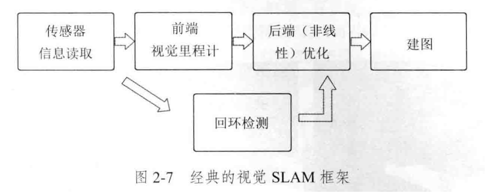

### 传感器：信息读取

- 相机图像信息的读取和预处理；机器人运动传感器的信息读取与同步
- Input：传感器输入
- Output：图像、运动数据；时间戳

### 前端：视觉里程计

- 估算相邻图像间运动
- Input：时间上相邻（连续）的图像；时间戳
- Output：相机相对位姿变化；进而得到运动轨迹；局部地图
- 会出现累积漂移

### 回环检测

- 判断机器人是否到达过先前的位置
- Input：当前图像、先前图像；全局地图（局部地图构建？）
- Output：图像相似度；位姿约束关系

### 后端（非线性）优化

- 接受不同时刻视觉里程计测量的相机位姿以及回环检测的信息，进行优化，得到全局一致的轨迹和地图
- Input：视觉里程计输出（相机位姿、约束）；回环检测输出（约束关系）
- Output：全局一致的轨迹和地图
- 图：仅供机器使用

### 建图

- 根据估计的轨迹，建立与任务要求对应的地图
- Input：优化后相机位姿；图像数据；
- Output：任务对应的地图

## 误差（准确度）、噪声（精密度）

- 误差：
- 视觉里程计在“估计运动”时的误差（漂移）；特征误匹配
- 后端受异常值干扰，导致地图错误
- 噪声：
- 传感器噪声（图像、运动传感器）
- （要滤波）

## 地图

- 度量地图：精确地表示地图中物体的位置关系
- 稠密/稀疏地图，二维/三维度量地图

- 拓扑地图：强调地图元素间的关系
- 考虑连通性，去除细节

- 这里用到的是点云

## SLAM数学建模

- 运动方程/观测方程

$$
\begin{cases} \boldsymbol{x}_k = f(\boldsymbol{x}_{k-1}, \boldsymbol{u}_k, \boldsymbol{w}_k), & k=1, \cdots, K \\ \boldsymbol{z}_{k,j} = h(\boldsymbol{y}_j, \boldsymbol{x}_k, \boldsymbol{v}_{k,j}), & (k, j) \in \mathcal{O} \end{cases}
$$

- 已知运动测量的读数u、传感器读数z
- 求解位姿x、图像y

- SLAM问题：状态估计问题——根据带有噪声的测量数据，估计内部的、隐藏状态的变量

# CH3

## 问题

- 旋转为什么需要这么多的表征方式？

## 坐标系间欧式变换

- 欧式变换由旋转和平移组成。

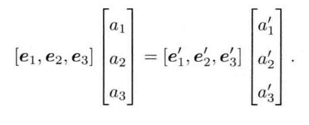

- 即某一个向量在两个坐标系下的表示

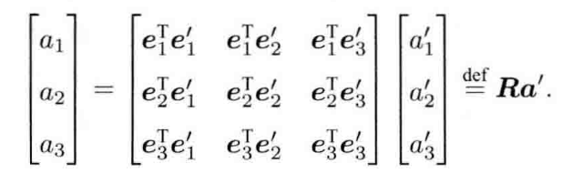

- 左乘$[e_1^T,e_2^T,e_3^T]^T$，得到两坐标系下不同坐标的关系；R表示旋转矩阵，是一个行列式为1的正交矩阵。

$$
a_1 = R_{12}a_2+t_{12}
$$

- 把坐标系2的向量变换到坐标系1中（向量本身没有变化，只是开始的时候是以坐标系2的基底表示的，经过变换，转换成坐标系1表示）。
- 这里的$t_{12}$：逆向：不是直接取反，因为之前的t是在坐标系2中取到的t，经过旋转后虽然平移的大小不变但方向改变。

## 变换矩阵，齐次坐标

- 当多次变换叠加时，每次变换都要加一个t，非线性。

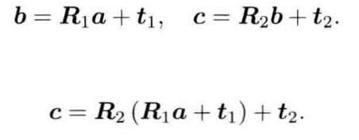

- 当引入齐次坐标和变换矩阵，可以重写上式。其中T称为变换矩阵（即旋转矩阵+平移）

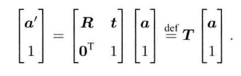

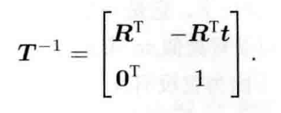

## 特殊正交群，特殊欧式群

- 特殊正交群

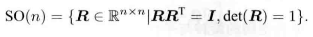

- 特殊欧式群

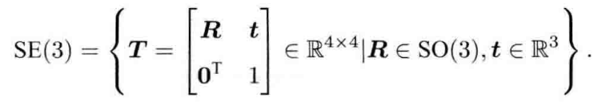

## 旋转向量

- 旋转矩阵有9个量，一次旋转只有3个自由度；变换矩阵有16个量，表达6个自由度。因此表达方式有冗余。
- 旋转矩阵自身带有约束，即必须是个正交矩阵，这使求解变得困难。
- 事实上旋转只需要1个旋转轴，1个旋转角；旋转轴为2维，旋转角为1维，共三维。因此一个变换矩阵可以使用6维向量表述。
- 罗德里格斯公式：旋转轴加旋转角度表示旋转矩阵：

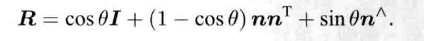

其中：

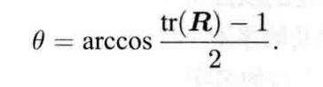

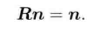

- 旋转轴在旋转之后不变，因此转轴n是矩阵R特征值1对应的特征向量

## 欧拉角

- 旋转矩阵和旋转向量不够直观。引入欧拉角：一个旋转分解成3次绕不同轴的旋转。
- 偏航-俯仰-旋转；ZYX；yaw-pitch-roll
- 问题：万向锁问题：俯仰角±90度时会丢失自由度

## 四元数

- 三维向量必然带有奇异性，而例如旋转矩阵则具有冗余性。
- 引入四元数，紧凑而没有奇异性。
- 正如二维欧拉公式表达旋转，三维旋转可以由单位四元数表示。

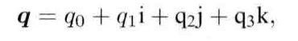

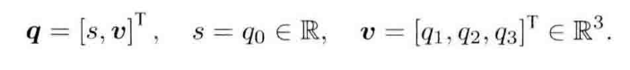

- 这种表达方式和复数有所不同。因为i、j、k实际上对应的是相乘旋转180度，否则不满足其旋转关系式。

### 四元数运算

- 当成实部+虚部的形式，只不过虚部有三种

## 总结

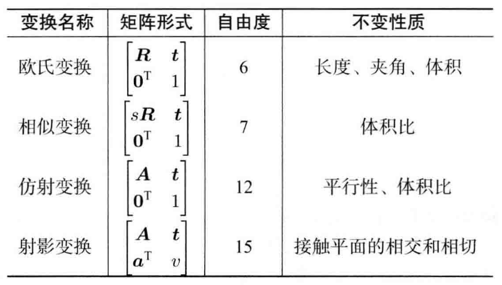

- 旋转为什么需要这么多的表征方式？
- 欧式变换矩阵：数学形式简便，便于进行计算，但是冗余非常严重；同时自带行列式为1且是正交矩阵，导致计算量大且计算困难。
- 欧拉角：三种旋转方式比较直观，且比较紧凑；但会有奇异性，导致系统丢失一个自由度。
- 四元数：紧凑且无奇异性，且使用矩阵乘法计算量很小；但四元数及其不直观，且带有“必须是单位四元数”的约束。
- 旋转向量与李代数：只有三个参数且没有约束；但存在周期性问题。

旋转要求紧凑，没有奇异性，便于求导；

- 紧凑：用最少的变量表达旋转的自由度，便于存储；
- 没有奇异性：不会出现死锁；
- 便于求导：旋转发生微小变化时，可以用简单的加法和线性映射更新。
- 没有一种方法可以同时满足上述所有的要求。
- 因此需要求导的时候，用旋转向量表示；需要没有奇异性时，用四元数表示；需要坐标时，用旋转矩阵。

# CH4

## 李群与李代数

- 特殊正交群与特殊欧氏群

$$
\text{SO}(3) = \{ \mathbf{R} \in \mathbb{R}^{3 \times 3} \mid \mathbf{RR}^{\text{T}} = \mathbf{I}, \det(\mathbf{R}) = 1 \}
$$

$$
SE(3) = \left\{ \mathbf{T} = \begin{bmatrix} \mathbf{R} & \mathbf{t} \\ \mathbf{0}^\text{T} & 1 \end{bmatrix} \in \mathbb{R}^{4 \times 4} \mid \mathbf{R} \in SO(3), \mathbf{t} \in \mathbb{R}^3 \right\}
$$

对加法不封闭，对乘法封闭

## 群

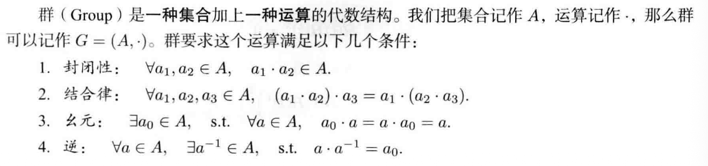

## 李代数

### 引入

$$
R(t)R(t)^{\mathrm{T}} = I
$$

- 对时间求导有：$\dot{R}(t)R(t)^{\mathrm{T}} + R(t)\dot{R}(t)^{\mathrm{T}} = 0$，可见是一个反对称矩阵

- 那么可以用反对称算子表示：$\dot{R}(t)R(t)^{\mathrm{T}} = \phi(t)^{\wedge}$，得到如下的表达式：

$$
\dot{R}(t) = \phi(t)^{\wedge}R(t) = \begin{bmatrix} 0 & -\phi_3 & \phi_2 \\ \phi_3 & 0 & -\phi_1 \\ -\phi_2 & \phi_1 & 0 \end{bmatrix} R(t)
$$

该式可以得到一个旋转矩阵关于时间的导数。

- 设R(0)=I，这里可以在t=0处进行展开，也可以得到微分方程形式的式子与微分方程的解。

$$
\begin{aligned} R(t) &\approx R(t_0) + \dot{R}(t_0)(t - t_0) \\ &= I + \phi(t_0)^{\wedge}(t) \end{aligned}
$$

$$
\dot{R}(t) = \phi(t_0)^{\wedge}R(t) = \phi_0^{\wedge}R(t)
$$

- 解：$R(t) = \exp(\phi_0^{\wedge}t) \tag{4.10}$。这里的问题是怎么求一个矩阵的指数/对数映射。

### 李代数so(3)

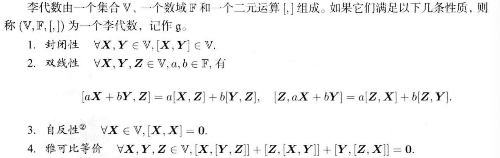

之前的$\phi$实际上是李代数。

- SO(3)对应的so(3)，so(3)的元素实际上是三维向量或者三维反对称矩阵。其中每一个三维向量对应一个反对称矩阵。

- 可以由该式联系SO(3)和so(3)：$R=exp(\phi^{\wedge})$

### 李代数se(3)

- se(3)中每一个元素是$\boldsymbol{\xi}$，六维向量，前三维平移，后三维旋转。

$$
\boldsymbol{\xi}^{\wedge} =
\begin{bmatrix}
\boldsymbol{\phi}^{\wedge} & \boldsymbol{\rho} \\
\mathbf{0}^{\mathrm{T}} & 0
\end{bmatrix} \in \mathbb{R}^{4 \times 4}.
$$

## 指数与对数映射

### 问题

- 如何计算$exp(\phi^{\wedge})$

### SO(3)上指数映射

- 方法：泰勒展开，但是不想计算矩阵的无穷次幂。因此用简便方法：$\phi$是三维向量，可以定义模长和方向，后续推导略。最后可以得到如下式子：

$$
\exp(\theta \mathbf{a}^{\wedge}) = \cos \theta \mathbf{I} + (1 - \cos \theta) \mathbf{a} \mathbf{a}^{\mathrm{T}} + \sin \theta \mathbf{a}^{\wedge}.
$$

不过对于旋转角$\theta$，多转一圈和没有转是一样的，即具有周期性。

### 总结

最终关系如下：

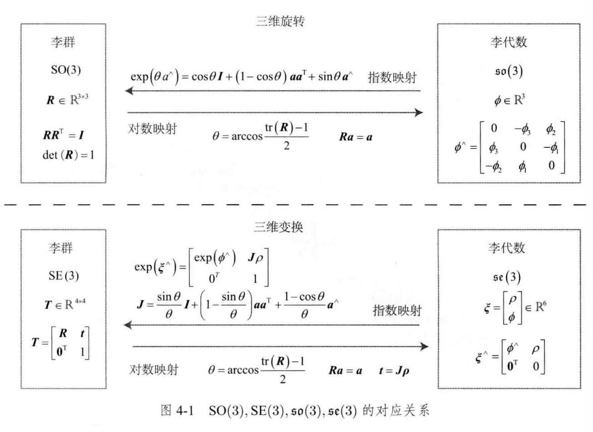

- 这里引入李群和李代数，是为了进行优化。因为它们可以定义导数和变化量。

## 李代数求导与扰动模型

- BCH公式说明，处理两个矩阵指数之积时，会产生一些李括号组成的余项。
- 李代数在BCH近似下，有左乘近似与右乘近似两种。

- SO(3)上近似：

$$
\exp(\Delta \boldsymbol{\phi}^{\wedge}) \exp(\boldsymbol{\phi}^{\wedge}) = \exp \left( \left( \boldsymbol{\phi} + \mathbf{J}_l^{-1}(\boldsymbol{\phi}) \Delta \boldsymbol{\phi} \right)^{\wedge} \right)
$$

$$
\exp((\boldsymbol{\phi} + \Delta \boldsymbol{\phi})^{\wedge}) \approx \exp((\mathbf{J}_l \Delta \boldsymbol{\phi})^{\wedge}) \exp(\boldsymbol{\phi}^{\wedge}) = \exp(\boldsymbol{\phi}^{\wedge}) \exp((\mathbf{J}_r \Delta \boldsymbol{\phi})^{\wedge})
$$

- 这里的雅可比为：

$$
\mathbf{J}_l = \mathbf{J} = \frac{\sin \theta}{\theta} \mathbf{I} + \left( 1 - \frac{\sin \theta}{\theta} \right) \mathbf{a} \mathbf{a}^{\mathrm{T}} + \frac{1 - \cos \theta}{\theta} \mathbf{a}^{\wedge}
$$

$$
\mathbf{J}_l^{-1} = \frac{\theta}{2} \cot \frac{\theta}{2} \mathbf{I} + \left( 1 - \frac{\theta}{2} \cot \frac{\theta}{2} \right) \mathbf{a} \mathbf{a}^{\mathrm{T}} - \frac{\theta}{2} \mathbf{a}^{\wedge}
$$

- SE(3)上近似：

$$
\exp(\Delta \boldsymbol{\xi}^{\wedge}) \exp(\boldsymbol{\xi}^{\wedge}) \approx \exp \left( \left( \mathcal{J}_l^{-1} \Delta \boldsymbol{\xi} + \boldsymbol{\xi} \right)^{\wedge} \right)
$$

$$
\exp(\boldsymbol{\xi}^{\wedge}) \exp(\Delta \boldsymbol{\xi}^{\wedge}) \approx \exp \left( \left( \mathcal{J}_r^{-1} \Delta \boldsymbol{\xi} + \boldsymbol{\xi} \right)^{\wedge} \right)
$$

- 这里仅理论推导

### SO(3)上李代数求导

$$
z = Tp + w
$$

$$
e = z - Tp
$$

这里的e指的是error，我们需要计算出w噪声导致的误差。

- 由于SO(3)上没有加法，这里转换为李代数求导，即：

$$
\frac{\partial (\mathbf{R}\mathbf{p})}{\partial \mathbf{R}} \rightarrow \frac{\partial (\exp(\boldsymbol{\phi}^{\wedge})\mathbf{p})}{\partial \boldsymbol{\phi}}
$$

$$
\begin{aligned} \frac{\partial (\exp(\boldsymbol{\phi}^{\wedge})\mathbf{p})}{\partial \boldsymbol{\phi}} &= \lim_{\delta \boldsymbol{\phi} \to 0} \frac{\exp((\boldsymbol{\phi} + \delta \boldsymbol{\phi})^{\wedge})\mathbf{p} - \exp(\boldsymbol{\phi}^{\wedge})\mathbf{p}}{\delta \boldsymbol{\phi}} \\ &= \lim_{\delta \boldsymbol{\phi} \to 0} \frac{\exp((\mathbf{J}_l \delta \boldsymbol{\phi})^{\wedge}) \exp(\boldsymbol{\phi}^{\wedge})\mathbf{p} - \exp(\boldsymbol{\phi}^{\wedge})\mathbf{p}}{\delta \boldsymbol{\phi}} \\ &= \lim_{\delta \boldsymbol{\phi} \to 0} \frac{(\mathbf{I} + (\mathbf{J}_l \delta \boldsymbol{\phi})^{\wedge}) \exp(\boldsymbol{\phi}^{\wedge})\mathbf{p} - \exp(\boldsymbol{\phi}^{\wedge})\mathbf{p}}{\delta \boldsymbol{\phi}} \\ &= \lim_{\delta \boldsymbol{\phi} \to 0} \frac{(\mathbf{J}_l \delta \boldsymbol{\phi})^{\wedge} \exp(\boldsymbol{\phi}^{\wedge})\mathbf{p}}{\delta \boldsymbol{\phi}} \\ &= \lim_{\delta \boldsymbol{\phi} \to 0} \frac{-(\exp(\boldsymbol{\phi}^{\wedge})\mathbf{p})^{\wedge} \mathbf{J}_l \delta \boldsymbol{\phi}}{\delta \boldsymbol{\phi}} = -(\mathbf{R}\mathbf{p})^{\wedge} \mathbf{J}_l \end{aligned}
$$

- 不过此处依旧含有雅可比$J_l$，计算较为复杂。

### 扰动模型（左乘）

$$
\begin{aligned} \frac{\partial (\mathbf{R}\mathbf{p})}{\partial \boldsymbol{\varphi}} &= \lim_{\boldsymbol{\varphi} \to \mathbf{0}} \frac{\exp(\boldsymbol{\varphi}^{\wedge}) \exp(\boldsymbol{\phi}^{\wedge}) \mathbf{p} - \exp(\boldsymbol{\phi}^{\wedge}) \mathbf{p}}{\boldsymbol{\varphi}} \\ &= \lim_{\boldsymbol{\varphi} \to \mathbf{0}} \frac{(\mathbf{I} + \boldsymbol{\varphi}^{\wedge}) \exp(\boldsymbol{\phi}^{\wedge}) \mathbf{p} - \exp(\boldsymbol{\phi}^{\wedge}) \mathbf{p}}{\boldsymbol{\varphi}} \\ &= \lim_{\boldsymbol{\varphi} \to \mathbf{0}} \frac{\boldsymbol{\varphi}^{\wedge} \mathbf{R} \mathbf{p}}{\boldsymbol{\varphi}} \\ &= \lim_{\boldsymbol{\varphi} \to \mathbf{0}} \frac{-(\mathbf{R} \mathbf{p})^{\wedge} \boldsymbol{\varphi}}{\boldsymbol{\varphi}} = -(\mathbf{R} \mathbf{p})^{\wedge} \end{aligned}
$$

- 这里只需要求解反对称矩阵，使扰动模型更为实用。

# CH5

- 针孔模型，畸变模型

## 针孔相机模型

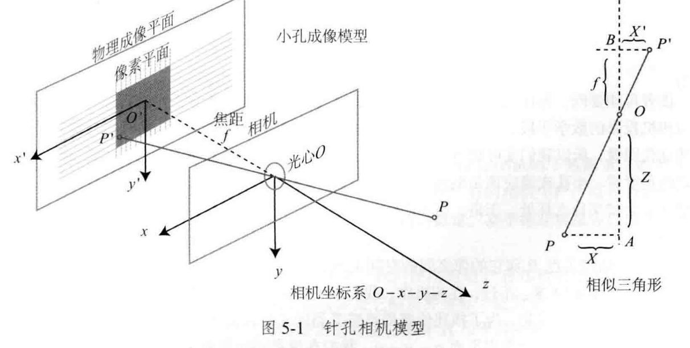

$$
X' = f \frac{X}{Z} \\
Y' = f \frac{Y}{Z}
$$

- 从坐标的角度上看，应该是带有负号。不过这里将负号去除。

### 像素坐标系

- 与成像平面相差一个缩放和一个原点平移。以u，v作为横纵坐标：

- 像素坐标与成像平面：

$$
\begin{cases} u = \alpha X' + c_x \\ v = \beta Y' + c_y \end{cases}
$$

- 合并参数：

$$
\begin{cases} u = f_x \frac{X}{Z} + c_x \\ v = f_y \frac{Y}{Z} + c_y \end{cases}
$$

- 齐次坐标表示：

$$
\begin{pmatrix} u \\ v \\ 1 \end{pmatrix} = \frac{1}{Z} \begin{pmatrix} f_x & 0 & c_x \\ 0 & f_y & c_y \\ 0 & 0 & 1 \end{pmatrix} \begin{pmatrix} X \\ Y \\ Z \end{pmatrix} \stackrel{\text{def}}{=} \frac{1}{Z} \mathbf{K P}
$$

$$
Z \begin{pmatrix} u \\ v \\ 1 \end{pmatrix} = \begin{pmatrix} f_x & 0 & c_x \\ 0 & f_y & c_y \\ 0 & 0 & 1 \end{pmatrix} \begin{pmatrix} X \\ Y \\ Z \end{pmatrix} \stackrel{\text{def}}{=} \mathbf{K P}
$$

- 公式的含义是：将相机坐标系下的真实点，变换为像素坐标系的点。从单位的角度上看，$f$的单位为米（焦距），$f_x,f_y,c_x,c_y$的单位为像素
- 其中，相机内参矩阵为：

$$
K = \begin{pmatrix} f_x & 0 & c_x \\ 0 & f_y & c_y \\ 0 & 0 & 1 \end{pmatrix}
$$

- $P$是相机坐标系下看到的物体的坐标；也可以说是$P$在世界坐标系下的坐标，根据相机当前的位姿变换到相机坐标系下的坐标。那么公式进一步改为：

$$
ZP_{uv} = Z \begin{bmatrix} u \\ v \\ 1 \end{bmatrix} = \mathbf{K} (\mathbf{R}P_w + \mathbf{t}) = \mathbf{K}\mathbf{T}P_w
$$

- 像素坐标是，先对世界坐标系下点的坐标$P_w$进行外参变换，再进行内参变换
- 公式右侧的T为$[\mathbf{R} | \mathbf{t}]$，是一个3x4的增广矩阵；或者说是去掉了最后一行的4x4的SE(3)。那么P需要加一维，即$\begin{bmatrix} X & Y & Z & 1 \end{bmatrix}^T$
- 归一化坐标：$\begin{bmatrix} X/Z & Y/Z & 1 \end{bmatrix}^T$，也可以看作在z=1处有一个归一化平面
- $\begin{bmatrix} u & v & 1 \end{bmatrix}^T$是齐次坐标。在得到$P_{uv}$的过程中，深度信息丢失（因为最后一维强制为1）
- 深度丢失：已知$u,v$求$P_w$，Z的值可以任取，此时$P_w$是可以随深度随意调整的。

### 畸变模型

- 透镜形状导致：透镜形状导致的畸变是径向畸变；不规则畸变通常镜像对称，分为桶形畸变和枕形畸变。
- 透镜和成像面不平行导致：切向畸变。

- 径向畸变：坐标点沿长度方向发生变化，即距离原点的长度发生变化

- 切向畸变坐标点沿切线方向发生变化，即水平夹角变化

径向畸变公式：

$$
\begin{cases}
x_{\text{distorted}} = x(1 + k_1r^2 + k_2r^4 + k_3r^6) \\
y_{\text{distorted}} = y(1 + k_1r^2 + k_2r^4 + k_3r^6)
\end{cases}
$$

切向畸变公式：

$$
\begin{cases}
x_{\text{distorted}} = x + 2p_1xy + p_2(r^2 + 2x^2) \\
y_{\text{distorted}} = y + p_1(r^2 + 2y^2) + 2p_2xy
\end{cases}
$$

## 双目相机模型

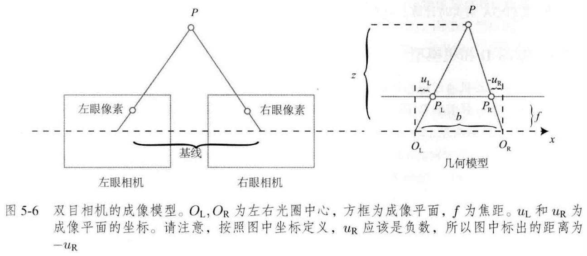

- 基线：b
- 根据相似关系，有：

$$
\frac{z - f}{z} = \frac{b - u_L + u_R}{b}
$$

$$
z = \frac{fb}{d}, \quad d \stackrel{\text{def}}{=} u_L - u_R
$$

- 由于d最小为一个像素，双目深度存在理论最大值。
- 基线越长，能测的最大距离就越远。

## RGB- D相机

- 主动测量距离。容易受到干扰，使用范围受限

## 图像

- 坐标轴方向与相机坐标系一致

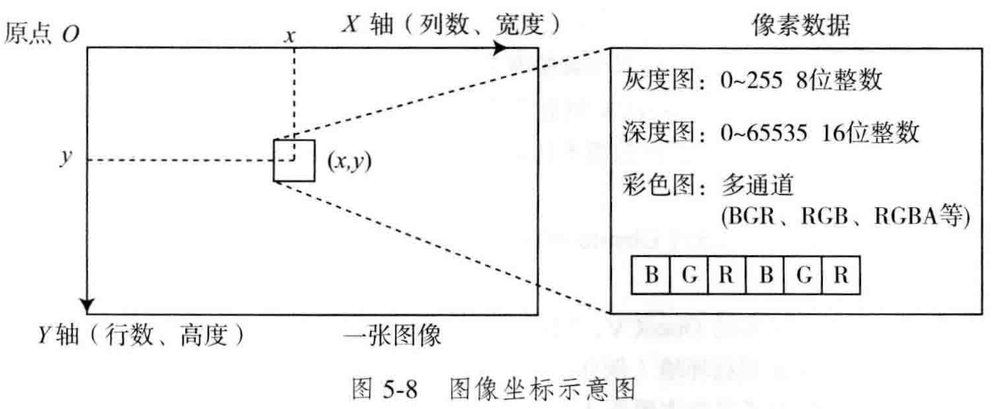

## 总结

- 相机坐标、归一化坐标、像素坐标
- - 相机坐标：相机坐标系下的真实坐标
  - 归一化坐标：相机坐标系除以Z（即对Z归一化）的坐标
  - 像素坐标：归一化坐标左乘内参矩阵K

# CH6

## 状态估计问题

### 批量状态估计，最大后验估计

- 运动方程与观测方程

$$
\begin{cases} \boldsymbol{x}_k = f(\boldsymbol{x}_{k-1}, \boldsymbol{u}_k, \boldsymbol{w}_k), & k=1, \cdots, K \\ \boldsymbol{z}_{k,j} = h(\boldsymbol{y}_j, \boldsymbol{x}_k, \boldsymbol{v}_{k,j}), & (k, j) \in \mathcal{O} \end{cases}
$$

其中$x_k$为相机位姿。我要在$x_k$处，对路标$y_j$进行观测，观测到的点对应图像上的像素位置$z_{k,j}$，则有观测方程：

$$
s\boldsymbol{z}_{k,j} = \boldsymbol{K}(\boldsymbol{R}_k \boldsymbol{y}_j + \boldsymbol{t}_k)
$$

- 这里的$s$为尺度因子

- 考虑噪声，有：

$$
\boldsymbol{w}_k \sim \mathcal{N}(\mathbf{0}, \boldsymbol{R}_k), \quad \boldsymbol{v}_k \sim \mathcal{N}(\mathbf{0}, \boldsymbol{Q}_{k,j})
$$

前者代表运动噪声，后者代表观测噪声。二者均服从正态分布。

- 增量/渐进方法incremental，滤波器：有当前的估计状态，然后用不惯新数据更新。
- 批量方法batch：批处理；可以在更大的范围达到最优化，为主流方法。问题：不实时，不符合SLAM运动场景。引出：**滑动窗口估计法**
- **最大后验概率**：

$$
P(\boldsymbol{x}, \boldsymbol{y} | \boldsymbol{z}, \boldsymbol{u}) = \frac{P(\boldsymbol{z}, \boldsymbol{u} | \boldsymbol{x}, \boldsymbol{y}) P(\boldsymbol{x}, \boldsymbol{y})}{P(\boldsymbol{z}, \boldsymbol{u})} \propto \underbrace{P(\boldsymbol{z}, \boldsymbol{u} | \boldsymbol{x}, \boldsymbol{y})}_{\text{似然}} \underbrace{P(\boldsymbol{x}, \boldsymbol{y})}_{\text{先验}}
$$

- 实际上就是：在已知输入数据u和观测数据z的情况下，找到一对x，y，使其出现的概率最大。即看到图像后自己最可能的位置。
- 后验难以直接计算，故用：$\text{后验} \propto \text{似然} \times \text{先验}$
- 似然：在这个位姿下，看到传感器的图像的概率是多大
- 先验：根据上一时刻的运动，现在我的位置在哪
- 只找概率最大的那个状态点：$(\boldsymbol{x}, \boldsymbol{y})^*_{\text{MAP}} = \arg \max P(\boldsymbol{z}, \boldsymbol{u} | \boldsymbol{x}, \boldsymbol{y}) P(\boldsymbol{x}, \boldsymbol{y})$
- 没有先验，就求解**最大似然估计**：

$$
(\boldsymbol{x}, \boldsymbol{y})^*_{\text{MLE}} = \arg \max P(\boldsymbol{z}, \boldsymbol{u} | \boldsymbol{x}, \boldsymbol{y})
$$

即假设没有任何先验知识，就是找到一组状态，使观测到现在传感器的数据的可能性最大。

### 最小二乘

- 可以使用**最小化负对数**求解一个高斯分布的最大似然

- 负对数似然变换：

$$
-\ln(P(\boldsymbol{x})) = \frac{1}{2}\ln((2\pi)^N \det(\boldsymbol{\Sigma})) + \frac{1}{2}(\boldsymbol{x} - \boldsymbol{\mu})^T \boldsymbol{\Sigma}^{-1} (\boldsymbol{x} - \boldsymbol{\mu})
$$

- 在SLAM中则有：

$$
\begin{aligned} (\boldsymbol{x}_k, \boldsymbol{y}_j)^* &= \arg \max \mathcal{N}(h(\boldsymbol{y}_j, \boldsymbol{x}_k), \boldsymbol{Q}_{k,j}) \\ &= \arg \min \left( (\boldsymbol{z}_{k,j} - h(\boldsymbol{x}_k, \boldsymbol{y}_j))^T \boldsymbol{Q}_{k,j}^{-1} (\boldsymbol{z}_{k,j} - h(\boldsymbol{x}_k, \boldsymbol{y}_j)) \right) \end{aligned}
$$

- 最大化似然概率等价于最小化马氏距离的平方
- 考虑批量输入。假设各个时刻的输入和观测相互独立，意味着输入之间是独立的，观测之间是独立的，输入和观测是独立的。那么联合分布可以进行因式分解，也说明各个时刻的运动和观测是可以独立处理的。有如下几个公式：

$$
P(\boldsymbol{z}, \boldsymbol{u} | \boldsymbol{x}, \boldsymbol{y}) = \prod_k P(\boldsymbol{u}_k | \boldsymbol{x}_{k-1}, \boldsymbol{x}_k) \prod_{k,j} P(\boldsymbol{z}_{k,j} | \boldsymbol{x}_k, \boldsymbol{y}_j)
$$

$$
\begin{aligned} \boldsymbol{e}_{\boldsymbol{u},k} &= \boldsymbol{x}_k - f(\boldsymbol{x}_{k-1}, \boldsymbol{u}_k) \\ \boldsymbol{e}_{\boldsymbol{z},j,k} &= \boldsymbol{z}_{k,j} - h(\boldsymbol{x}_k, \boldsymbol{y}_j) \end{aligned}
$$

$$
\min J(\boldsymbol{x}, \boldsymbol{y}) = \sum_k \boldsymbol{e}_{\boldsymbol{u},k}^T \boldsymbol{R}_k^{-1} \boldsymbol{e}_{\boldsymbol{u},k} + \sum_k \sum_j \boldsymbol{e}_{\boldsymbol{z},k,j}^T \boldsymbol{Q}_{k,j}^{-1} \boldsymbol{e}_{\boldsymbol{z},k,j}
$$

前半部分指的是运动模型，后半部分是观测模型。然后求出一个总的代价函数。这即是一个最小二乘问题。

## 非线性最小二乘

- $\min_{x} F(x) = \frac{1}{2} \|f(x)\|_2^2$，迭代步骤：

1. 给定某个初始值 $\boldsymbol{x}_0$。
2. 对于第 $k$ 次迭代，寻找一个增量 $\Delta \boldsymbol{x}_k$，使得 $\|\boldsymbol{f}(\boldsymbol{x}_k + \Delta \boldsymbol{x}_k)\|_2^2$ 达到极小值。
3. 若 $\Delta \boldsymbol{x}_k$ 足够小，则停止。
4. 否则，令 $\boldsymbol{x}_{k+1} = \boldsymbol{x}_k + \Delta \boldsymbol{x}_k$，返回第 2 步。

- 这里的主要问题是，如何找到每次迭代点的增量

### 一阶和二阶梯度

- 考虑第k次迭代，要寻找增量$\Delta \boldsymbol{x}_k$，可以在$x_k$附近进行泰勒展开：

$$
F(x_k + \Delta x_k) \approx F(x_k) + \mathbf{J}(x_k)^T \Delta x_k + \frac{1}{2} \Delta x_k^T \mathbf{H}(x_k) \Delta x_k
$$

- 若保留一阶梯度，取增量为反向的梯度，可以保证函数下降：$\Delta x^* = -\mathbf{J}(x_k) \tag{6.27}$。此为**最速下降法**。不过这个方法过于贪心（算$\Delta \boldsymbol{x}_k$时），容易出现锯齿，增加迭代次数。
- 若保留二阶梯度，此时增量方程为：

$$
\Delta x^* = \arg \min \left( F(x) + \mathbf{J}(x)^T \Delta x + \frac{1}{2} \Delta x^T \mathbf{H} \Delta x \right)
$$

- 对$\Delta \boldsymbol{x}_k$求导，有$\mathbf{J} + \mathbf{H} \Delta x = \mathbf{0} \Rightarrow \mathbf{H} \Delta x = -\mathbf{J} $。这里可以得到增量，也被称为**牛顿法**。这个方法要计算$H$矩阵，问题规模大的时候难以计算。

### 高斯牛顿法

- 过程的逻辑：我要找到使$\|f(x+\Delta x)\|^2$达到最小的$\Delta \boldsymbol{x}_k$

- 在$\min_{x} F(x) = \frac{1}{2} \|f(x)\|_2^2$中，我们不再对F进行展开，而是对f进行展开

$$
f(x + \Delta x) \approx f(x) + \mathbf{J}(x)^T \Delta x
$$

- 那么就是求解下列最小二乘问题

$$
\Delta x^* = \arg \min_{\Delta x} \frac{1}{2} \| f(x) + \mathbf{J}(x)^T \Delta x \|^2
$$

- 展开，得到：

$$
\begin{aligned}
\frac{1}{2} \| f(x) + \mathbf{J}(x)^T \Delta x \|^2 &= \frac{1}{2} (f(x) + \mathbf{J}(x)^T \Delta x)^T (f(x) + \mathbf{J}(x)^T \Delta x) \\
&= \frac{1}{2} (\| f(x) \|_2^2 + 2f(x) \mathbf{J}(x)^T \Delta x + \Delta x^T \mathbf{J}(x) \mathbf{J}(x)^T \Delta x)
\end{aligned}
$$

- 对上述公式求导并使之为零：

$$
\mathbf{J}(x) f(x) + \mathbf{J}(x) \mathbf{J}(x)^T \Delta x = 0
$$

$$
\underbrace{\mathbf{J}(x) \mathbf{J}(x)^T}_{\mathbf{H}(x)} \Delta x = \underbrace{-\mathbf{J}(x) f(x)}_{\mathbf{g}(x)}
$$

- 我们拿到了一个增量方程，而求解这个方程也是整个优化问题的核心：

$$
\mathbf{H} \Delta x = \mathbf{g}
$$

- 高斯牛顿法的步骤可以写成：

1. 给定初始值 $x_0$。
2. 对于第 $k$ 次迭代，求出当前的雅可比矩阵 $\mathbf{J}(x_k)$ 和误差 $f(x_k)$。
3. 求解增量方程：$\mathbf{H} \Delta x_k = \mathbf{g}$。
4. 若 $\Delta x_k$ 足够小，则停止。否则，令 $x_{k+1} = x_k + \Delta x_k$，返回第 2 步。

### 列文伯格—马夸尔特方法

- 高斯牛顿法，在展开点附近有比较好的近似效果；我们可以给$\Delta x$一个**信赖区域**，定义二阶近似的有效区间。
- 刻画近似的好坏程度：

$$
\rho = \frac{f(x + \Delta x) - f(x)}{\mathbf{J}(x)^T \Delta x}
$$

- 即实际下降的值比近似下降的值。若接近1则认为近似很好。
- 那么改良版的非线性优化步骤为：

1. 给定初始值 $x_0$，以及初始优化半径 $\mu$。

2. 对于第 $k$ 次迭代，在高斯牛顿法的基础上加上信赖区域，求解：

   $\min_{\Delta x_k} \frac{1}{2} \| f(x_k) + \mathbf{J}(x_k)^T \Delta x_k \|^2, \quad \text{s.t. } \| \mathbf{D} \Delta x_k \|^2 \le \mu \tag{6.35}$

   其中，$\mu$ 是信赖区域的半径，$\mathbf{D}$ 为系数矩阵，将在后文说明。

3. 计算 $\rho$。

4. 若 $\rho > \frac{3}{4}$，则设置 $\mu = 2\mu$。

5. 若 $\rho < \frac{1}{4}$，则设置 $\mu = 0.5\mu$。

6. 如果 $\rho$ 大于某阈值，则认为近似可行。令 $x_{k+1} = x_k + \Delta x_k$。

7. 判断算法是否收敛。如不收敛则返回第 2 步，否则结束。

### 总结

- 高斯牛顿法：对F求二阶导不如对f求一阶导，求H。

- 列文伯格—马夸尔特方法：引入信赖区域，解决矩阵不可逆的问题或者步长太大的问题。

# CH7 视觉里程计

- 特征点；估计相机运动

## 特征点法

### 特征点

- 希望特征点在相机运动之后保持稳定
- 图像中的角点和边缘辨识度更强
- 人工设计特征点，有以下性质
- - 可重复性（相同特征可以在不同图像中找到），可区别性（不同特征不同表达），高效率（数量少），本地性（只与一小片图像区域相关）
- 关键点，描述子：
- - 关键点：特征点的位置、朝向、大小等
  - 描述子：向量等，描述周围信息；若两个特征点在向量空间距离相近，就认为是同一个特征点

### ORB特征

#### FAST关键点

- 在图像中选取像素 $p$，假设它的亮度为 $I_p$。
- 设置一个阈值 $T$（比如，$I_p$ 的 20%）。
- 以像素 $p$ 为中心，选取半径为 3 的圆上的 16 个像素点。
- 假如选取的圆上有连续的 $N$ 个点的亮度大于 $I_p + T$ 或小于 $I_p - T$，那么像素 $p$ 可以被认为是特征点（$N$ 通常取 12，即 FAST-12。其他常用的 $N$ 取值为 9 和 11，它们分别被称为 FAST-9 和 FAST-11）。
- 循环以上四步，对每一个像素执行相同的操作。

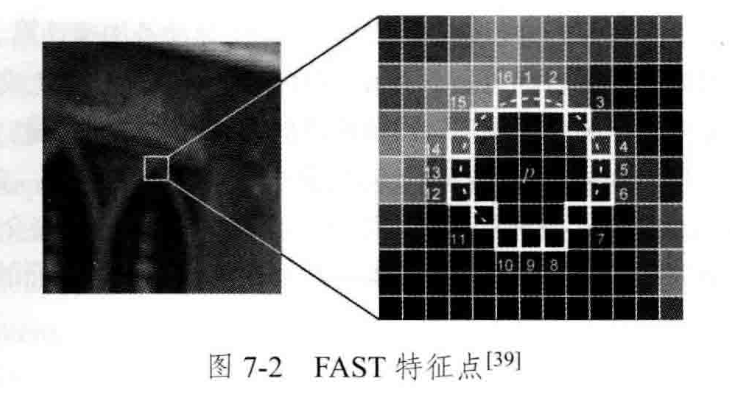

- 或者找周围一圈像素的亮度，当1，5，9，13号像素的亮度同时有三个大于$I_p + T$ 或小于 $I_p - T$，才认为可能是角点
- 在此之后要过非极大值抑制，只保留响应极大值的角点
- 金字塔图像：匹配相机前后帧的变化
- 旋转：求灰度质心
- - 拿到一个图像块的矩

$$
m_{pq} = \sum_{x,y \in B} x^p y^q I(x, y), \quad p,q = \{0, 1\}
$$

- - 通过矩找质心：$m_{00}$是整个图像块的总灰度值，$m_{10}$和$m_{01}$是灰度在x和y方向上的加权分布

$$
C = \left( \frac{m_{10}}{m_{00}}, \frac{m_{01}}{m_{00}} \right)
$$

- - 拿到特征点方向：特征点的旋转不会导致特征点无法匹配

$$
\theta = \arctan(m_{01}/m_{10})
$$

#### BRIEF描述子

- 二进制描述子，比较特征点附近两个随机像素大小关系，从而得到周围信息。
- 旋转可以通过Oriented FAST计算得到

### 特征匹配

- 暴力匹配：取距离最近的特征点
- 快速近似最近邻FLANN

## 对极几何

- 用于恢复两帧之间摄像机的运动

### 对极约束

- 考虑两帧图像之间的运动

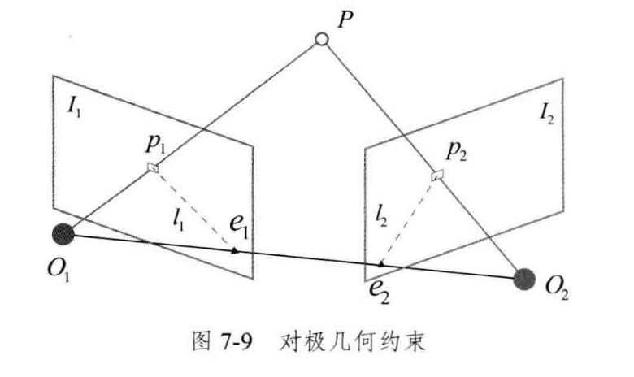

- $p_1,p_2$为特征匹配点，$e_1,e_2$为极点，$l_1,l_2$为极线
- $O_1,O_2,P$可以确定极平面，$O_1,O_2$为基线

$$
P = [X, Y, Z]^T
$$

$$
s_1 \mathbf{p}_1 = \mathbf{K} P, \quad s_2 \mathbf{p}_2 = \mathbf{K} (\mathbf{R} P + \mathbf{t})
$$

$$
\mathbf{p}_1 \simeq \mathbf{K} P, \quad \mathbf{p}_2 \simeq \mathbf{K} (\mathbf{R} P + \mathbf{t})
$$

- 转化为归一化平面

$$
\mathbf{x}_1 = \mathbf{K}^{-1} \mathbf{p}_1, \quad \mathbf{x}_2 = \mathbf{K}^{-1} \mathbf{p}_2
$$

$$
\mathbf{x}_2 \simeq \mathbf{R} \mathbf{x}_1 + \mathbf{t}
$$

- 对极约束推导：

$$
\mathbf{t}^\wedge \mathbf{x}_2 \simeq \mathbf{t}^\wedge \mathbf{R} \mathbf{x}_1
$$

$$
\mathbf{x}_2^T \mathbf{t}^\wedge \mathbf{x}_2 \simeq \mathbf{x}_2^T \mathbf{t}^\wedge \mathbf{R} \mathbf{x}_1
$$

- $\mathbf{t}^\wedge \mathbf{x}_2$与$\mathbf{t}$ 和 $\mathbf{x}_2$ 都垂直，与$\mathbf{x}_2$ 做内积结果为0

$$
\mathbf{x}_2^T \mathbf{t}^\wedge \mathbf{R} \mathbf{x}_1 = 0
$$

$$
\mathbf{p}_2^T \mathbf{K}^{-T} \mathbf{t}^\wedge \mathbf{R} \mathbf{K}^{-1} \mathbf{p}_1 = 0
$$

- 基础矩阵F和本质矩阵E：

$$
E = t^{\wedge} R, F = K^{-T} E K^{-1}, x_{2}^{T} E x_{1} = p_{2}^{T} F p_{1} = 0
$$

- 因此估计相机位姿（即求$R$与$t$）为如下步骤：

- - 根据匹配点像素位置求E或F
  - 根据E或F求R和t

### 本质矩阵

$$
E=t^{\wedge}R
$$

- 尺度等价：无法通过匹配点确定绝对距离
- 奇异值：必须是 $[\sigma, \sigma, 0]^T$ 的形式，因为$R$（旋转矩阵）的奇异值全为1，$t^{\wedge}$奇异值为$[\text{length}, \text{length}, 0]$。该方法可以判断3x3矩阵是否为本质矩阵
- 自由度，R和t分别有3个自由度，由于尺度等价性丢失一个自由度，因此E有5个自由度。因此理论上5对匹配点就可以解出E（不过5点非线性，难解）

#### 八点法

- 只利用尺度等价性
- 考虑一对匹配点，有：

$$
(u_2, v_2, 1) \begin{pmatrix} e_1 & e_2 & e_3 \\ e_4 & e_5 & e_6 \\ e_7 & e_8 & e_9 \end{pmatrix} \begin{pmatrix} u_1 \\ v_1 \\ 1 \end{pmatrix} = 0
$$

- 本质矩阵向量化：

$$
\mathbf{e} = [e_1, e_2, e_3, e_4, e_5, e_6, e_7, e_8, e_9]^T
$$

- 单个点对线性约束：

$$
[u_2u_1, u_2v_1, u_2, v_2u_1, v_2v_1, v_2, u_1, v_1, 1] \cdot \mathbf{e} = 0
$$

- 八点法：

$$
\begin{pmatrix} u_2^1u_1^1 & u_2^1v_1^1 & u_2^1 & v_2^1u_1^1 & v_2^1v_1^1 & v_2^1 & u_1^1 & v_1^1 & 1 \\ u_2^2u_1^2 & u_2^2v_1^2 & u_2^2 & v_2^2u_1^2 & v_2^2v_1^2 & v_2^2 & u_1^2 & v_1^2 & 1 \\ \vdots & \vdots & \vdots & \vdots & \vdots & \vdots & \vdots & \vdots & \vdots \\ u_2^8u_1^8 & u_2^8v_1^8 & u_2^8 & v_2^8u_1^8 & v_2^8v_1^8 & v_2^8 & u_1^8 & v_1^8 & 1 \end{pmatrix} \begin{pmatrix} e_1 \\ e_2 \\ e_3 \\ e_4 \\ e_5 \\ e_6 \\ e_7 \\ e_8 \\ e_9 \end{pmatrix} = 0
$$

- 从本质矩阵E中看（$\Sigma$ 为奇异值矩阵），进行奇异值分解SVD：

$$
E = U \Sigma V^T
$$

- 那么可以得到E的4个解

$$
\begin{cases}
t_1^{\wedge} = U R_Z(\frac{\pi}{2}) \Sigma U^T, & R_1 = U R_Z^T(\frac{\pi}{2}) V^T \\
t_2^{\wedge} = U R_Z(-\frac{\pi}{2}) \Sigma U^T, & R_2 = U R_Z^T(-\frac{\pi}{2}) V^T
\end{cases}
$$

- 原因：由于$t^{\wedge}$的秩为2，旋转矩阵不改变奇异值，引入辅助矩阵：

$$
W = \begin{bmatrix} 0 & -1 & 0 \\ 1 & 0 & 0 \\ 0 & 0 & 1 \end{bmatrix}
$$

- 此时有：

$$
E = (U W \Sigma U^T) (U W^T V^T)
$$

- $U W \Sigma U^T$ 是一个反对称矩阵，可以把它看作 $t^{\wedge}$；$U W^T V^T$ 是两个正交矩阵的乘积，依然是正交矩阵，可以把它看作 $R$

- 所以对于$W$的位置，可以取$W$或者$W^T$，二者等价，也就是说有4个解

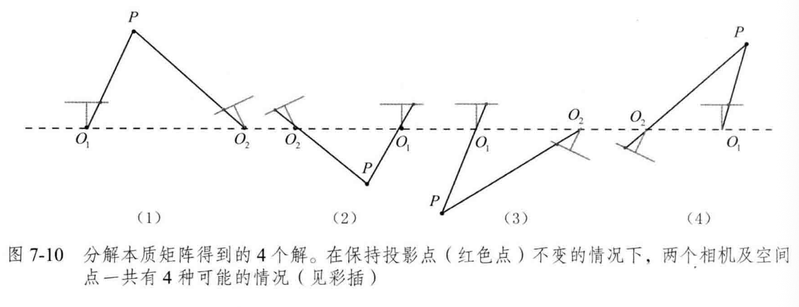

- 解E：

$$
E = U \text{diag}\left( \frac{\sigma_1 + \sigma_2}{2}, \frac{\sigma_1 + \sigma_2}{2}, 0 \right) V^T
$$

### 单应矩阵

- 描述处于共同平面上的一些点在两张图片之间的变换关系

- 平面方程（$n$ 是平面的法向量，$P$ 是空间点坐标，$d$ 是相机中心到平面的距离）：

$$
n^T P + d = 0, -\frac{n^T P}{d} = 1
$$

- 所以单应矩阵H为：

$$
\begin{aligned}
p_2 & \simeq K(RP + t) \\
& \simeq K(RP + t \cdot (-\frac{n^T P}{d})) \\
& \simeq K(R - \frac{tn^T}{d})P \\
& \simeq K(R - \frac{tn^T}{d})K^{-1}p_1
\end{aligned}
$$

$$
p_2 \simeq Hp_1
$$

$$
H = K(R - \frac{tn^T}{d})K^{-1}
$$

- 求解方法DLT（一组匹配点可以构造出两个约束）：

$$
\begin{pmatrix}
u_1^1 & v_1^1 & 1 & 0 & 0 & 0 & -u_1^1 u_2^1 & -v_1^1 u_2^1 \\
0 & 0 & 0 & u_1^1 & v_1^1 & 1 & -u_1^1 v_2^1 & -v_1^1 v_2^1 \\
u_1^2 & v_1^2 & 1 & 0 & 0 & 0 & -u_1^2 u_2^2 & -v_1^2 u_2^2 \\
0 & 0 & 0 & u_1^2 & v_1^2 & 1 & -u_1^2 v_2^2 & -v_1^2 v_2^2 \\
u_1^3 & v_1^3 & 1 & 0 & 0 & 0 & -u_1^3 u_2^3 & -v_1^3 u_2^3 \\
0 & 0 & 0 & u_1^3 & v_1^3 & 1 & -u_1^3 v_2^3 & -v_1^3 v_2^3 \\
u_1^4 & v_1^4 & 1 & 0 & 0 & 0 & -u_1^4 u_2^4 & -v_1^4 u_2^4 \\
0 & 0 & 0 & u_1^4 & v_1^4 & 1 & -u_1^4 v_2^4 & -v_1^4 v_2^4
\end{pmatrix}
\begin{pmatrix}
h_1 \\ h_2 \\ h_3 \\ h_4 \\ h_5 \\ h_6 \\ h_7 \\ h_8
\end{pmatrix}
=
\begin{pmatrix}
u_2^1 \\ v_2^1 \\ u_2^2 \\ v_2^2 \\ u_2^3 \\ v_2^3 \\ u_2^4 \\ v_2^4
\end{pmatrix}
$$

## 三角测量

- 估计地图点的深度

$$
s_2 \mathbf{x}_2 = s_1 \mathbf{R} \mathbf{x}_1 + \mathbf{t}
$$

$$
s_2 \mathbf{x}_2^{\wedge} \mathbf{x}_2 = 0 = s_1 \mathbf{x}_2^{\wedge} \mathbf{R} \mathbf{x}_1 + \mathbf{x}_2^{\wedge} \mathbf{t}
$$

- 最后用最小二乘解

- 三角测量的矛盾：增大平移可能导致匹配实效，平移太小则精度不够

## PnP

- 当知道n个3D空间点及其投影位置时，如何估计相机位姿
- 最少需要3个点对，加一个额外点验证结果，就可以估计相机运动

### 直接线性变换

 已知一组3D点的位置，以及它们在某个相机中的投影位置，求该相机的位姿

- 三维空间点到二维图像点的齐次坐标变换：

$$
s \begin{pmatrix} u_1 \\ v_1 \\ 1 \end{pmatrix} = \begin{pmatrix} t_1 & t_2 & t_3 & t_4 \\ t_5 & t_6 & t_7 & t_8 \\ t_9 & t_{10} & t_{11} & t_{12} \end{pmatrix} \begin{pmatrix} X \\ Y \\ Z \\ 1 \end{pmatrix}
$$

- 消去尺度因子，得到约束方程：

$$
u_1 = \frac{t_1X + t_2Y + t_3Z + t_4}{t_9X + t_{10}Y + t_{11}Z + t_{12}}, \quad v_1 = \frac{t_5X + t_6Y + t_7Z + t_8}{t_9X + t_{10}Y + t_{11}Z + t_{12}}
$$

- 定义矩阵的行向量为 $\mathbf{t}_1, \mathbf{t}_2, \mathbf{t}_3$，有：

$$
\mathbf{t}_1^T \mathbf{P} - \mathbf{t}_3^T \mathbf{P} u_1 = 0, \quad \mathbf{t}_2^T \mathbf{P} - \mathbf{t}_3^T \mathbf{P} v_1 = 0
$$

- 有N个特征点就有2N个方程：

$$
\begin{pmatrix} \mathbf{P}_1^T & 0 & -u_1 \mathbf{P}_1^T \\ 0 & \mathbf{P}_1^T & -v_1 \mathbf{P}_1^T \\ \vdots & \vdots & \vdots \\ \mathbf{P}_N^T & 0 & -u_N \mathbf{P}_N^T \\ 0 & \mathbf{P}_N^T & -v_N \mathbf{P}_N^T \end{pmatrix} \begin{pmatrix} \mathbf{t}_1 \\ \mathbf{t}_2 \\ \mathbf{t}_3 \end{pmatrix} = 0
$$

- 因此理论上需要六个点对（本来矩阵有12个参数，然后尺度等价性去除一个自由度），就可以求解这个矩阵

### P3P

- 输入三对3D-2D匹配点。已知三点在世界坐标系中的坐标，一旦算出3D点在相机坐标系下的坐标，就得到了3D-3D的对应点

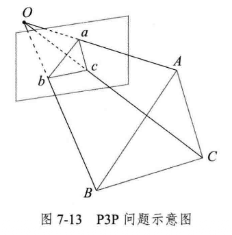

### 最小化重投影误差求解PnP

- 重投影误差：将3D点的投影位置与观测位置作差

- 前面的方法往往先求相机位姿，再求空间点位置，而非线性优化则将它们放在一起优化。

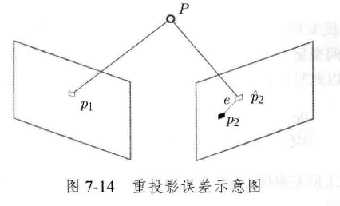

- 重投影误差对位姿的导数，重投影误差 $\mathbf{e}$ 关于相机位姿李代数 $\delta \boldsymbol{\xi}$ 的 $2 \times 6$ 雅可比矩阵

$$
\frac{\partial \mathbf{e}}{\partial \delta \boldsymbol{\xi}} = - \begin{bmatrix} \frac{f_x}{Z'} & 0 & -\frac{f_x X'}{Z'^2} & -\frac{f_x X' Y'}{Z'^2} & f_x + \frac{f_x X'^2}{Z'^2} & -\frac{f_x Y'}{Z'} \\ 0 & \frac{f_y}{Z'} & -\frac{f_y Y'}{Z'^2} & -f_y - \frac{f_y Y'^2}{Z'^2} & \frac{f_y X' Y'}{Z'^2} & \frac{f_y X'}{Z'} \end{bmatrix}
$$

- 重投影误差对空间点的导数

$$
\frac{\partial \mathbf{e}}{\partial \mathbf{P}} = - \begin{bmatrix} \frac{f_x}{Z'} & 0 & -\frac{f_x X'}{Z'^2} \\ 0 & \frac{f_y}{Z'} & -\frac{f_y Y'}{Z'^2} \end{bmatrix} \mathbf{R}
$$

## 3D-3D：ICP

- 找到了一组配对好的3D点，想要找到欧式变换R，t，使：

$$
\forall i, \mathbf{p}_i = \mathbf{R} \mathbf{p}'_i + \mathbf{t}
$$

### SVD方法

- 首先计算质心，并求出去质心坐标

$$
p = \frac{1}{n} \sum_{i=1}^{n} p_i, \quad p' = \frac{1}{n} \sum_{i=1}^{n} p'_i
$$

$$
q_i = p_i - p, \quad q'_i = p'_i - p'
$$

- 然后求解最佳旋转矩阵R

$$
\mathbf{R}^* = \arg \min_{\mathbf{R}} \frac{1}{2} \sum_{i=1}^{n} \|q_i - \mathbf{R} q'_i\|^2
$$

- 计算平移向量t（只与质心位置有关）

$$
t^* = p - Rp'
$$

# CH8 视觉里程计

## 直接法概述

- 特征点提取十分耗时
- 只用特征点会丢弃大量可能有用的信息
- 特征缺失时不足以计算相机运动
- 解决思路：
- - 光流法跟踪特征点运动
  - 直接法计算特征点在下一时刻的位置

## 2D光流

- 稀疏光流：计算部分像素的运动

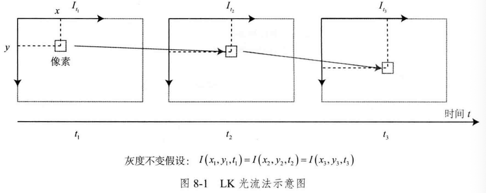

### Lucas-Kanade光流

- 认为相机的图像随时间变化，图像可以看作时间的函数：$I(t)$，
- 灰度不变假设：假设同一个空间点的像素灰度值在哥哥图像中是固定不变的。
- 灰度值不变，所以有：

$$
I(x+dx,y+dy,t+dt)=I(x,y,t)
$$

- 灰度不变假设实际上是一个很强的假设，因为像素会出现高光和阴影，有时相机也会自动调整曝光参数。

- 对图像进行泰勒展开，保留一阶项，有：

$$
I(x + \text{d}x, y + \text{d}y, t + \text{d}t) \approx I(x, y, t) + \frac{\partial I}{\partial x} \text{d}x + \frac{\partial I}{\partial y} \text{d}y + \frac{\partial I}{\partial t} \text{d}t
$$

- 灰度不变假设：

$$
\frac{\partial I}{\partial x} \text{d}x + \frac{\partial I}{\partial y} \text{d}y + \frac{\partial I}{\partial t} \text{d}t = 0
$$

- 可以得到光流基本方程：

$$
\frac{\partial I}{\partial x} \frac{\text{d}x}{\text{d}t} + \frac{\partial I}{\partial y} \frac{\text{d}y}{\text{d}t} = -\frac{\partial I}{\partial t}
$$

- 将$\frac{\text{d}x}{\text{d}t}$ 和 $\frac{\text{d}y}{\text{d}t}$定义为运动速度u和v，即有：

$$
\begin{bmatrix} I_x & I_y \end{bmatrix} \begin{bmatrix} u \\ v \end{bmatrix} = -I_t
$$

## 直接法

- 首先追踪特征点位置，再根据位置确定相机运动
- 后一步是否可以调整前一步结果

### 直接法推导

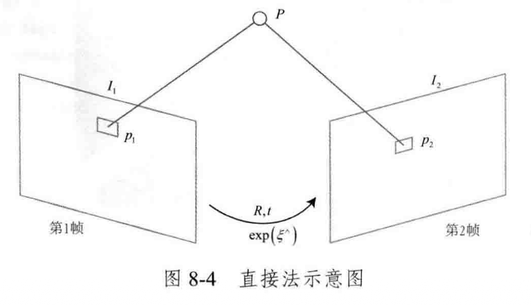

- 目标是求R和t
- 对于同一个点的投影$p_1,p_2$：

$$
p_1 = \begin{bmatrix} u \\ v \\ 1 \end{bmatrix}_1 = \frac{1}{Z_1} \mathbf{K} P
$$

$$
p_2 = \begin{bmatrix} u \\ v \\ 1 \end{bmatrix}_2 = \frac{1}{Z_2} \mathbf{K} (\mathbf{R}P + \mathbf{t}) = \frac{1}{Z_2} \mathbf{K} (\mathbf{T}P)_{1:3}
$$

- 直接法中，没有特征匹配，因此不知道$p_2,p_1$的对应关系；
- 直接发的思路是依据当前位姿估计寻找$p_2$
- 优化相机的位姿，找到与$p_1$更相似的$p_2$。这是一个优化问题：

$$
e = I_1(p_1) - I_2(p_2)
$$

$$
\min_{\mathbf{T}} J(\mathbf{T}) = \| e \|^2
$$

- 这里优化的是相机位姿T

### 直接法优缺点

- - 省去计算特征点、描述子
- - 只有有像素梯度即可，无需特征点
  - 可以构建半稠密甚至稠密的地图
- - 非凸，完全靠梯度搜索
  - 单个像素没有区分度
  - 要求灰度值不变，假设太强

# CH9 后端

- 状态估计：通常考虑一段更长时间内的状态估计问题，会用过去、也会用将来的信息更新自己的状态（Batch）；如果只由过去的时刻决定，则是渐进的（Incremental）。
- 运动方程和观测方程：

$$
\begin{cases}
\boldsymbol{x}_k = f(\boldsymbol{x}_{k-1}, \boldsymbol{u}_k) + \boldsymbol{w}_k \\
\boldsymbol{z}_{k,j} = h(\boldsymbol{y}_j, \boldsymbol{x}_k) + \boldsymbol{v}_{k,j}
\end{cases}
\quad k = 1, \dots, N, \ j = 1, \dots, M.
$$

- 每个方程都受噪声影响，因此位姿x和路标y都是服从某种概率分布的随机变量
- 当没有观测数据时，不确定性越来越大；如果有正确的观测数据，不确定性就会缩小至一定大小，保持稳定。

- 令$x_k$为k时刻的所有未知量，包含当前时刻的相机位姿与m个路标点。因此有：

$$
\boldsymbol{x}_k \stackrel{\text{def}}{=} \{\boldsymbol{x}_k, \boldsymbol{y}_1, \dots, \boldsymbol{y}_m\}
$$

- 把k时刻的所有观测记作$z_k$，则运动方程为：

$$
\begin{cases} \boldsymbol{x}_k = f(\boldsymbol{x}_{k-1}, \boldsymbol{u}_k) + \boldsymbol{w}_k \\ \boldsymbol{z}_k = h(\boldsymbol{x}_k) + \boldsymbol{v}_k \end{cases} \quad k = 1, \dots, N.
$$

- 那么我们要估计的分布为：

$$
P(\boldsymbol{x}_k | \boldsymbol{x}_0, \boldsymbol{u}_{1:k}, \boldsymbol{z}_{1:k})
$$

- 其中：

$$
P(\boldsymbol{x}_k | \boldsymbol{x}_0, \boldsymbol{u}_{1:k}, \boldsymbol{z}_{1:k}) \propto P(\boldsymbol{z}_k | \boldsymbol{x}_k) P(\boldsymbol{x}_k | \boldsymbol{x}_0, \boldsymbol{u}_{1:k}, \boldsymbol{z}_{1:k-1})
$$

$$
P(\boldsymbol{x}_k | \boldsymbol{x}_0, \boldsymbol{u}_{1:k}, \boldsymbol{z}_{1:k-1}) = \int P(\boldsymbol{x}_k | \boldsymbol{x}_{k-1}, \boldsymbol{x}_0, \boldsymbol{u}_{1:k}, \boldsymbol{z}_{1:k-1}) P(\boldsymbol{x}_{k-1} | \boldsymbol{x}_0, \boldsymbol{u}_{1:k}, \boldsymbol{z}_{1:k-1}) d\boldsymbol{x}_{k-1}
$$

## 线性系统和KF

- 假设了马尔可夫性，那么当前时刻状态只和上一时刻有关；在程序中也就只需要维护一个状态量。
- 卡尔曼滤波器：
- - 预测：基于上一时刻的状态估计当前时刻的状态和协方差

$$
\check{\boldsymbol{x}}_k = \boldsymbol{A}_k \hat{\boldsymbol{x}}_{k-1} + \boldsymbol{u}_k
$$

$$
\check{\boldsymbol{P}}_k = \boldsymbol{A}_k \hat{\boldsymbol{P}}_{k-1} \boldsymbol{A}_k^T + \boldsymbol{R}
$$

- - 更新：先计算K，卡尔曼增益；再计算后验概率的分布

$$
\boldsymbol{K} = \check{\boldsymbol{P}}_k \boldsymbol{C}_k^T (\boldsymbol{C}_k \check{\boldsymbol{P}}_k \boldsymbol{C}_k^T + \boldsymbol{Q}_k)^{-1}
$$

$$
\hat{\boldsymbol{x}}_k = \check{\boldsymbol{x}}_k + \boldsymbol{K} (\boldsymbol{z}_k - \boldsymbol{C}_k \check{\boldsymbol{x}}_k)
$$

$$
\hat{\boldsymbol{P}}_k = (\boldsymbol{I} - \boldsymbol{K} \boldsymbol{C}_k) \check{\boldsymbol{P}}_k
$$

- 可见，卡尔曼滤波器构成了该系统中的最大后验概率估计

## 非线性系统和EKF

- 扩展卡尔曼滤波器，在某个点附近考虑运动方程及观测方程的一阶泰勒展开，只保留一阶线性的部分，然后按照线性系统推导。

- 线性化近似（一阶泰勒展开）：
- - 运动方程线性化：

$$
\boldsymbol{x}_k \approx f(\hat{\boldsymbol{x}}_{k-1}, \boldsymbol{u}_k) + \left. \frac{\partial f}{\partial \boldsymbol{x}_{k-1}} \right|_{\hat{\boldsymbol{x}}_{k-1}} (\boldsymbol{x}_{k-1} - \hat{\boldsymbol{x}}_{k-1}) + \boldsymbol{w}_k
$$

$$
\boldsymbol{F} = \left. \frac{\partial f}{\partial \boldsymbol{x}_{k-1}} \right|_{\hat{\boldsymbol{x}}_{k-1}}
$$

- - 观测方程线性化：

$$
\boldsymbol{z}_k \approx h(\check{\boldsymbol{x}}_k) + \left. \frac{\partial h}{\partial \boldsymbol{x}_k} \right|_{\check{\boldsymbol{x}}_k} (\boldsymbol{x}_k - \check{\boldsymbol{x}}_k) + \boldsymbol{n}_k
$$

$$
\boldsymbol{H} = \left. \frac{\partial h}{\partial \boldsymbol{x}_k} \right|_{\check{\boldsymbol{x}}_k}
$$

- 那么预测步骤为：

$$
P(\boldsymbol{x}_k | \boldsymbol{x}_0, \boldsymbol{u}_{1:k}, \boldsymbol{z}_{0:k-1}) = N(f(\hat{\boldsymbol{x}}_{k-1}, \boldsymbol{u}_k), \boldsymbol{F} \hat{\boldsymbol{P}}_{k-1} \boldsymbol{F}^T + \boldsymbol{R}_k)
$$

- - 均值与协方差预测为：

$$
\check{\boldsymbol{x}}_k = f(\hat{\boldsymbol{x}}_{k-1}, \boldsymbol{u}_k), \quad \check{\boldsymbol{P}}_k = \boldsymbol{F} \hat{\boldsymbol{P}}_{k-1} \boldsymbol{F}^T + \boldsymbol{R}_k
$$

- 更新步骤为：
- - 观测似然：

$$
P(\boldsymbol{z}_k | \boldsymbol{x}_k) = N(h(\check{\boldsymbol{x}}_k) + \boldsymbol{H}(\boldsymbol{x}_k - \check{\boldsymbol{x}}_k), \boldsymbol{Q}_k)
$$

- - 计算卡尔曼增益：

$$
\boldsymbol{K}_k = \check{\boldsymbol{P}}_k \boldsymbol{H}^T (\boldsymbol{H} \check{\boldsymbol{P}}_k \boldsymbol{H}^T + \boldsymbol{Q}_k)^{-1}
$$

- - 后验概率更新：

$$
\hat{\boldsymbol{x}}_k = \check{\boldsymbol{x}}_k + \boldsymbol{K}_k (\boldsymbol{z}_k - h(\check{\boldsymbol{x}}_k)), \quad \hat{\boldsymbol{P}}_k = (\boldsymbol{I} - \boldsymbol{K}_k \boldsymbol{H}) \check{\boldsymbol{P}}_k
$$

## BA与图优化

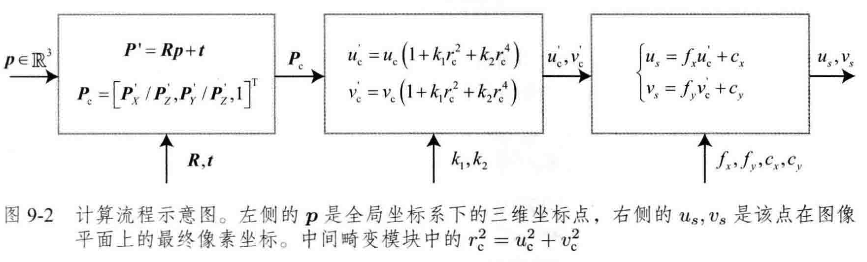

- BA的目标函数：

$$
\min_{\xi, p} \frac{1}{2} \sum_{i=1}^{m} \sum_{j=1}^{n} \| z_{ij} - h(\xi_i, p_j) \|_{\Sigma}^2
$$

$z_{ij}$：相机 $i$ 观测到路标 $j$ 的实际像素坐标。

$h(\xi_i, p_j)$：观测模型，即通过相机位姿 $\xi_i$ 将三维点 $p_j$ 投影到像素平面的理论坐标。

误差项 $e_{ij} = z_{ij} - h(\xi_i, p_j)$ 就是我们要最小化的重投影误差。

### 稀疏性与边缘化

- 矩阵H是稀疏的，是由雅可比矩阵J引起的
- 可以利用H矩阵的稀疏性，使用Schur手段（Marginalization）进行加速计算
- 海森矩阵H的结构：

由于每一个重投影误差项只和**一个具体的相机位姿**和**一个具体的路标点**有关，当我们把所有的相机位姿变量排在前面，所有的路标点变量排在后面时，$H$ 矩阵会呈现出典型的**箭头状（Arrowhead）**结构：

1. **左上角（相机-相机块）：** 是一个对角块矩阵，代表相机位姿的信息矩阵。
2. **右下角（路标-路标块）：** 也是一个对角块矩阵，代表路标点的信息矩阵。由于路标点极多，这部分极其庞大，但它是绝对的对角块（因为路标和路标之间没有直接观测约束）。
3. **右上角和左下角（相机-路标交叉块）：** 记录了哪些相机看到了哪些路标。

### 鲁棒核函数

- BA问题中，将最小化误差项的二范数平方和作为目标函数——如果出现误匹配，这部分的误差会非常大，抹平其他正确边的影响。（即误差很大的时候，二范数增长过快）
- 方法就是将原先误差的二范数度量替换成增长没有那么快的函数。
- 例如Huber核：

$$
H(e) = \begin{cases}
\frac{1}{2}e^2 & \text{当 } |e| \le \delta, \\
\delta \left(|e| - \frac{1}{2}\delta\right) & \text{其他}
\end{cases}
$$

# CH10 后端 位姿图

- BA可以精确优化每个相机位姿与特征点位置，但是会降低计算效率。

## 滑动窗口滤波与优化

- 滑动窗口法：仅保留当前时刻最近的N个关键帧，去掉时间上更早的关键帧（也可以取时间上靠近、空间上展开的关键帧）
- 使用共视图：取存在共同观测的关键帧构成的图

### 滑动窗口法

- 考虑新增一个关键帧和路标点、删除一个旧的关键帧
- 边缘化之后，整个问题不再稀疏。边缘化：保持这个关键帧当前的估计值，求其他状态变量以这个关键帧为条件的条件概率。所以当某个关键帧被边缘化后，观测到的路标点就会产生一个“这些路标应该在哪里”的先验信息。再边缘化这些路标点，那么它们的观测者会得到一个“观测它们的关键帧应该在哪里”的先验信息。
- 原因：
- - 原本的增量方程：

$$
\begin{bmatrix} H_{mm} & H_{mr} \\ H_{rm} & H_{rr} \end{bmatrix} \begin{bmatrix} \Delta x_m \\ \Delta x_r \end{bmatrix} = \begin{bmatrix} g_m \\ g_r \end{bmatrix}
$$

- - 通过舒尔补消元$x_m$后，剩下变量$x_r$的方程变为

$$
(H_{rr} - H_{rm} H_{mm}^{-1} H_{mr}) \Delta x_r = g_r - H_{rm} H_{mm}^{-1} g_m
$$

- - 即去除一个旧帧x后，原本只与它相连的路标点之间会在数学上相连

## 位姿图

- 在优化几次特征点后，认为其已收敛，并把它们看作位姿估计的约束。
- 那么是否可以在优化的时候不管特征点（路标），只管轨迹

### 位姿图的优化

- 节点：相机位姿，T；边：两个位姿节点之间的相对运动估计
- 优化变量为各个顶点的位姿，边来自于位姿观测约束

# CH11 回环检测

- 前端提供给特征点的提取和轨迹、地图的初值，后端负责对所有这些数据进行优化；如果像视觉里程计那样仅考虑相邻时间上的关键帧，那么误差会累积到下一时刻，使整个SLAM出现累积误差。也就是说无法构建全局一致的轨迹和地图。

## 回环检测方法

- 对任意两幅图像都做特征匹配；这里假设任意两幅图像都会出现回环，检测数量太大。
- 在过去n帧中随机抽取几帧与当前帧比较（盲目试探，检测效率又不高）
- 更好的做法是，有“哪出可能出现回环”的预计。
- - 基于里程计的几何关系：检测相机是否运动到了之前的某个位置附近，有点倒果为因
  - 基于外观的几何关系：图像相似性（主流做法）
  - 无人车：GPS（室内不好用）

### 准确率和召回率

- 结果分类：
- - 程序判断是回环——是回环——真阳性TP
  - 程序判断是回环——不是回环——假阳性FP
  - 程序判断不是回环——是回环——假阴性FN
  - 程序判断不是回环——不是回环——真阴性TN
- 准确率与召回率：
- - Precision=TP/(TP+FP)，算法提取的所有回环中确实是真实回环的概率
  - Recall=TP/(TP+FN)，所有真实回环中被正确检测出来的概率
- SLAM中，对准确率的要求更高，而对召回率相对宽容。
- 倾向于将参数设置得更严格，或者检测后加入回环验证

## 词袋模型

- 词袋BoW，用“图像上有哪几种特征”描述一幅图像，因此需要：
- - 确定特征的概念（比如人、车等），对应W(Word)，许多word放在一起，组成字典(Dictionary)
  - 确定一幅图像中出现了哪些在字典中定义的概念——用单词出现的情况描述整幅图像（也就将图像转换成了向量描述）
  - 比较上一步中描述的相似程度
- 字典固定，只需要一个向量就可以描述整幅图像（是否出现，不管在哪出现）；无关顺序。字典为一个集合。
- 二值向量：一个描述是否出现，一个描述个数

## 字典

- 单词不是从单幅图片上提取出来的，而是某一类特征的组合，因此字典生成问题类似于一个聚类问题
- K-means算法解决（找一个有k个单词的字典，每个单词可以看作局部相邻特征点的集合）

- - 随机选取 $k$ 个中心点： $c_1, \dots, c_k$。
  - 对每一个样本： 计算它与每个中心点之间的距离，取最小的作为它的归类。
  - 重新计算每个类的中心点。
  - 如果每个中心点都变化很小： 则算法收敛，退出；否则返回第 2 步。
- 问题变为如何根据图像中的特征点查找字典中对应的单词。
- 如果和每个单词做比对取最相似的——当字典规模较大，其复杂度非常大
- 用k叉树表达字典
- 假设有N个特征点，希望构建一个深度为d、每次分叉为k的树：

- - 在根节点： 用 K-means 把所有样本聚成 $k$ 类（实际中为保证聚类均匀性会使用 K-means++）。这样就得到了第一层。
  - 对第一层的每个节点： 把属于该节点的样本再聚成 $k$ 类，得到下一层。
  - 依此类推： 最后得到叶子层。叶子层即为所谓的 Words（视觉单词）。

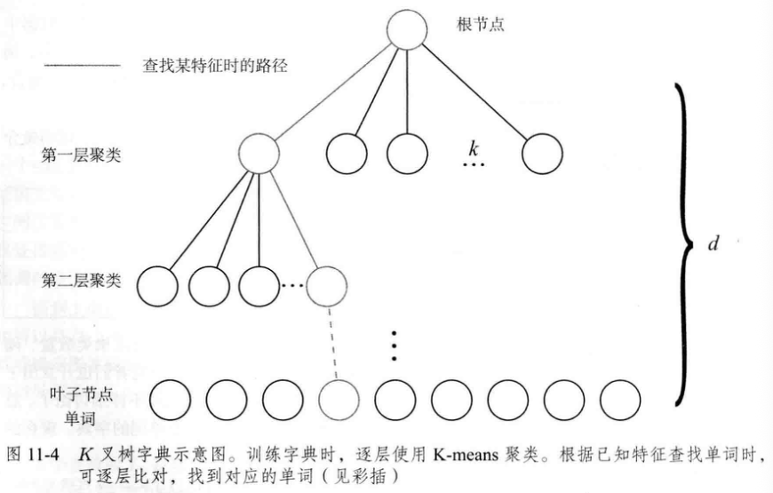

- 对数级别的查找效率

## 相似度计算

- 有字典之后，给定特征f只要逐层查找，总能找到与其对应的单词w。
- 应考虑部分单词具有更强区分性这一因素。给予单词不同的权值。

- **TF-IDF：译频率-逆文档频率**
- - TF：单词在一幅图像中经常出现，其区分度就高；IDF：单词在字典中出现的频率越低，分类图像时区分度越高
- IDF：某个叶子结点$w_i$中特征数量相对于所有特征数量的比例作为IDF部分，设n个特征，$w_i$数量为$n_i$，有：

$$
\text{IDF}_i = \log \frac{n}{n_i}
$$

- TF：某个特征在单幅图像中出现的频率。假设图像中单词$w_i$出现了$n_i$次，一共出现单词n次，那么有：

$$
\text{TF}_i = \frac{n_i}{n}
$$

- 于是$w_i$的权重为：

$$
\eta_i = \text{TF}_i \times \text{IDF}_i
$$

- 图像可以表示为由单词与其权重组成的集合：

$$
A = \{(w_1, \eta_1), (w_2, \eta_2), \dots, (w_N, \eta_N)\} \stackrel{\text{def}}{=} v_A
$$

- 给定两个向量v，计算差异：

$$
s(v_A - v_B) = 2 \sum_{i=1}^{N} |v_{Ai}| + |v_{Bi}| - |v_{Ai} - v_{Bi}|
$$

## 实验分析

### 关键帧处理

- 必须考虑关键帧选取
- 基于回环检测的帧最好稀疏一些：n与n-2相似，其意义不大
- 把相近的回环聚成一类

### 检测之后验证 

- 回环检测完全依赖于外观而没有任何几何信息，导致外观相似的图像容易被当成回环
- 可以用一段时间一直检测到回环当做验证

### 与机器学习的关系

- 回环中类别的数量很大，但每类的样本很少
- 实际上是对图像间相似度的学习
- - 可以对机器学习的图像特征进行聚类，而不对人工设计的特征进行聚类
  - 更好的聚类方式

# CH12 建图

- 地图的用处：
- - 定位：确定机器人的位置（还可以保存地图）
  - 导航：机器人在地图中进行路径规划，然后自己运动到目标点（需要知道地图中哪里可以通过）；必须是稠密的地图
  - 避障：更注重局部的障碍物处理。需要稠密地图
  - 重建：向人展示
  - 交互：人与地图之间互动

## 单目稠密重建

### 立体视觉

稠密重建：

- 单目相机估计相机运动并三角化，计算像素的距离
- 双目相机利用左右目的视差计算像素距离
- RGB-D直接获得距离

### 极线搜索 块匹配

极线搜索：

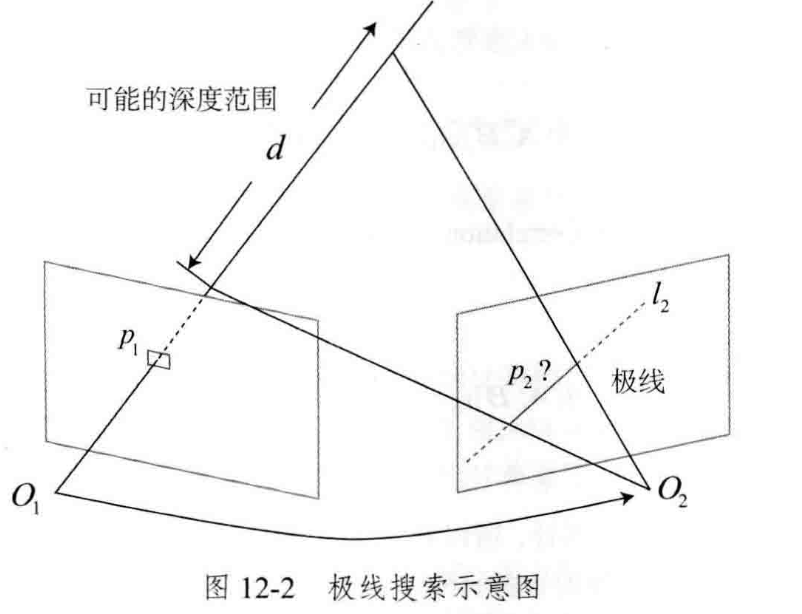

- 需要确定第二张图中p1像素的位置
- 由于没有特征，难以像词袋那样进行匹配；单个像素的亮度没有区分性
- 块匹配：取p1周围的$w*w$小块，极线上取n个小块
- - SAD:

$$
S(\mathbf{A}, \mathbf{B})_{\text{SAD}} = \sum_{i,j} |\mathbf{A}(i, j) - \mathbf{B}(i, j)|
$$

- - SSD，对噪声敏感，较大的差异会被放大:

$$
S(\mathbf{A}, \mathbf{B})_{\text{SSD}} = \sum_{i,j} (\mathbf{A}(i, j) - \mathbf{B}(i, j))^2
$$

- - NCC，归一化互相关，对光照有更好的鲁棒性:

$$
S(\mathbf{A}, \mathbf{B})_{\text{NCC}} = \frac{\sum_{i,j} \mathbf{A}(i, j) \mathbf{B}(i, j)}{\sqrt{\sum_{i,j} \mathbf{A}(i, j)^2 \sum_{i,j} \mathbf{B}(i, j)^2}}
$$

- 深度滤波器：估计深度概率分布

### 高斯分布的深度滤波器

- 前段已占据不少计算量，建图则采用计算量较少的滤波器方式
- 高斯分布假设下的深度滤波器：
- - 假设某个像素点深度d服从：

$$
P(d) = N(\mu, \sigma^2)
$$

- - 当新数据来的时候，假设这次观测也是高斯分布：

$$
P(d_{\text{obs}}) = N(\mu_{\text{obs}}, \sigma_{\text{obs}}^2)
$$

- - 那么需要根据观测信息更新原先的d的分布：

$$
\mu_{\text{fuse}} = \frac{\sigma_{\text{obs}}^2 \mu + \sigma^2 \mu_{\text{obs}}}{\sigma^2 + \sigma_{\text{obs}}^2}, \quad \sigma_{\text{fuse}}^2 = \frac{\sigma^2 \sigma_{\text{obs}}^2}{\sigma^2 + \sigma_{\text{obs}}^2}
$$

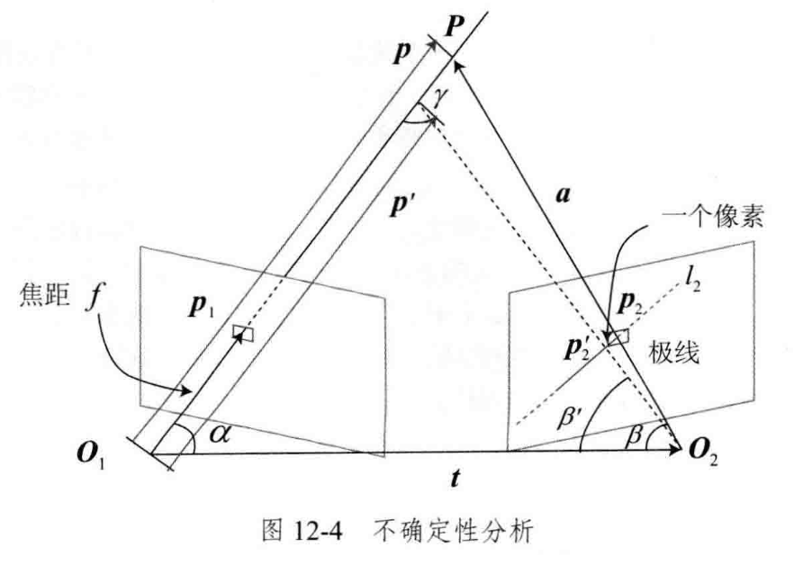

- 不确定性分析：像素误差

- 给出稠密深度的一个完整的过程：

1. 假设所有像素的深度满足某个初始的高斯分布。
2. 当新数据产生时，通过**极线搜索**和**块匹配**确定投影点位置。
3. 根据几何关系计算**三角化**后的深度及不确定性。
4. 将当前观测融合进上一次的估计中。若收敛则停止计算，否则返回第 2 步。

### 像素梯度问题

- 有明显梯度的小块具有良好的区分度
- 立体视觉对物体纹理具有很强的依赖性

### 逆深度

- u，v，d，三个参量，认为u，v和d是近似独立的。d呈一维高斯分布
- 发现假设深度的倒数“逆深度”，为高斯分布，是比较有效的

### 图像间的变换

- 图像小块在相机发生明显旋转的时候会导致相关性计算出现问题（我们之前假设了图像小块在相机运动时保持不变）
- 因此需要在块匹配之前考虑参考帧与当前帧之间的运动
- 参考帧上像素$P_R$，真实三维点世界坐标$P_W$，当前帧上像素$P_C$
- - 参考帧投影方程

$$
d_R P_R = K(R_{RW} P_W + t_{RW})
$$

- - 当前帧投影方程

$$
d_C P_C = K(R_{CW} P_W + t_{CW})
$$

- - 两帧间像素变换关系

$$
d_C P_C = d_R K R_{CW} R_{RW}^T K^{-1} P_R + K t_{CW} - K R_{CW} R_{RW}^T K t_{RW}
$$

- - 再给$P_R$的两个分量各一个增量du，dv，可以求得$P_C$的增量:

$$
\begin{bmatrix} du_c \\ dv_c \end{bmatrix} = \begin{bmatrix} \frac{\partial u_c}{\partial u} & \frac{\partial u_c}{\partial v} \\ \frac{\partial v_c}{\partial u} & \frac{\partial v_c}{\partial v} \end{bmatrix} \begin{bmatrix} du \\ dv \end{bmatrix}
$$

- 这样以来，可以统一帧，再进行块匹配

## RGB-D稠密建图

- 硬件进行深度估计
- 建图方式：将RGB-D数据转化成点云，然后拼接，最后得到一个由离散的点组成的点云地图；如果对外观有要求，可以使用三角网格Mesh、面片Surfel；希望知道障碍物信息并导航，可以使用体素Voxel
- 不过点云是初级的：
- - 定位需求：点云不存储特征点信息，无法用于基于特征点的定位方法
  - 导航与避障需求：无法得知空间是否被占据
  - 可视化与交互：有基本的能力，但是点云正面和背面是一样的，不符合日常经验

### 八叉树地图

- 点云规模大，需要大量存储空间；且有许多冗余内容
- 点云地图无法处理运动物体
- 八叉树：将小方块（节点）分成八块，可以多次重复；节点存储是否被占据的信息
- - 八叉树优势：当某个方块的所有子节点都被占据或者都不被占据时，可以不展开这个节点
- 用**概率**的形式表达某个节点是否被占据。用y表示概率对数值，x表示概率：

$$
y = \text{logit}(x) = \log \left( \frac{x}{1 - x} \right)
$$

$$
x = \text{logit}^{-1}(y) = \frac{\exp(y)}{\exp(y) + 1}
$$

- 也就是说，y从负无穷到正无穷，x就从0变到1；可以用y来表达节点是否被占据
- 设节点为n，观测数据为z，那么从开始到t时刻某节点的概率对数值为L，t+1时刻为：

$$
L(n|z_{1:t+1}) = L(n|z_{1:t-1}) + L(n|z_t)
$$

## TSDF地图和Fusion系列

- 前述地图模型以定位为主体，地图拼接作为后续的加工步骤
- 定位通常是轻量级的；地图的表达和存储是重量级的
- 现有做法没有对稠密地图进行优化，比如两幅图像观察同一把椅子时，只对点云进行叠加——重影
- 实时三维重建
- TSDF(Truncated Signed Distance Function)：将地图存储在显存中，可以并行地对每个体素进行计算和更新

# CH13 设计SLAM系统

## 工程框架

1. 在 **bin** 下存储编译好的二进制文件。
2. **include/myslam** 存放 SLAM 模块的头文件，主要是 **.h** 文件。这种做法的目的是，当把包含目录设到 include，引用自己的头文件时，需要写 `include "myslam/xxx.h"`，这样不容易和别的库混淆。
3. **src** 存放源代码文件，主要是 **.cpp** 文件。
4. **test** 存放测试用的文件，也是 **.cpp** 文件。
5. **config** 存放配置文件。
6. **cmake_modules** 存放第三方库的 cmake 文件，在使用 g2o 之类的库时会用到它。

### 确定算法结构

如视觉里程计：

- 处理的最基本单元时图像（双目视觉就是一对图像，**一帧**）
- 对帧会提取**特征**，特征是很多2D点
- 在图像间寻找特征关联。多次看到某个特征，可以用三角化的方法计算它的3D位置，即**路标**

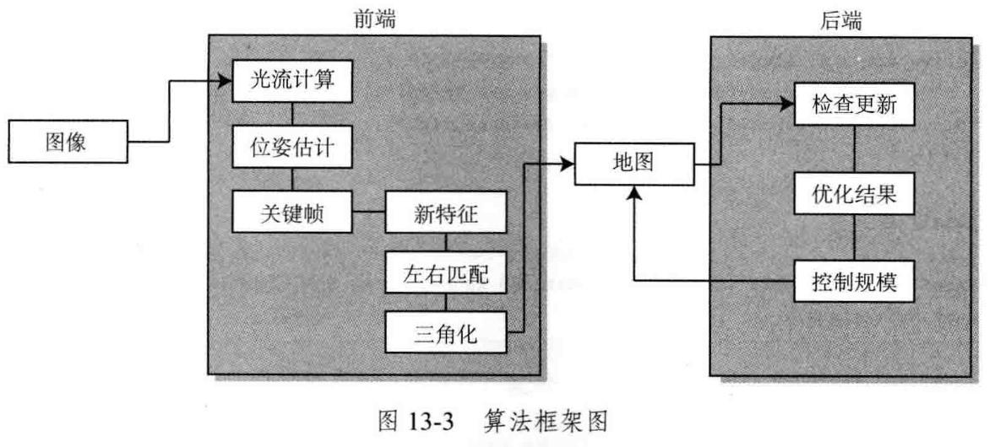
