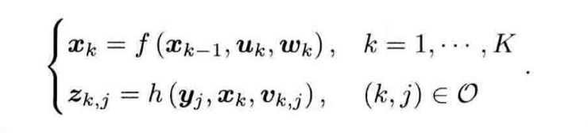

# CH2

## 问题

- 一个完整的SLAM framework由哪些功能模块组成，每个功能模块干什么事情，它们各自的输入输出是什么？
- 噪声是什么？误差又是什么？
- SLAM的中文译名为即时定位与地图构建，这里的“地图”指的是什么类型的地图？

## 经典SLAM框架

### 传感器：信息读取

- 相机图像信息的读取和预处理；机器人运动传感器的信息读取与同步
- Input：传感器输入
- Output：图像、运动数据；时间戳

### 前端：视觉里程计

- 估算相邻图像间运动
- Input：时间上相邻（连续）的图像；时间戳
- Output：相机相对位姿变化；进而得到运动轨迹；局部地图
- 会出现累积漂移

### 回环检测

- 判断机器人是否到达过先前的位置
- Input：当前图像、先前图像；全局地图（局部地图构建？）
- Output：图像相似度；位姿约束关系

### 后端（非线性）优化

- 接受不同时刻视觉里程计测量的相机位姿以及回环检测的信息，进行优化，得到全局一致的轨迹和地图
- Input：视觉里程计输出（相机位姿、约束）；回环检测输出（约束关系）
- Output：全局一致的轨迹和地图
- 图：仅供机器使用

### 建图

- 根据估计的轨迹，建立与任务要求对应的地图
- Input：优化后相机位姿；图像数据；
- Output：任务对应的地图

## 误差（准确度）、噪声（精密度）

- 误差：
- 视觉里程计在“估计运动”时的误差（漂移）；特征误匹配
- 后端受异常值干扰，导致地图错误
- 噪声：
- 传感器噪声（图像、运动传感器）
- （要滤波）

## 地图

- 度量地图：精确地表示地图中物体的位置关系
- 稠密/稀疏地图，二维/三维度量地图

- 拓扑地图：强调地图元素间的关系
- 考虑连通性，去除细节

- 这里用到的是点云

## SLAM数学建模

- 运动方程/观测方程

- 已知运动测量的读数u、传感器读数z
- 求解位姿x、图像y

- SLAM问题：状态估计问题——根据带有噪声的测量数据，估计内部的、隐藏状态的变量

# CH3

## 问题

- 旋转为什么需要这么多的表征方式？

## 坐标系间欧式变换

- 欧式变换由旋转和平移组成。

- 即某一个向量在两个坐标系下的表示

- 左乘$[e_1^T,e_2^T,e_3^T]^T$，得到两坐标系下不同坐标的关系；R表示旋转矩阵，是一个行列式为1的正交矩阵。

$$
a_1 = R_{12}a_2+t_{12}
$$

- 把坐标系2的向量变换到坐标系1中（向量本身没有变化，只是开始的时候是以坐标系2的基底表示的，经过变换，转换成坐标系1表示）。
- 这里的$t_{12}$：逆向：不是直接取反，因为之前的t是在坐标系2中取到的t，经过旋转后虽然平移的大小不变但方向改变。

## 变换矩阵，齐次坐标

- 当多次变换叠加时，每次变换都要加一个t，非线性。

- 当引入齐次坐标和变换矩阵，可以重写上式。其中T称为变换矩阵（即旋转矩阵+平移）

## 特殊正交群，特殊欧式群

- 特殊正交群

- 特殊欧式群

## 旋转向量

- 旋转矩阵有9个量，一次旋转只有3个自由度；变换矩阵有16个量，表达6个自由度。因此表达方式有冗余。
- 旋转矩阵自身带有约束，即必须是个正交矩阵，这使求解变得困难。
- 事实上旋转只需要1个旋转轴，1个旋转角；旋转轴为2维，旋转角为1维，共三维。因此一个变换矩阵可以使用6维向量表述。
- 罗德里格斯公式：旋转轴加旋转角度表示旋转矩阵：

其中：

- 旋转轴在旋转之后不变，因此转轴n是矩阵R特征值1对应的特征向量

## 欧拉角

- 旋转矩阵和旋转向量不够直观。引入欧拉角：一个旋转分解成3次绕不同轴的旋转。
- 偏航-俯仰-旋转；ZYX；yaw-pitch-roll
- 问题：万向锁问题：俯仰角±90度时会丢失自由度

## 四元数

- 三维向量必然带有奇异性，而例如旋转矩阵则具有冗余性。
- 引入四元数，紧凑而没有奇异性。
- 正如二维欧拉公式表达旋转，三维旋转可以由单位四元数表示。

- 这种表达方式和复数有所不同。因为i、j、k实际上对应的是相乘旋转180度，否则不满足其旋转关系式。

### 四元数运算

- 当成实部+虚部的形式，只不过虚部有三种

## 总结

- 旋转为什么需要这么多的表征方式？
- 欧式变换矩阵：数学形式简便，便于进行计算，但是冗余非常严重；同时自带行列式为1且是正交矩阵，导致计算量大且计算困难。
- 欧拉角：三种旋转方式比较直观，且比较紧凑；但会有奇异性，导致系统丢失一个自由度。
- 四元数：紧凑且无奇异性，且使用矩阵乘法计算量很小；但四元数及其不直观，且带有“必须是单位四元数”的约束。
- 旋转向量与李代数：只有三个参数且没有约束；但存在周期性问题。

旋转要求紧凑，没有奇异性，便于求导；

- 紧凑：用最少的变量表达旋转的自由度，便于存储；
- 没有奇异性：不会出现死锁；
- 便于求导：旋转发生微小变化时，可以用简单的加法和线性映射更新。
- 没有一种方法可以同时满足上述所有的要求。
- 因此需要求导的时候，用旋转向量表示；需要没有奇异性时，用四元数表示；需要坐标时，用旋转矩阵。

# CH4

## 李群与李代数

- 特殊正交群与特殊欧氏群

$$
\text{SO}(3) = \{ \mathbf{R} \in \mathbb{R}^{3 \times 3} \mid \mathbf{RR}^{\text{T}} = \mathbf{I}, \det(\mathbf{R}) = 1 \}
$$

$$
\text{SE}(3) = \left\{ \mathbf{T} = \begin{bmatrix} \mathbf{R} & \mathbf{t} \\ \mathbf{0}^{\text{T}} & 1 \end{bmatrix} \in \mathbb{R}^{4 \times 4} \mid \mathbf{R} \in \text{SO}(3), \mathbf{t} \in \mathbb{R}^3 \right\}
$$

对加法不封闭，对乘法封闭

## 群

## 李代数

### 引入

$$
R(t)R(t)^{\mathrm{T}} = I
$$

- 对时间求导有：$\dot{R}(t)R(t)^{\mathrm{T}} + R(t)\dot{R}(t)^{\mathrm{T}} = 0$，可见是一个反对称矩阵

- 那么可以用反对称算子表示：$\dot{R}(t)R(t)^{\mathrm{T}} = \phi(t)^{\wedge}$，得到如下的表达式：

$$
\dot{R}(t) = \phi(t)^{\wedge}R(t) = \begin{bmatrix} 0 & -\phi_3 & \phi_2 \\ \phi_3 & 0 & -\phi_1 \\ -\phi_2 & \phi_1 & 0 \end{bmatrix} R(t)
$$

该式可以得到一个旋转矩阵关于时间的导数。

- 设R(0)=I，这里可以在t=0处进行展开，也可以得到微分方程形式的式子与微分方程的解。

$$
\begin{aligned} R(t) &\approx R(t_0) + \dot{R}(t_0)(t - t_0) \\ &= I + \phi(t_0)^{\wedge}(t) \end{aligned}
$$

$$
\dot{R}(t) = \phi(t_0)^{\wedge}R(t) = \phi_0^{\wedge}R(t)
$$

- 解：$R(t) = \exp(\phi_0^{\wedge}t) \tag{4.10}$。这里的问题是怎么求一个矩阵的指数/对数映射。

### 李代数so(3)

之前的$\phi$实际上是李代数。

- SO(3)对应的so(3)，so(3)的元素实际上是三维向量或者三维反对称矩阵。其中每一个三维向量对应一个反对称矩阵。

- 可以由该式联系SO(3)和so(3)：$R=exp(\phi^{\wedge})$

### 李代数se(3)

- se(3)中每一个元素是$\boldsymbol{\xi}$，六维向量，前三维平移，后三维旋转。

$$
\boldsymbol{\xi}^{\wedge} = 
\begin{bmatrix} 
\boldsymbol{\phi}^{\wedge} & \boldsymbol{\rho} \\ 
\mathbf{0}^{\mathrm{T}} & 0 
\end{bmatrix} \in \mathbb{R}^{4 \times 4}.
$$

## 指数与对数映射

### 问题

- 如何计算$exp(\phi^{\wedge})$

### SO(3)上指数映射

- 方法：泰勒展开，但是不想计算矩阵的无穷次幂。因此用简便方法：$\phi$是三维向量，可以定义模长和方向，后续推导略。最后可以得到如下式子：

$$
\exp(\theta \mathbf{a}^{\wedge}) = \cos \theta \mathbf{I} + (1 - \cos \theta) \mathbf{a} \mathbf{a}^{\mathrm{T}} + \sin \theta \mathbf{a}^{\wedge}.
$$

不过对于旋转角$\theta$，多转一圈和没有转是一样的，即具有周期性。

### 总结

最终关系如下：

- 这里引入李群和李代数，是为了进行优化。因为它们可以定义导数和变化量。

## 李代数求导与扰动模型

- BCH公式说明，处理两个矩阵指数之积时，会产生一些李括号组成的余项。
- 李代数在BCH近似下，有左乘近似与右乘近似两种。

- SO(3)上近似：

$$
\exp(\Delta \boldsymbol{\phi}^{\wedge}) \exp(\boldsymbol{\phi}^{\wedge}) = \exp \left( \left( \boldsymbol{\phi} + \mathbf{J}_l^{-1}(\boldsymbol{\phi}) \Delta \boldsymbol{\phi} \right)^{\wedge} \right) 
$$

$$
\exp((\boldsymbol{\phi} + \Delta \boldsymbol{\phi})^{\wedge}) \approx \exp((\mathbf{J}_l \Delta \boldsymbol{\phi})^{\wedge}) \exp(\boldsymbol{\phi}^{\wedge}) = \exp(\boldsymbol{\phi}^{\wedge}) \exp((\mathbf{J}_r \Delta \boldsymbol{\phi})^{\wedge})
$$

- 这里的雅可比为：

$$
\mathbf{J}_l = \mathbf{J} = \frac{\sin \theta}{\theta} \mathbf{I} + \left( 1 - \frac{\sin \theta}{\theta} \right) \mathbf{a} \mathbf{a}^{\mathrm{T}} + \frac{1 - \cos \theta}{\theta} \mathbf{a}^{\wedge} 
$$

$$
\mathbf{J}_l^{-1} = \frac{\theta}{2} \cot \frac{\theta}{2} \mathbf{I} + \left( 1 - \frac{\theta}{2} \cot \frac{\theta}{2} \right) \mathbf{a} \mathbf{a}^{\mathrm{T}} - \frac{\theta}{2} \mathbf{a}^{\wedge} 
$$

- SE(3)上近似：

$$
\exp(\Delta \boldsymbol{\xi}^{\wedge}) \exp(\boldsymbol{\xi}^{\wedge}) \approx \exp \left( \left( \mathcal{J}_l^{-1} \Delta \boldsymbol{\xi} + \boldsymbol{\xi} \right)^{\wedge} \right)
$$

$$
\exp(\boldsymbol{\xi}^{\wedge}) \exp(\Delta \boldsymbol{\xi}^{\wedge}) \approx \exp \left( \left( \mathcal{J}_r^{-1} \Delta \boldsymbol{\xi} + \boldsymbol{\xi} \right)^{\wedge} \right)
$$

- 这里仅理论推导

### SO(3)上李代数求导

$$
z = Tp + w
$$

$$
e = z - Tp
$$

这里的e指的是error，我们需要计算出w噪声导致的误差。

- 由于SO(3)上没有加法，这里转换为李代数求导，即：

$$
\frac{\partial (\mathbf{R}\mathbf{p})}{\partial \mathbf{R}} \rightarrow \frac{\partial (\exp(\boldsymbol{\phi}^{\wedge})\mathbf{p})}{\partial \boldsymbol{\phi}}
$$

$$
\begin{aligned} \frac{\partial (\exp(\boldsymbol{\phi}^{\wedge})\mathbf{p})}{\partial \boldsymbol{\phi}} &= \lim_{\delta \boldsymbol{\phi} \to 0} \frac{\exp((\boldsymbol{\phi} + \delta \boldsymbol{\phi})^{\wedge})\mathbf{p} - \exp(\boldsymbol{\phi}^{\wedge})\mathbf{p}}{\delta \boldsymbol{\phi}} \\ &= \lim_{\delta \boldsymbol{\phi} \to 0} \frac{\exp((\mathbf{J}_l \delta \boldsymbol{\phi})^{\wedge}) \exp(\boldsymbol{\phi}^{\wedge})\mathbf{p} - \exp(\boldsymbol{\phi}^{\wedge})\mathbf{p}}{\delta \boldsymbol{\phi}} \\ &= \lim_{\delta \boldsymbol{\phi} \to 0} \frac{(\mathbf{I} + (\mathbf{J}_l \delta \boldsymbol{\phi})^{\wedge}) \exp(\boldsymbol{\phi}^{\wedge})\mathbf{p} - \exp(\boldsymbol{\phi}^{\wedge})\mathbf{p}}{\delta \boldsymbol{\phi}} \\ &= \lim_{\delta \boldsymbol{\phi} \to 0} \frac{(\mathbf{J}_l \delta \boldsymbol{\phi})^{\wedge} \exp(\boldsymbol{\phi}^{\wedge})\mathbf{p}}{\delta \boldsymbol{\phi}} \\ &= \lim_{\delta \boldsymbol{\phi} \to 0} \frac{-(\exp(\boldsymbol{\phi}^{\wedge})\mathbf{p})^{\wedge} \mathbf{J}_l \delta \boldsymbol{\phi}}{\delta \boldsymbol{\phi}} = -(\mathbf{R}\mathbf{p})^{\wedge} \mathbf{J}_l \end{aligned}
$$

- 不过此处依旧含有雅可比$J_l$，计算较为复杂。

### 扰动模型（左乘）

$$
\begin{aligned} \frac{\partial (\mathbf{R}\mathbf{p})}{\partial \boldsymbol{\varphi}} &= \lim_{\boldsymbol{\varphi} \to \mathbf{0}} \frac{\exp(\boldsymbol{\varphi}^{\wedge}) \exp(\boldsymbol{\phi}^{\wedge}) \mathbf{p} - \exp(\boldsymbol{\phi}^{\wedge}) \mathbf{p}}{\boldsymbol{\varphi}} \\ &= \lim_{\boldsymbol{\varphi} \to \mathbf{0}} \frac{(\mathbf{I} + \boldsymbol{\varphi}^{\wedge}) \exp(\boldsymbol{\phi}^{\wedge}) \mathbf{p} - \exp(\boldsymbol{\phi}^{\wedge}) \mathbf{p}}{\boldsymbol{\varphi}} \\ &= \lim_{\boldsymbol{\varphi} \to \mathbf{0}} \frac{\boldsymbol{\varphi}^{\wedge} \mathbf{R} \mathbf{p}}{\boldsymbol{\varphi}} \\ &= \lim_{\boldsymbol{\varphi} \to \mathbf{0}} \frac{-(\mathbf{R} \mathbf{p})^{\wedge} \boldsymbol{\varphi}}{\boldsymbol{\varphi}} = -(\mathbf{R} \mathbf{p})^{\wedge} \end{aligned}
$$

- 这里只需要求解反对称矩阵，使扰动模型更为实用。

# CH5

- 针孔模型，畸变模型

## 针孔相机模型

$$
X' = f \frac{X}{Z} \\
Y' = f \frac{Y}{Z}
$$

- 从坐标的角度上看，应该是带有负号。不过这里将负号去除。

### 像素坐标系

- 与成像平面相差一个缩放和一个原点平移。以u，v作为横纵坐标：

- 像素坐标与成像平面：

$$
\begin{cases} u = \alpha X' + c_x \\ v = \beta Y' + c_y \end{cases}
$$

- 合并参数：

$$
\begin{cases} u = f_x \frac{X}{Z} + c_x \\ v = f_y \frac{Y}{Z} + c_y \end{cases}
$$

- 齐次坐标表示：

$$
\begin{pmatrix} u \\ v \\ 1 \end{pmatrix} = \frac{1}{Z} \begin{pmatrix} f_x & 0 & c_x \\ 0 & f_y & c_y \\ 0 & 0 & 1 \end{pmatrix} \begin{pmatrix} X \\ Y \\ Z \end{pmatrix} \stackrel{\text{def}}{=} \frac{1}{Z} \mathbf{K P}
$$

$$
Z \begin{pmatrix} u \\ v \\ 1 \end{pmatrix} = \begin{pmatrix} f_x & 0 & c_x \\ 0 & f_y & c_y \\ 0 & 0 & 1 \end{pmatrix} \begin{pmatrix} X \\ Y \\ Z \end{pmatrix} \stackrel{\text{def}}{=} \mathbf{K P}
$$

- 公式的含义是：将相机坐标系下的真实点，变换为像素坐标系的点。从单位的角度上看，$f$的单位为米（焦距），$f_x,f_y,c_x,c_y$的单位为像素
- 其中，相机内参矩阵为：

$$
K = \begin{pmatrix} f_x & 0 & c_x \\ 0 & f_y & c_y \\ 0 & 0 & 1 \end{pmatrix}
$$

- $P$是相机坐标系下看到的物体的坐标；也可以说是$P$在世界坐标系下的坐标，根据相机当前的位姿变换到相机坐标系下的坐标。那么公式进一步改为：

$$
ZP_{uv} = Z \begin{bmatrix} u \\ v \\ 1 \end{bmatrix} = \mathbf{K} (\mathbf{R}P_w + \mathbf{t}) = \mathbf{K}\mathbf{T}P_w
$$

- 像素坐标是，先对世界坐标系下点的坐标$P_w$进行外参变换，再进行内参变换
- 公式右侧的T为$[\mathbf{R} | \mathbf{t}]$，是一个3x4的增广矩阵；或者说是去掉了最后一行的4x4的SE(3)。那么P需要加一维，即$\begin{bmatrix} X & Y & Z & 1 \end{bmatrix}^T$
- 归一化坐标：$\begin{bmatrix} X/Z & Y/Z & 1 \end{bmatrix}^T$，也可以看作在z=1处有一个归一化平面
- $\begin{bmatrix} u & v & 1 \end{bmatrix}^T$是齐次坐标。在得到$P_{uv}$的过程中，深度信息丢失（因为最后一维强制为1）
- 深度丢失：已知$u,v$求$P_w$，Z的值可以任取，此时$P_w$是可以随深度随意调整的。

### 畸变模型

- 透镜形状导致：透镜形状导致的畸变是径向畸变；不规则畸变通常镜像对称，分为桶形畸变和枕形畸变。
- 透镜和成像面不平行导致：切向畸变。

- 径向畸变：坐标点沿长度方向发生变化，即距离原点的长度发生变化

- 切向畸变坐标点沿切线方向发生变化，即水平夹角变化

径向畸变公式：
$$
\begin{cases} 
x_{\text{distorted}} = x(1 + k_1r^2 + k_2r^4 + k_3r^6) \\ 
y_{\text{distorted}} = y(1 + k_1r^2 + k_2r^4 + k_3r^6) 
\end{cases}
$$
切向畸变公式：
$$
\begin{cases} 
x_{\text{distorted}} = x + 2p_1xy + p_2(r^2 + 2x^2) \\ 
y_{\text{distorted}} = y + p_1(r^2 + 2y^2) + 2p_2xy 
\end{cases}
$$

## 双目相机模型

- 基线：b
- 根据相似关系，有：

$$
\frac{z - f}{z} = \frac{b - u_L + u_R}{b}
$$

$$
z = \frac{fb}{d}, \quad d \stackrel{\text{def}}{=} u_L - u_R
$$

- 由于d最小为一个像素，双目深度存在理论最大值。
- 基线越长，能测的最大距离就越远。

## RGB- D相机

- 主动测量距离。容易受到干扰，使用范围受限

## 图像

- 坐标轴方向与相机坐标系一致

