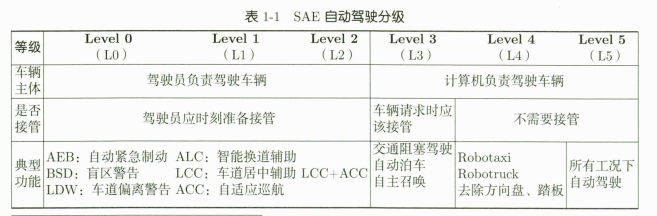
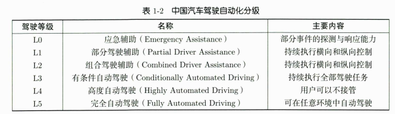
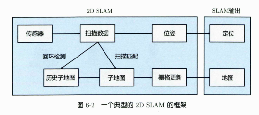

# CH1 自动驾驶

## 自动驾驶技术

车辆应有感知能力、定位能力、规划控制能力

- 分级：





- 接管率

# CH2 数学知识

- 对于车辆而言，x，y，z为向前、向左、向上

## 运动学

运动学研究位姿随时间如何变化。三维刚体运动主要由旋转和平移组成：

- 旋转：$R(t) \in SO(3)$
- 平移：$t(t) \in \mathbb{R}^3$
- 位姿：$T = \begin{bmatrix} R & t \\ 0^T & 1 \end{bmatrix} \in SE(3)$

### 旋转矩阵运动学

$$
\dot{R} = R \omega^\wedge
$$

其中 $\omega$ 是瞬时角速度。离散更新时：

$$
R(t) = R(t_0)\mathrm{Exp}(\omega \Delta t)
$$

小量近似：

$$
R(t_0 + \Delta t) \approx R(t_0)(I + \omega^\wedge \Delta t)
$$

重点：旋转矩阵要保持正交性，不能像普通向量一样直接相加更新。

### 四元数运动学

$$
\dot{q} = \frac{1}{2}q[0, \omega]^T
$$

当 $\omega$ 较小时：

$$
\mathrm{Exp}(\omega) \approx [1, \frac{1}{2}\omega]
$$

四元数与旋转向量的关系：

$$
q = [\cos \frac{\theta}{2}, n \sin \frac{\theta}{2}]^T
$$

重点：四元数更新里有 $\frac{1}{2}$，近似更新后通常要重新归一化。

### 旋转和平移

$$
\dot{R} = R\omega^\wedge,\quad \dot{t} = v
$$

这是实践中最常用的表达：旋转用 SO(3) 或四元数更新，平移用速度积分。

若统一写成 SE(3) 形式，可定义：

$$
\xi = [R^T v, \omega]^T
$$

则：

$$
\dot{T} = T\xi^\wedge
$$

### 速度与加速度变换

先区分两类问题：

- 同一个速度向量换坐标系表达：例如车辆本体速度 $v_w$ 从世界系换到车体系，直接用 $v_b = R_{bw}v_w$。
- 不同速度向量之间的关系：如果点 $p$ 所在的坐标系本身在旋转，就要考虑旋转带来的额外速度。

当坐标系本身在旋转时，速度变换不能只乘旋转矩阵，还要加入角速度项：

$$
v_1 = R_{12}(\omega^\wedge p_2 + v_2)
$$

加速度变换会多出几项：

$$
a_1 = R_{12}(a_2 + 2\omega^\wedge v_2 + \dot{\omega}^\wedge p_2 + \omega^\wedge\omega^\wedge p_2)
$$

- $2\omega^\wedge v_2$：科氏加速度。
- $\dot{\omega}^\wedge p_2$：角加速度项。
- $\omega^\wedge\omega^\wedge p_2$：向心加速度。

重点：同一个速度换坐标系只是改变表达；不同坐标系下运动点的速度关系，还要考虑 $\omega \times p$。

### 扰动模型和雅可比

SLAM 优化里不能直接对旋转矩阵元素随便求导，常用做法是在李代数上加扰动：

- 在旋转矩阵或四元数上施加左扰动或右扰动。
- 用 BCH 近似和左/右雅可比计算导数。
- 左扰动和右扰动都会用，公式不同，要和代码里的更新方式保持一致。

常见结论：对旋转后的向量 $Ra$ 施加右扰动，有

$$
\frac{\partial Ra}{\partial \omega} = -Ra^\wedge
$$

### 圆周运动案例

车辆固定速度、固定转向角时，会形成圆周运动。车体系速度可写为 $v_b=[v_x,0,0]^T$，角速度沿 $z$ 轴。这个例子用来比较旋转矩阵和四元数更新姿态时的差别。

# CH3 惯性导航与组合导航

## IMU惯性测量单元

- 速度公式：新速度 = 旧速度 + 世界系加速度 * dt + 重力 * dt
- 位置公式：新位置 = 旧位置 + 旧速度 * dt + 1/2 * 世界系加速度 * dt^2 + 1/2 * 重力 * dt^2

## 怎样的测量方法

ω_k = ω_m,k - b_g
a_k = a_m,k - b_a

R_{k+1} = R_k Exp(ω_k Δt)

v_{k+1} = v_k + [R_k a_k + g] Δt

p_{k+1} = p_k + v_k Δt + 1/2 [R_k a_k + g] Δt²

---

ω_m,k：第k帧IMU测量的角速度

a_m,k：第k帧IMU测量的加速度

R_k：当前姿态，把机体系向量转到世界系

角速度 → 积分 → 姿态 R
加速度 → 转到世界系 + 重力 → 世界系加速度
世界系加速度 → 积分 → 速度 v
速度 → 积分 → 位置 p

---

- 不解决零偏问题，imu_integration是固定零偏的

---

- 静止时测量：

陀螺仪测到 ≈ 陀螺零偏 + 噪声

加速度计测到 ≈ 重力投影 + 加计零偏 + 噪声

估计：

陀螺零偏
加计零偏
陀螺噪声
加计噪声
重力方向

在高精度定位系统中，**GNSS**（全球导航卫星系统）负责接收卫星信号以提供全局的绝对坐标，但存在十几米的天然误差且极易被建筑或隧道遮挡；**RTK**（实时动态差分技术）则是一种“增强算法”，它通过基准站纠正GNSS的误差，将其定位精度硬生生拉升至厘米级；而**IMU**（惯性测量单元）作为无需外界信号的纯内部传感器，能提供极高频率、极致平滑的相对运动数据，却有着随时间不断累积漂移的致命弱点。三者结合构成了完美的互补：在信号开阔地带，**GNSS+RTK**提供绝对准确的厘米级坐标并不断“重置”**IMU**的累积误差；一旦进入信号盲区（如隧道），系统便无缝接力，依靠**IMU**短期极高的精度“盲走”过渡，直到重新捕获卫星信号，从而实现全场景、全天候的连续高精度定位。

## ESKF

dx = [delta_p, delta_v, delta_theta, delta_bg, delta_ba, delta_g]

每一项都是三维：xyz方向

1. 静止 IMU 初始化
2. 等待第一帧有效 GNSS/RTK
3. 用 GNSS 初始化位置和姿态
4. IMU 高频预测
5. GNSS 低频修正
6. 可选 Odom 速度修正
7. 误差注入名义状态
8. 重置误差状态

- 真值状态 x_true
  名义状态 x_nominal
  误差状态 delta_x

x_true = x_nominal ⊕ delta_x：把误差注入到名义状态

真值是真实状态，实际系统拿不到

名义状态是对真实状态的主估计值

- GNSS是主要更新误差状态，然后通过残差估计名义状态错了多少，然后把误差状态注入名义状态

- 每次通过低频 GNSS 观测估计当前名义状态的误差，再将误差注入由高频 IMU 预测得到的名义状态，从而获得对高频真实状态的连续估计。
- 用运动学方程积分的名义状态只有三类：位置p、速度v、姿态R，预测阶段不改变陀螺零偏、加计零偏、重力
- 误差状态协方差预测会考虑 bg、ba、g 对 p、v、R 漂移的影响

---

代码中只有已确认的点往后的点会受到gnss约束，不会影响之前的

# CH6 2D SLAM



## 扫描匹配

Scan-to-Scan 是将当前的激光雷达扫描帧（Current Scan，$S_t$）与上一帧（Previous Scan，$S_{t-1}$）或最近的一个关键帧进行匹配。

Scan-to-Map 是将当前的激光雷达扫描帧（Current Scan，$S_t$）与已经构建好的局部地图或全局地图（Map，$M$）进行匹配。

## 流程

- 一帧2D激光数据：

```cpp
struct Scan2d {
    double timestamp = 0.0;
    double angle_min = 0.0;
    double angle_max = 0.0;
    double angle_increment = 0.0;
    double range_min = 0.0;
    double range_max = 0.0;
    std::vector<float> ranges;
};
```

- 从angle_min到angle_max，每隔angle_increment发一束激光，每束激光返回距离ranges[i]
- 所以坐标为x = r * cos(angle);y = r * sin(angle);

### 模板法与Bresenham法

- 模板法：以当前激光雷达位置为中心的局部像素窗口，对每个栅格，反查是否有激光穿过
- Bresenham法：计算激光经过的位置，可以得到路径上的栅格是否被占据

### 似然场

似然场法是一种用已有地图来估计当前激光帧位姿的 scan matching 方法：它先把占据栅格地图中的障碍物格子扩散成一张距离场，也就是每个栅格都保存“到最近障碍物的距离”；然后把当前 scan 的激光末端点按照一个初始位姿投影到这张距离场上，读取每个点所在位置的距离残差 `e`；如果位姿正确，这些 scan 点应该落在地图障碍物附近，`e` 就小，反之 `e` 就大；因此算法通过高斯牛顿等优化方法不断调整当前 scan 的 `SE2` 位姿，使所有有效 scan 点的 `e^2` 总和最小，最终得到当前激光帧相对于子地图的位姿。

### 子地图类

- 当前子地图的位姿，当前子地图的占据栅格，当前子地图的似然场
- 接受关键帧scan，更新占据栅格和似然场；用似然场把新scan匹配到当前子地图，以估计当前scan的位姿。

## 建图流程

初始化第一张子地图
    ↓
不断接收 2D scan
    ↓
给当前 scan 一个位姿初值
    ↓
用当前子地图的似然场匹配 scan，估计位姿
    ↓
判断它是不是关键帧
    ↓
如果是关键帧，就加入子地图，占据栅格更新，似然场更新
    ↓
如果当前子地图太大或 scan 出界，就创建新子地图
    ↓
输出当前子地图图像、似然场图像或全局地图图像

## 回环检测

系统在建图过程中只用关键帧触发回环检查，先把已经完成的历史子地图固定为匹配目标，并为它们生成多分辨率似然场；当新的关键帧到来时，根据当前帧位置和历史子地图中心距离筛选可能的回环候选，同时跳过当前子地图和相邻子地图；随后将当前关键帧的 scan 与候选历史子地图的多分辨率似然场进行匹配，如果匹配成功，就得到“历史子地图到当前子地图”的相对位姿约束；最后把每个子地图作为 g2o 图优化中的 SE2 顶点，把相邻子地图关系和回环关系作为边进行 pose graph 优化，筛掉误差过大的错误回环，并把优化后的位姿写回各个子地图，从而调整子地图之间的全局摆放关系，减小累计漂移和全局地图重影。
